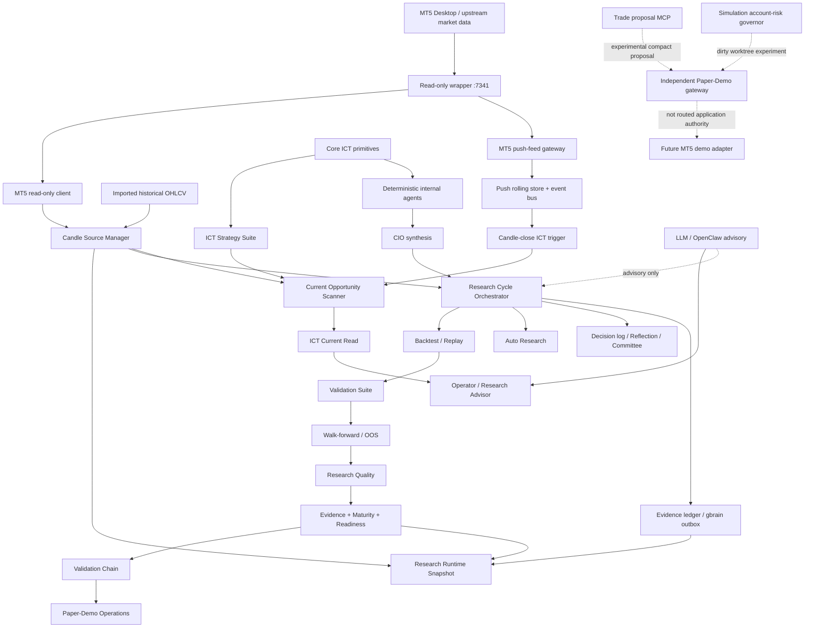
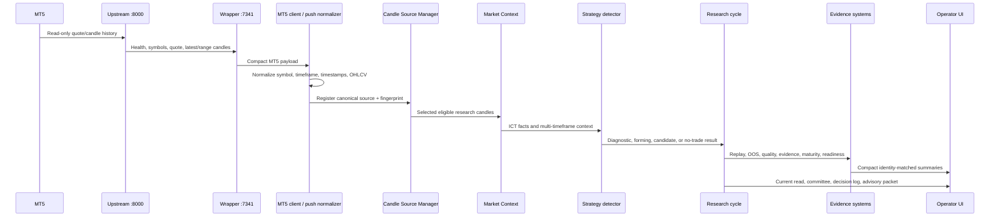
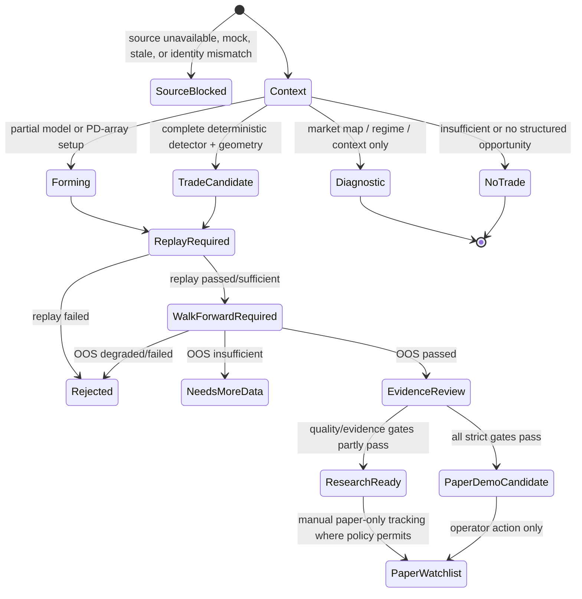
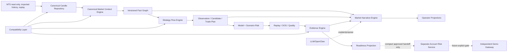

# GoTrader V2 Comprehensive Architecture Audit

**Audit date:** 2026-07-22  
**Repository:** `C:/Users/andre/OneDrive/Documents/gotrader`  
**Audited branch:** `local-restart-safety-check-2`  
**Audited HEAD:** `f6dbe33` (`Prevent cycle failure on storage quota`)  
**Purpose:** Observational design specification for GoTrader V2. No production behavior was changed by this audit.

## 1. Audit Boundary

The current codebase is the source of truth. Existing documents were used as supporting history, but a statement in a document is not treated as implemented unless the corresponding code, route, storage contract, or test exists.

The worktree was materially dirty during the audit. This matters because several account-risk and gateway changes exist only as uncommitted worktree additions. This document labels those paths **EXPERIMENTAL (dirty worktree)** and does not treat them as released capability.

The non-negotiable authority contract observed throughout the research application is:

```text
executionAuthority: none
brokerAuthority: none
readinessOverrideAuthority: none
```

Type definitions and independent demo-gateway experiments mention future paper or live states, but the routed React application has no `/execute` page and the research pipeline does not possess broker execution authority.

### Classification legend

| Classification | Meaning |
| --- | --- |
| **KEEP** | Proven boundary or behavior that V2 should preserve unchanged. |
| **KEEP + REFACTOR** | Preserve behavior and contracts while changing internal ownership or composition. |
| **REWRITE** | Replace behavior. No current production subsystem meets this threshold. |
| **DEPRECATE** | Keep behind compatibility until callers migrate, then retire. |
| **EXPERIMENTAL** | Useful research or infrastructure work that is not production authority. |

## 2. Executive Findings

GoTrader is not a small strategy application. It is a broad, deterministic trading-research terminal with:

- MT5 read-only source acquisition, normalization, fingerprints, depth diagnostics, and push-feed contracts.
- A large ICT primitive and strategy suite.
- Current-opportunity, current-read, scenario, replay, backtest, walk-forward, OOS, Monte Carlo, quality, evidence, maturity, and readiness systems.
- Internal deterministic agents plus optional LLM/OpenClaw advisory presentation.
- Auto Research, Autonomous Research, proposal generation, and fail-closed calibration policy.
- Paper-Demo watchlist operations that remain separate from execution.
- Compact decision, reflection, memory, prediction, and forward-evidence ledgers.

The strongest assets are not the UI or orchestration files. They are the safety contracts, source identity/provenance, detector-specific validation work, compact evidence artifacts, and frozen research profiles. Those must be preserved.

The main architectural problem is **parallel ownership**:

1. Market facts such as FVG, liquidity, bias, session, displacement, and trade levels are calculated in core ICT modules, strategy-suite helpers, detector files, Advisor logic, Grinch phases, and runtime aggregation.
2. `runResearchCycle.ts` and `resolveResearchRuntimeSnapshot.ts` are separate composition roots with overlapping responsibility.
3. UI pages independently hydrate and recompute large runtime snapshots.
4. Strategy definitions, detectors, approved-profile rules, opportunity lanes, and validation profiles do not share one standard strategy lifecycle contract.
5. Durable research artifacts are split among IndexedDB, many localStorage keys, JSON/JSONL files, and in-memory fallbacks.

The V2 recommendation is therefore **not a rewrite**. It is a compatibility-first migration toward six canonical layers:

1. Canonical Market Context Engine
2. Strategy Flow Engine
3. Risk Management Engine
4. Evidence Engine
5. Market Narrative Engine
6. Compatibility Layer

Existing algorithms should be adapted into these layers and dual-run against current outputs before any caller is migrated.

## 3. Repository Architecture Map

### 3.1 Repository inventory

| Area | Approximate size | Responsibility |
| --- | ---: | --- |
| `src/components` | 100 files | Routed workspaces, operator surfaces, Advisor, research labs, results, settings. |
| `src/lib` | 488 files | Domain logic, storage, integration clients, strategy engines, validation, evidence. |
| `src/lib/ict-strategy-suite` | 89 files | Detectors, ICT strategy helpers, current read, trade construction, telemetry, profile policies. |
| `src/lib/integrations` | 47 files | MT5, imported data, FMP, Twelve Data, TradingView legacy, local adapters. |
| `scripts` | 177 files | Service launchers, CLIs, diagnostic harnesses, local gateways, strategy tests. |
| `tests/smoke` | 1 Playwright suite | Route, shell, safety, and visible UI smoke coverage. |
| `docs` | Large audit/runbook set | Design history, evidence audits, source runbooks, safety and strategy reports. |

### 3.2 Application entry points

- `src/main.tsx` mounts React, imports `src/index.css`, and renders `App`.
- `src/App.tsx` owns lazy route registration and initializes MT5 push-feed handling.
- `src/components/AppShell.tsx` owns the operator shell, primary navigation, advanced routes, source context, and safety strip.
- `src/components/dashboard/ResearchCommandCenter.tsx` is `/dashboard`.
- `src/components/operator/OperatorDecisionsView.tsx` is `/advisor`.
- `src/components/dashboard/MissionControlShell.tsx` is the advanced `/research-lab` surface.
- `src/lib/researchCycle/runResearchCycle.ts` is the central manual research-cycle orchestrator.
- `src/lib/runtime/resolveResearchRuntimeSnapshot.ts` is the central read-side runtime aggregator.
- `src/lib/currentOpportunity/detectCurrentOpportunities.ts` is the live strategy scanner.
- `src/lib/ict-strategy-suite/ictCurrentRead.ts` composes the ICT current-read contract.
- `src/lib/backtesting/runBacktest.ts` is the central replay/backtest execution path.
- `src/lib/autonomousResearch/runAutonomousResearchLoop.ts` supervises autonomous cycles.

### 3.3 Routed product surface

The primary shell intentionally exposes four operator-oriented hubs:

- Overview: `/dashboard`
- Decisions: `/advisor`
- Results: `/performance`
- Settings: `/settings`

Advanced Research retains the full specialist surface: Mission Control, Research Advisor, Market Data, ICT Lab, Research Workbench, Replay, Walk-Forward, Backtest, Validation, Research Quality, Paper-Demo Ops, Evidence, Maturity, Readiness, Strategy Library, Agent Audit, Runbook, Self-Improvement, Autonomous Research, Parameter Search, Prompt Lab, Research Committee, OpenClaw, Agents, and Communications.

This shell simplification is directionally correct and should be preserved. V2 should reduce the data required by the primary hubs rather than remove specialist tools.

### 3.4 Dependency diagram



### 3.5 Major subsystem ownership

| Subsystem | Current owner | Primary consumers | Classification |
| --- | --- | --- | --- |
| Canonical candle sources | `src/lib/candleSources` | Runtime, cycle, replay, scanner, UI | **KEEP + REFACTOR** |
| MT5 read-only HTTP | `src/lib/integrations/mt5` | Source manager, activation, CLIs | **KEEP** |
| MT5 push feed | `src/lib/mt5PushFeed` | Event trigger, feed status | **EXPERIMENTAL -> KEEP + REFACTOR** |
| Core ICT primitives | `src/lib/ict` | Agents, strategy suite, context builders | **KEEP + REFACTOR** |
| Strategy detectors | `src/lib/ict-strategy-suite` | Scanner, replay, Advisor | **KEEP** |
| Strategy catalog | `src/lib/strategyLibrary` | UI, intake, OpenClaw, validation | **KEEP + REFACTOR** |
| Current opportunity | `src/lib/currentOpportunity` | Advisor, Dashboard, validation queue | **KEEP + REFACTOR** |
| Research cycle | `src/lib/researchCycle` | Manual and autonomous research | **KEEP + REFACTOR** |
| Runtime snapshot | `src/lib/runtime` | Most research pages | **KEEP + REFACTOR** |
| Replay/backtest | `src/lib/backtesting`, replay components | Validation, research | **KEEP + REFACTOR** |
| Walk-forward/OOS | `src/lib/walkForward` | Evidence, quality, readiness | **KEEP** |
| Validation chain/provenance | `src/lib/validationChain`, `validationProvenance` | Advisor, evidence, Paper-Demo | **KEEP** |
| Evidence/maturity/readiness | `evidence`, `maturity`, `readiness`, `researchQuality` | Operator gates | **KEEP + REFACTOR** |
| Paper-Demo Operations | `src/lib/paperDemoOperations` | Manual watchlist operations | **KEEP** |
| Internal agents/CIO | `src/lib/agents` | Thesis and Advisor | **KEEP + REFACTOR** |
| LLM/OpenClaw | `src/lib/llm`, `openclawPilot` | Explanation and draft intents | **KEEP** |
| Research memory | `researchEvidenceLedger`, `researchMemory` | Runtime, operator memory, future gbrain | **KEEP + REFACTOR** |
| Broker/router contracts | `src/lib/brokers` | Future gateway work | **EXPERIMENTAL** |
| Simulation account risk | `src/lib/risk/accountRiskTypes.ts`, script core | Future paper gateway | **EXPERIMENTAL (dirty worktree)** |

## 4. End-to-End Data Flow

### 4.1 Market data flow



### 4.2 Stage ownership

| Stage | Begins | Ends | Owner | Mutates | Consumers |
| --- | --- | --- | --- | --- | --- |
| MT5 acquisition | Wrapper request/event | Raw read-only payload | `integrations/mt5`, local scripts | Feed caches/status only | Normalizers |
| Normalization | Provider payload | Canonical candles/ticks | MT5 normalizer and push normalizer | No provider data | Source manager, push store |
| Source registration | Canonical series | Eligible source snapshot + fingerprint | Candle Source Manager | Active source metadata | Runtime, research, chart, replay |
| Context construction | Selected candles | ICT and MTF facts | `ict`, `ictMarketAnalysisContext`, suite helpers | No candles | Agents, detectors, Advisor |
| Recognition | Context | Diagnostic/forming/model recognition | Universal Recognition, opportunity scanner | Compact journal/state | Current Read, validation intake |
| Trade construction | Candidate facts | Entry, stop, target, RR or blockers | `ictTradeConstruction` plus detector-local logic | Candidate only | Validation, Advisor |
| Research cycle | Source and configuration | Cycle result | `runResearchCycle` | Compact cycle/evidence state | Runtime, UI, autonomy |
| Replay/validation | Candidate/profile + frozen candles | Outcomes and quality reports | Backtest, Validation, Walk-Forward | Compact result stores | Evidence/readiness |
| Evidence promotion | Identity-matched results | Chain/evidence/maturity/readiness state | Validation Chain, evidence, maturity, readiness | Durable compact records | Paper-Demo, UI |
| Narrative | Deterministic artifacts | Human-readable explanation | Current Read, Committee, Advisor, LLM advisory | Transcript/draft only | Operator |

### 4.3 Important source inconsistency

The MT5 push-feed store and Candle Source Manager are adjacent but not yet one canonical repository. The push store deduplicates and publishes candle-close events, while the Source Manager owns chart/research/walk-forward selection and source eligibility. V2 should unify them behind one repository facade without changing existing source fingerprints or deep-history behavior.

### 4.4 Source fallback behavior

The Source Manager supports MT5 read-only, imported historical, replay, and mock/demo providers. Imported historical remains useful for deep comparison. Mock and sample sources are valid only when explicitly selected for demonstration and cannot create research evidence or Paper-Demo eligibility. Silent fallback in a research cycle is unsafe; V2 must preserve the explicit source guard.

## 5. Strategy Inventory

### 5.1 First-class Strategy Library entries

All entries below declare authority none/none/none. "Evidence support" means the strategy may generate evidence only after deterministic replay and identity-matched validation. Recognition alone is never evidence.

| Strategy | Purpose and files | Required inputs/dependencies | Output and trade construction | Replay/OOS/evidence | Current status, strengths, weaknesses | V2 recommendation |
| --- | --- | --- | --- | --- | --- | --- |
| `silver_bullet_v1` | Baseline ICT Silver Bullet. `ictSilverBullet.ts`, registry. | 1m, 5m/15m context, NY Silver Bullet window, sweep, directional FVG, return. | Long/short candidate with gap entry, sweep/FVG invalidation, liquidity target, min 2R. | Replay and OOS supported; prior 90-day audit rejected it. | **Executable research.** Useful baseline; weak target-first and OOS degradation. | Keep as frozen negative-control profile. |
| `silver_bullet_v2_refined_research` | Stricter Silver Bullet refinement. Same detector family. | Meaningful early sweep, timely displacement FVG, timely return, 5m/15m context, news/session state. | Realistic nearest target, stop floor, RR 2R-15R. | Replay/OOS supported. | **Executable research.** Removes weak v1 cases but has very small candidate count. | Keep; migrate through standard strategy adapter. |
| `camerons_model_research_v1` | Catalog intake for Cameron's Model. Registry only. | Session, phase, sweep/displacement, future entry model. | No deterministic trade construction. | Cannot create evidence. | **Placeholder.** Useful vocabulary, no detector. | Keep catalog entry; no V2 execution adapter until detector exists. |
| `ifvg_v1` | Baseline inversion FVG. `ictIfvg.ts`, types. | 5m/15m, original FVG, full inversion, unused zone, retest, HTF review, liquidity target. | IFVG body/zone entry, opposite boundary stop, next liquidity target, min 2R. | Replay/OOS scripts and audits exist. | **Executable research.** Broad sample, but target-first alone did not establish robust net expectancy. | Keep as baseline/diagnostic comparator. |
| `ifvg_filtered_v2_research` | Causal clean-retest and displacement filter. `ictIfvgFilteredV2.ts`. | IFVG v1 facts plus clean retest and pre-entry displacement. | Reuses IFVG construction with stricter causal eligibility. | Detector-specific replay/OOS exists; independent validation failed. | **Executable research, replay required.** Correctly rejects hindsight; weak independent result. | Keep frozen; never silently substitute generic Grinch metrics. |
| `ifvg_fresh_retest_v3_research` | Strongest frozen causal IFVG profile. `ictIfvgFreshRetestV3.ts`. | Fresh first retest, pre-entry confirmation, exact source/profile identity. | Compact assessment over IFVG candidate; detector-profile outcomes. | 180-day audit: 172 trades, 55.23% target-first, 2.805R mean, PF 5.979, 95 dates, 11/11 positive rolling windows, 2/2 frozen OOS passed. | **Evidence building.** Strong historical/OOS evidence; still no automatic paper promotion and needs untouched forward evidence. | **KEEP untouched.** Treat as golden V2 migration profile. |
| `ifvg_fresh_retest_v4_candidate` | Shallow-retest forward candidate. `ictIfvgShallowRetestV4.ts`. | V3 facts plus bounded retest penetration. | Candidate assessment only; not in-place v3 mutation. | Forward collector/ledger and audit exist. | **Experimental evidence building.** Correct versioned hypothesis, forward sample incomplete. | Keep experimental and versioned. |
| `turtle_soup_v1` | False-break reversal. `ictTurtleSoup.ts`, types. | 5m/15m, setup-range sweep, rejection, MSS, valid session, news check. | Reversal entry, beyond-sweep stop, opposing liquidity target, min 2R. | Replay/OOS diagnostic exists. | **Executable research.** Prior audit produced no valid candidates; sweep/rejection/MSS chain is restrictive. | Keep detector; instrument blockers before changing rules. |
| `crt_research_v1` | Candle Range Theory intake. Registry only. | Defined range, liquidity event, delivery confirmation. | No detector or trade plan. | No evidence. | **Placeholder.** | Keep catalog-only. |
| `ote_research_v1` | Optimal Trade Entry intake. Registry only. | Directional leg, retracement zone, PD/HTF context. | No detector or trade plan. | No evidence. | **Placeholder.** | Keep catalog-only; likely primitive-dependent future adapter. |
| `cisd_v1` | Change in State of Delivery. `ictCisd.ts`, types. | 5m/15m, clear prior delivery, strong body close-through, retest, non-chop session. | Body-zone retest, full-candle wick stop, opposing liquidity target, min 2R. | Replay/OOS and performance audit exist. | **Executable research.** Deterministic and compact; prior standalone edge was weak/unstable. | Keep as detector and potential confluence fact. |
| `amd_power_of_three_research_v1` | Accumulation-Manipulation-Distribution intake. Registry only. | Consolidation, manipulation, expansion, session narrative. | No dedicated registered detector. | No direct evidence. | **Placeholder**, while related CMD/session narrative logic exists elsewhere. | Unify naming before implementing; do not duplicate CMD. |
| `ict_cmd_short_paper_watchlist_v1` | Narrow CMD short paper-watchlist definition. Registry plus CMD gate/telemetry/tracking. | Clear range, short manipulation/sweep, distribution, external target, session, min RR, independent dates. | Target/invalidation/RR from CMD evidence; paper-only tracking. | Replay, OOS, telemetry, Monte Carlo, independent-date gate. | **Registry placeholder with substantial adjacent tooling.** Promising cluster was date-concentrated/overfit-risk. | Keep policy and telemetry; reconcile registry status with actual detector ownership. |
| `cmd_high_displacement_v2_research` | High-displacement CMD refinement. `ictCmdHighDisplacementV2.ts`. | CMD structure plus strong displacement and evidence thresholds. | Compact candidate/evidence assessment. | 90-day performance diagnostic. | **Executable research.** Designed to test the differentiating cluster, not promote it. | Keep versioned; adapt to standard flow. |
| `grinch_reversal_expansion_confirmation_v1` | Grinch reversal/expansion profile definition. Registry plus Phase 2/Grinch modules. | Sweep, MSS, displacement, PD array, expansion confirmation. | Advisor signal and profile score; generic trade construction may follow. | Replay diagnostics exist but registry detector remains placeholder. | **Placeholder/profile vocabulary.** Existing implementation is distributed. | Preserve algorithms; consolidate behind one profile adapter. |
| `grinch_model_1_research_v1` | Grinch Model One/Power of Three definition. Registry and Phase 1 logic. | Accumulation, manipulation, distribution, bias/session. | Research signal/profile output. | Generic replay diagnostics. | **Placeholder registry entry with existing legacy logic.** | Compatibility adapter first; do not rewrite thresholds. |
| `grinch_consolidation_research_v1` | Grinch consolidation profile. Registry and Phase 3 logic. | Consolidation range, pivots, sweep/expansion context. | Research/no-trade context. | Generic replay diagnostics. | **Placeholder registry entry with implemented context logic.** | Treat context facts separately from trade strategy. |
| `pd_array_setup_research_v1` | Generic PD-array setup intake. Registry + Universal Recognition. | Recognized FVG/order block/breaker/mitigation array and directional context. | Forming setup only until a registered entry model exists. | No evidence from recognition alone. | **Placeholder.** Correctly non-promotable. | Keep as recognition tier, not trade strategy. |
| `scalp_setup_research_v1` | Lower-timeframe scalp intake. Registry + Universal Recognition. | LTF direction, session, nearby target, risk context. | Forming setup only. | No evidence from recognition alone. | **Placeholder.** | Keep as observation type, not strategy. |
| `nasdaq_london_raid_ny_reversal_v1` | London raid to New York reversal narrative. `ictSessionRaidReversal.ts`. | MT5-derived session/open levels, London range raid, NY reversal sequence, PD/target context. | Narrative plus validation seed and possible scenario levels. | 90-day/live validation and winner-loser audits. | **Executable research.** Strong narrative value; baseline performance was not promotion-grade. | Keep narrative and detector; separate facts from candidate gate. |
| `nasdaq_london_raid_ny_reversal_v2_filtered_research` | Filtered session-raid variant. `ictSessionRaidReversalV2.ts`. | V1 facts plus explicit quality thresholds and failed-filter telemetry. | Filtered candidate/outcome classification. | Dedicated audit and replay scripts. | **Executable research.** Better diagnostics, still research-only. | Keep versioned; standardize telemetry contract. |
| `market_map_only_diagnostic_v1` | Context-only market map. Registry + diagnostic opportunity path. | Any sufficient market context. | No entry, stop, target, RR, evidence, or chain entry. | Not applicable. | **Retired/diagnostic.** Correctly bypasses trade construction. | Move from Strategy Library to Context View after compatibility period. |

### 5.2 Implemented strategy-like engines outside the registry

| Engine | Files | Role | Current gap | Recommendation |
| --- | --- | --- | --- | --- |
| Phase 2 Bread & Butter Buy/Sell | `ictPhase2BreadAndButter.ts` | Order-block/PD-array Advisor signals. | Not first-class registry lifecycle. | Add compatibility strategy adapters without changing rules. |
| Phase 2 One Shot One Kill | `ictPhase2OneShotOneKill.ts` | Session/PD-array model signal. | Not first-class registry lifecycle. | Same adapter approach. |
| Phase 2 Order Block Taxonomy | `ictPhase2OrderBlocks.ts` | Standard, reclaimed, mitigation, rejection, breaker, propulsion, vacuum classifications. | Both primitive and setup logic in one module. | Split fact classification from strategy policy. |
| Universal Recognition | `ictUniversalRecognition.ts` | Full/forming/PD-array/scalp/market-map recognition tiers. | Can look like a strategy despite being a classifier. | Preserve as a recognition service. |
| Grinch Phase 1-4 | `ict-strategy-suite` Grinch modules | Model One, reversal, consolidation, SMT refinement. | Runtime and cycle recompute overlapping outputs. | Wrap legacy outputs; centralize context inputs. |
| Approved Setup Profiles | `ictApprovedSetupProfile.ts` | Scores research signals against model-aware gates. | Parallel to Strategy Library status and validation chain. | Keep policy, make it a Strategy Flow stage. |
| CMD telemetry/tracking | CMD telemetry, gate, paper tracking modules | Evidence discovery and paper-only outcome collection. | Support system is more mature than registry detector label. | Preserve; reconcile identities and storage. |

## 6. ICT Primitive Inventory

| Primitive | Primary implementation | Other recalculation sites | Major consumers | Audit result |
| --- | --- | --- | --- | --- |
| Swings | `ict/detectSwings.ts` | Detector-local extrema scans, strategy helpers | BOS/MSS, liquidity, targets, IFVG, agents | Canonicalize swing facts by context/timeframe. |
| BOS | `ict/detectBOS.ts` | Detector-specific structure checks | Bias, trend continuation, agents | Core implementation should own the fact. |
| MSS | `ict/detectMSS.ts` | Turtle Soup, session reversal, Grinch | Reversal models, Advisor | Core fact plus strategy policy. |
| Liquidity pools | `ict/detectLiquiditySweeps.ts`, suite helpers | Silver Bullet, Turtle Soup, CMD, session raid | Most strategies and targets | **High-priority duplication.** |
| Liquidity sweeps | Same | Strategy-local sweep quality and windows | Reversal/CMD/Silver Bullet | Canonical event plus strategy-specific qualification. |
| FVG | `ict/detectFVG.ts` | Suite helpers, Advisor engine, IFVG, Silver Bullet, session logic | IFVG, PD arrays, targets, narrative | **High-priority duplication.** |
| IFVG | `ictIfvg.ts` | v2/v3/v4 assessment layers | IFVG profiles, scanner, replay | Preserve base detector and versioned filters. |
| Order blocks | `pdArrayHierarchy.ts`, `ictPhase2OrderBlocks.ts` | Advisor helpers | Phase 2, PD array recognition | Make taxonomy canonical; keep setup ranking separate. |
| Breakers | Phase 2 order blocks / PD hierarchy | Session and Advisor labels | PD arrays, targets, context | Consolidate classification vocabulary. |
| Mitigation/rejection blocks | Phase 2 order blocks | Advisor display | Phase 2 strategies | Same as order blocks. |
| Premium/discount | `detectPremiumDiscount.ts`, `dealingRangePremiumDiscount.ts` | Advisor/strategy helpers | OTE, IFVG, CMD, agents | Choose one canonical dealing-range contract. |
| Dealing range | `dealingRangePremiumDiscount.ts` | Strategy-specific ranges and consolidations | PD arrays, targets, context | Separate global dealing range from setup-local range. |
| Sessions/killzones | `sessionTagger.ts`, `timePriceAlignment.ts` | Silver Bullet, narrative, session raid, news risk | Nearly every intraday strategy | **High-priority duplication.** Canonical timezone/session service. |
| Opening references | `openingPriceEquilibrium.ts`, market analysis/session modules | Session raid and Advisor | Sunday/12AM/9:30 references | Preserve MT5-derived source and one resolver. |
| HTF bias | `higherTimeframeBias.ts` | `ictMarketAnalysisContext`, Advisor composite, agents, Grinch | Profiles and risk context | **High-priority duplication.** |
| Weekly/daily bias | Market analysis context | Runtime, Advisor | HTF alignment | Derive once from canonical MTF context. |
| Displacement | Suite helpers and detector-local calculations | Silver Bullet, IFVG, CMD, session raid | Candidate confirmation | Standardize measurement; retain profile thresholds. |
| SMT | `smtIntermarketDivergence.ts`, Grinch Phase 4 | Advisor/approved profile | Confluence and warnings | Keep optional because counterpart data may be missing. |
| Market cycle/regime | `marketCycleClassifier.ts`, `regime`, agents | Runtime, narrative, readiness | Strategy context and conservative gates | Canonicalize facts; retain multiple policy views. |
| Consolidation | `consolidationProfile.ts`, CMD/session modules | Market episodes, Grinch | CMD/AMD, market map | Canonical base range; strategy-specific range allowed. |
| Trade construction | `ictTradeConstruction.ts` | Detector-local and Advisor RR helpers | Candidate validation | Make one authoritative geometry validator. |
| Target selection | PD/liquidity logic plus each detector | CIO and Advisor | All candidate strategies | Canonical target candidates, strategy policy selects one. |
| Stop/invalidation | Detector-local plus trade construction | CIO/Advisor | All candidate strategies | Strategy owns thesis invalidation; canonical validator checks geometry. |
| Confidence/confluence | `confluenceScoring.ts`, approved profiles, agents/CIO | Detectors, Current Read, readiness | Advisor and gates | Separate fact quality, model score, evidence maturity, and presentation confidence. |

## 7. Duplication Audit

Repository-wide term counts show conceptual scattering: session appears in more than 200 source files, bias in more than 130, liquidity and FVG in more than 110 each, and displacement in more than 90. These counts include types, tests, and presentation, so they are not detector counts, but they accurately signal broad ownership.

| Duplicate concern | Examples | Why it exists | Classification | V2 treatment |
| --- | --- | --- | --- | --- |
| FVG detection | Core ICT, suite helpers, Advisor engine, IFVG, Silver Bullet | Strategy development was incremental. | **High priority** | Canonical FVG facts with compatibility fields. |
| Liquidity/sweeps | Core sweeps, helper pools, detector-local scans | Each model needs different sweep quality. | **High priority** | Share raw event; keep model qualification policy. |
| HTF bias/alignment | Core bias, MTF context, Advisor composite, agents, approved profile | Different consumers grew independently. | **High priority** | One timeframe-direction map; policy evaluates it. |
| Session classification | Session tagger, killzone code, detector windows, news-session risk | Exact model windows differ. | **High priority** | Canonical clock/session facts plus strategy windows. |
| Target/stop/RR | Trade construction, detectors, CIO, Advisor | Some paths are thesis-level, others validation-level. | **High priority** | Strategy proposes; geometry service validates. |
| Confidence | Confluence score, agent confidence, CIO confidence, approval score, readiness | "Confidence" represents different concepts. | **High priority** | Rename concepts in V2 contracts; compatibility maps old fields. |
| Context aggregation | Research cycle and runtime snapshot | Write path and read path both reconstruct state. | **High priority** | Materialized Research Snapshot keyed by identity. |
| Validation identity checks | Runtime, chain, readiness, Paper-Demo | Safety requires repeated fail-closed checks. | **Acceptable duplication** | Central helper, but keep boundary revalidation. |
| Authority assertions | Nearly every compact contract | Defense in depth. | **Acceptable duplication** | Preserve at every trust boundary. |
| Raw-data exclusion checks | Memory, OpenClaw, journals, gateway | Safety/privacy boundary. | **Acceptable duplication** | Preserve and centralize shared validator only. |
| Storage parsing/migration | Many localStorage modules | Features were independently added. | **Refactor candidate** | One versioned repository/migration framework. |
| Symbol/timeframe normalization | MT5 client, source manager, push feed, strategies | Provider and domain aliases. | **Refactor candidate** | Canonical instrument/timeframe registry. |

## 8. Current Decision Engine

### 8.1 Decision state flow



### 8.2 Decision ownership

| Decision | Owner | Notes |
| --- | --- | --- |
| Source usable | Candle Source Manager + research source guard | Mock/sample cannot create evidence. |
| Diagnostic vs candidate | Current Opportunity Scanner | Diagnostic rows bypass trade construction. |
| Known model / recognition tier | Universal Recognition | Full, forming, PD-array, scalp, market-map, insufficient. |
| Model eligibility | Detector + Approved Setup Profile | Detector facts first; policy evaluates model-aware HTF and quality rules. |
| Trade geometry valid | Detector + `ictTradeConstruction` | Entry, invalidation, target, side ordering, minimum RR. |
| Replay required/passed | Validation Chain | Recognition is not evidence. |
| OOS sufficient | Walk-Forward | Exact identity and frozen chronology matter. |
| Research quality | Research Quality | Drawdown, false-positive attribution, sessions, conservative scenario. |
| Evidence/maturity | Evidence and Maturity engines | Independent inputs and cycle depth. |
| Research Ready/Paper-Demo Candidate | Readiness Gate | Advisory cannot promote. |
| Manual Paper-Demo watchlist | Paper-Demo Operations | No broker execution authority. |

### 8.3 Ambiguities V2 must remove

- "Approved setup" can mean an Approved Setup Profile match, not Paper-Demo readiness.
- "Paper watchlist" is a research evidence lane, not a broker paper order.
- "Research Ready" is below "Paper-Demo Candidate."
- A valid trade plan is not evidence; it only enables replay.
- A validation pass without exact profile/source provenance cannot promote the active read.
- Diagnostic context must never inherit entry/stop/target/RR blockers.

V2 contracts should encode these as different artifact types rather than overloaded status strings.

## 9. Scoring System Audit

### 9.1 Existing score families

| Score | Source | Meaning | Deterministic | Promotion authority |
| --- | --- | --- | --- | --- |
| ICT confluence | `ict/confluenceScoring.ts` | Agreement among ICT conditions. | Yes | No |
| Detector quality | Individual detector | Model-specific condition strength. | Yes | No |
| Approved profile score | `ictApprovedSetupProfile.ts` | Match to a named profile and HTF allowance. | Yes | No |
| Internal-agent confidence | Agent registry/policy | Agent opinion strength capped by evidence. | Yes | No |
| CIO confidence | `agents/cioSynthesis.ts` | Weighted directional agreement, capped by evidence coverage. | Yes | No |
| Opportunity quality | `ictOpportunityDetection.ts` | Structured opportunity completeness. | Yes | No |
| Research Quality | `researchQuality` | Replay quality, drawdown, false positives, sessions, conservative stability. | Yes | Contributes to gate |
| Evidence score | `evidence` | Independent evidence category coverage/quality. | Yes | Contributes to gate |
| Maturity score | `maturity` | Breadth and depth of accumulated research. | Yes | Contributes to gate |
| Readiness | `readinessGate.ts` | Strict conjunction of identity-matched requirements. | Yes | Final research gate |
| LLM confidence note | LLM/OpenClaw response | Explanation only. | No | None |

### 9.2 CIO behavior

The CIO synthesizer computes a weighted directional score from evidence-participating agents. Abstaining agents are excluded. Confidence is capped by evidence coverage, and a neutral thesis is emitted when directional agreement is inadequate. It also derives illustrative entry, invalidation, target, and RR from ICT context, but these are thesis levels, not an approved execution plan.

### 9.3 Scoring risks

1. The same underlying fact may influence detector quality, agent confidence, approved-profile score, and CIO confidence. This is not necessarily wrong, but it can look like independent confirmation when it is correlated evidence.
2. Generic "confidence" mixes detection certainty, directional conviction, data quality, and maturity.
3. Readiness recomputes and summarizes already-scored reports, making traceability difficult when a stale identity is loaded.
4. Strategy-specific thresholds and generic Grinch metrics have historically been mixed; detector-specific profiles now avoid this in several paths but not through one universal contract.

V2 should retain every current threshold initially, assign each score a named semantic category, and attach evidence references so correlated facts are not counted as independent coverage.

## 10. Risk and Execution Audit

### 10.1 What exists

| Layer | Current implementation | Status |
| --- | --- | --- |
| Trade geometry risk | `ictTradeConstruction`, detector stops/targets/RR | Production research capability. |
| Replay outcome risk | Drawdown, stop hits, session results, conservative scenario | Production research capability. |
| Monte Carlo | ICT Monte Carlo diagnostics | Production research diagnostic when outcomes exist. |
| Readiness risk gates | Drawdown <= 4R, false-positive/session/conservative/runbook gates | Production research gate. |
| Agent Bridge Risk Manager | `riskDecisionTypes.ts` | Placeholder, always rejects execution. |
| Broker routing contracts | `brokers/brokerTypes.ts`, `brokerRouter.ts` | Experimental contract surface. |
| Simulation account-risk governor | `risk/accountRiskTypes.ts`, `gotrader-account-risk-core.mjs` | **Dirty worktree experiment**, simulation-only, no broker calls. |
| Paper-Demo gateway | `paperDemoGateway`, gateway scripts | Independent, opt-in experimental preparation path. |
| Trade proposal MCP | `gotrader-trade-proposal-mcp.mjs` | Compact proposal/control plane; cannot grant authority or call MT5. |

### 10.2 What does not exist as production authority

- No routed `/execute` React page.
- No live-trading control in the primary UI.
- No research-cycle call to a broker order API.
- No LLM authority to size, approve readiness, or submit a broker order.
- No production account/position/order mutation path owned by the research application.

The current dirty gateway work describes a future flow where a separate gateway would revalidate an MT5 demo account, symbol metadata, volume bounds, margin, stop/target protection, freshness, and risk. It must remain experimental until independently reviewed, committed, and tested. The existence of `paper_ready` or `live_ready` type variants is not proof of a reachable execution path.

### 10.3 V2 risk recommendation

Build one Risk Management Engine with explicit subdomains:

1. **Model Risk:** replay/OOS quality, false positives, session stability, drawdown, Monte Carlo.
2. **Scenario Risk:** geometry, stop/target validity, cost/slippage assumptions, scenario expiry.
3. **Account Risk:** separate process, fresh broker snapshot, exposure, loss limits, size, idempotency.
4. **Authority Gate:** a final immutable policy boundary. LLMs can propose; they cannot approve.

The research application should consume compact risk decisions, not account state. No account-risk experiment should be promoted merely because it compiles.

## 11. Replay, Validation, Evidence, and Promotion

### 11.1 Validation stack

| System | Responsibility | Identity behavior | Storage/output |
| --- | --- | --- | --- |
| Backtest | Run generic or detector-specific profile over candles. | Includes strategy/profile and source metadata. | Compact metrics and outcomes. |
| Replay | Freeze a selected canonical source snapshot. | Preserves fingerprint/symbol/timeframe. | Replay result used by chain. |
| Validation Suite | Baseline/conservative/other scenarios. | Produces run identity and quality inputs. | Validation report. |
| Walk-Forward | Rolling/frozen chronological OOS. | Requires source/profile/parameter provenance. | Windows, OOS trades, verdict. |
| Detector-profile walk-forward | Profile-native validation for IFVG and similar strategies. | Avoids unrelated generic metrics. | Frozen detector evidence. |
| Research Quality | Drawdown clusters, false positives, sessions, confidence calibration. | Should consume same validation identity. | Grade and blockers. |
| Validation Chain | Lifecycle and next action. | Stores exact source/profile/provenance links. | Compact chain entry. |
| Evidence Ledger | Durable cycle/evidence memory. | Fingerprint and profile references. | IndexedDB with compact fallback/index. |
| Maturity | Breadth/depth progression. | Reads cycles/evidence/walk-forward. | Score/grade/next requirement. |
| Readiness | Strict final research gate. | Fails closed on missing/mismatched provenance. | Research Ready or Paper-Demo Candidate. |

### 11.2 Current readiness requirements

The current gate includes, at minimum:

- Validation exists and matches the active strategy/source identity.
- OOS provenance matches validation.
- Validation has simulated outcomes.
- Research Quality reaches Paper-Demo Candidate.
- A configured real advisory review passes, while remaining non-authoritative.
- Simulation runbook is complete, broker path skipped, positions/trades zero, shutdown checks complete.
- Validation max drawdown is no more than 4R and red drawdown clusters equal zero.
- Confidence calibration clears the configured average and conservative thresholds.
- False-positive context coverage is sufficient, attributable avoidable-loss rate is no more than 25%, and directly attributed families are bounded.
- At least one session is non-red with trades and acceptable average R.
- Conservative scenario is green with minimum sample, average R, and drawdown limits.
- Walk-forward windows, pass rate, evidence, maturity, source quality, risk policy, and authority checklist requirements pass.

This strictness is deliberate. Lack of promotion is not an infrastructure failure when a gate truthfully reports insufficient or mismatched evidence.

### 11.3 Evidence storage

- Research Evidence Ledger uses IndexedDB as the authoritative browser store, with a compact localStorage fallback and aggregate materialized view.
- Cycle state was recently compacted because large localStorage writes exceeded browser quota.
- Validation, forward evidence, predictions, journals, and feature-specific state still use separate stores.
- gbrain support is currently a bounded local outbox (250 entries) with delivery disabled by default. It is not a remote memory authority.
- Prediction and forward-evidence ledgers hold compact facts, not candle arrays.

V2 should unify artifact indexing and identity while retaining raw candle storage separately.

## 12. Advisor, Agents, Autonomy, and Memory

### 12.1 Advisor conclusion path

1. `resolveResearchRuntimeSnapshot` loads source, cycle, validation, quality, walk-forward, evidence, maturity, LLM, and runbook state.
2. Current market candles are transformed into Grinch/ICT context and profile outputs.
3. `detectCurrentOpportunities` routes executable detectors and diagnostic context.
4. `ictCurrentRead` composes opportunity, recognition, approved profile, latest research state, validation evidence, forward scenario, and self-improvement state.
5. Advisor/Dashboard render deterministic facts.
6. Research Committee, decision log, reflection, and optional LLM/OpenClaw produce explanation, not authority.

### 12.2 Deterministic internal agents

Internal agents are local TypeScript evaluators. An evidence-aware policy can make an agent abstain. `runAgents` applies regime-aware weighting, and CIO synthesis combines only active opinions. This architecture is valuable, but the agents currently consume some facts that are also interpreted elsewhere. In V2, agents should consume a shared immutable context and cite fact IDs.

### 12.3 LLM and OpenClaw

- Local LLM bridge and provider-state models distinguish not configured, bridge stub, skill routed, timeout, offline, and unsafe response.
- Advisory packets are compact and exclude raw candles, credentials, accounts, orders, and positions.
- OpenClaw Pilot validates proposal intents and stores draft-only proposals.
- `autoApplyAllowed` is false by default; unsafe authority or calibration mutation is blocked.
- OpenClaw cannot approve readiness or call MT5.

This boundary is well designed and should be **KEEP**.

### 12.4 Self-improvement and autonomy

- Self-Improvement creates hypotheses, calibration proposals, and draft intents.
- Auto Research evaluates bounded candidate configurations and detector profiles.
- Autonomous Research supervises cycles and may request validation work.
- Calibration apply is separately guarded by explicit operator opt-in, an allowlist, stale/cancellation checks, and frozen-profile protection.
- Frozen profiles must create a new version rather than mutate in place.

The system "learns" by accumulating evidence and proposing versioned tests. It does not train a model or autonomously rewrite strategy code.

## 13. Performance and Storage Audit

### 13.1 Largest architectural bottlenecks

| Priority | Bottleneck | Evidence | Effect | Recommendation |
| ---: | --- | --- | --- | --- |
| 1 | Research cycle monolith | `runResearchCycle.ts` imports about 44 modules and owns 11 stages. | Hard to resume, test, cache, or isolate failures. | Stage runner with immutable artifacts and checkpoints. |
| 2 | Runtime aggregation monolith | `resolveResearchRuntimeSnapshot.ts` imports about 29 modules; many pages call it. | Repeated hydration and recomputation; stale combinations are possible. | Materialized identity-keyed snapshot service. |
| 3 | Heavy UI composition | Mission Control, Advisor, Self-Improvement, Settings, Backtest each have 28-43 imports. | Large render trees and difficult ownership. | Query compact projections; lazy-load specialist panels. |
| 4 | Repeated ICT facts | FVG/liquidity/bias/session/displacement logic is scattered. | CPU duplication and inconsistent explanations. | Canonical context computed once per candle close. |
| 5 | Storage silos | Many independent localStorage keys and migrations. | Quota errors, stale state, difficult cleanup. | IndexedDB artifact repository with bounded projections. |
| 6 | Mixed browser/deep workloads | Browser-safe windows coexist with 90/180-day CLIs. | Results can differ by path; UI can freeze if limits leak. | Explicit job runner and result artifact contract. |
| 7 | Bespoke script tests | More than 100 standalone Node scripts, one Playwright suite. | Broad coverage but no unified dependency/coverage view. | Keep tests; add manifest and orchestrated suites. |
| 8 | Push/source split | Push rolling store and Source Manager are separate. | Event-driven updates may not equal active research source state. | One candle repository facade. |

### 13.2 Caching opportunities

Safe cache keys already exist conceptually: source fingerprint, requested/broker symbol, timeframe, last candle timestamp, strategy profile/version, parameter fingerprint, and validation run ID. V2 should cache:

- Canonical Market Context per symbol/timeframe/fingerprint/last candle.
- Multi-timeframe context by constituent source fingerprints.
- Detector results by context ID + profile version.
- Current-read projection by detector result + evidence snapshot ID.
- Validation and evidence projections by exact research identity.

Raw candle arrays should not be copied into every cache entry.

## 14. Preservation Report

### 14.1 KEEP

| System | Technical justification |
| --- | --- |
| Authority none/none/none contracts | Defense-in-depth safety boundary across UI, research, memory, and advisory. |
| MT5 read-only wrapper/client and deep range fetch | Proven current source path with explicit proxy labeling and no broker mutation. |
| Source fingerprint/provenance model | Necessary for evidence identity and preventing stale promotion. |
| Frozen detector profiles, especially IFVG v3 | Historical/OOS baselines are migration golden tests. |
| Detector algorithms and thresholds | Audit found duplication, not proof that detector logic should change. |
| Validation Chain state machine | Clear replay -> OOS -> evidence lifecycle with compact storage. |
| Exact validation/OOS provenance gates | Safety-critical and prevents evidence contamination. |
| Paper-Demo eligibility checks | Correctly separate research evidence from manual paper operations. |
| OpenClaw/LLM safety validators | Advisory-only contract is appropriate. |
| Explicit calibration opt-in and frozen-profile policy | Prevents silent self-modification. |
| Raw-data exclusion rules | Protect browser storage, advisory payloads, journals, and future gateways. |

### 14.2 KEEP + REFACTOR

| System | Preserve | Refactor |
| --- | --- | --- |
| Candle Source Manager | Provider eligibility, active source selection, fingerprints | Put push and cached/history data behind one repository interface. |
| Core ICT | Existing fact outputs | Compute once, standardize IDs, eliminate duplicate base detection. |
| Strategy Library | Names, profiles, requirements, authority | Separate catalog metadata from executable detector adapters. |
| Current Opportunity | Diagnostic/candidate distinction and blockers | Consume canonical context and standardized Strategy Result. |
| Research Cycle | Stage behavior and safety | Replace monolithic function with resumable stage orchestration. |
| Runtime Snapshot | Existing UI contract initially | Read materialized artifacts rather than recompute strategy logic. |
| Backtest/Replay | Existing outcome semantics | Standardize detector adapter and cost model inputs. |
| Evidence/Maturity/Readiness | Current thresholds and fail-closed behavior | Centralize artifact queries and blocker traceability. |
| Internal agents/CIO | Abstention, evidence caps, weighted synthesis | Consume fact references; distinguish confidence semantics. |
| Research memory/gbrain outbox | Compact packets and opt-in delivery | Move durable outbox to shared artifact repository. |
| Operator UI | Four primary hubs and advanced tools | Use compact task-oriented projections. |

### 14.3 DEPRECATE after compatibility migration

| System/behavior | Reason |
| --- | --- |
| Market-map-only as a "strategy" | It is context, not a trade lifecycle. |
| Silent research fallback to prepared/mock data | Conflicts with source identity and evidence safety. |
| Duplicate Advisor/runtime primitive calculations | Should consume canonical facts. |
| Feature-specific localStorage journals as authoritative history | Caused quota/staleness problems; retain as read compatibility only. |
| Legacy TradingView controls for active research | MT5 is the stated canonical current source; retain only explicit legacy comparison paths. |
| Placeholder strategies appearing executable | Catalog-only status must be unambiguous. |

### 14.4 EXPERIMENTAL

| System | Exit criteria before promotion |
| --- | --- |
| MT5 push gateway | Demonstrate unified source-store integration, reconnect/replay safety, and no duplicated cycles. |
| IFVG v4 and other forward collectors | Untouched forward sample and exact provenance gates. |
| Trade Proposal MCP | Independent security review, immutable audit, no authority escalation. |
| Paper-Demo gateway | Demo-only account verification, idempotency, risk revalidation, kill switch, isolated process tests. |
| Simulation account-risk governor | Commit/review separately; prove stale-state, reset, exposure, and failure behavior. |
| gbrain delivery | Reliable local gateway and conflict/version policy; memory remains non-authoritative. |

### 14.5 REWRITE

**None.** The audit found over-coupling and duplicated ownership, but no evidence that wholesale replacement is safer than incremental adaptation. New V2 layers should be introduced beside existing behavior and validated by parity tests.

## 15. GoTrader V2 Target Architecture



### 15.1 Canonical Market Context Engine

**Purpose:** Compute stable market facts once per exact source identity and closed candle.

Recommended immutable identity:

```text
contextId = hash(
  sourceProvider,
  sourceFingerprint,
  requestedSymbol,
  brokerSymbol,
  timeframe fingerprints,
  lastClosedCandleTime,
  contextSchemaVersion
)
```

The context should contain references to candle series, not serialized raw arrays, plus:

- MTF direction and depth status.
- Swings, BOS, MSS.
- Liquidity pools and sweep events.
- FVG/IFVG and PD-array facts.
- Dealing range and premium/discount.
- Session, killzone, opens, and timezone facts.
- Displacement and volatility measurements.
- Optional SMT/macro/news facts with explicit availability.
- Fact IDs, calculation version, and quality warnings.

Strategies may interpret these facts differently, but should not redetect the base fact unless the strategy explicitly defines a different local structure window.

### 15.2 Strategy Flow Engine

Every executable strategy should implement one adapter contract:

```text
StrategyDefinition -> requirements and metadata
StrategyDetector(context, profile) -> Observation
StrategyQualifier(observation, profile) -> Candidate or blockers
TradePlanBuilder(candidate) -> proposed entry/stop/targets
TradeGeometryValidator(plan) -> valid or blocked
ValidationProfile -> replay/OOS/cost policy
```

Standard artifacts:

- `DiagnosticContext`
- `FormingCandidate`
- `TradeCandidate`
- `RejectedTradeCandidate`
- `NoTradeObservation`
- `ResearchTradePlan`

This formalizes the distinction the current scanner already started to make. Detector-specific telemetry remains allowed, but common identity, authority, geometry, blockers, and evidence references must be shared.

### 15.3 Risk Management Engine

The V2 Risk Engine should not be one giant class. It should compose:

- Model Risk decision from validation and evidence.
- Scenario Risk decision from geometry, costs, freshness, and session/news state.
- Account Risk decision from an isolated service only when explicitly enabled in a future phase.
- Authority decision that can only reduce permission.

The LLM may propose and initiate evaluation. GoTrader validates and sizes. An independent broker gateway may eventually execute and monitor only after explicit infrastructure and authority exist. That future sentence is an architecture direction, not current capability.

### 15.4 Evidence Engine

Use an append-only, versioned artifact store with compact materialized projections:

- `ResearchIdentity`
- detection/replay/OOS/quality/evidence/maturity artifacts
- immutable links between parent and child artifacts
- source/profile/parameter provenance
- forward observations and outcomes
- decision logs/reflections/memory export status

IndexedDB is the appropriate browser persistence layer for compact structured evidence. LocalStorage should hold only small preferences and migration pointers. CLI/deep jobs should export/import the same artifact schema.

### 15.5 Market Narrative Engine

Narrative should be a projection over facts and decisions, never a second decision engine.

Outputs:

- Operator summary: what changed, what is blocked, what needs a decision.
- Advisor explanation: deterministic trace with evidence references.
- Committee views: bull, bear, risk, chair.
- LLM/OpenClaw packet: compact, sanitized, advisory-only.

The engine must distinguish market fact, strategy interpretation, evidence status, and advisory opinion in every sentence.

### 15.6 Compatibility Layer

V2 must initially preserve:

- Existing route URLs.
- Existing authority objects.
- Source provider IDs and fingerprints.
- Frozen strategy profile IDs and versions.
- Validation-chain states and provenance.
- Existing storage keys for read/migration compatibility.
- Existing UI snapshot fields until consumers migrate.
- Existing script commands and golden detector tests.

Adapters should translate V2 artifacts into current types. Old modules should not be deleted until parity, storage migration, and route tests pass.

## 16. Phased Migration Plan

### Phase 0: Freeze and measure

- Record golden outputs for IFVG v3, IFVG v2 negative control, Silver Bullet, Turtle Soup, CISD, CMD, and session raid.
- Add a manifest that maps strategy ID to detector, validation profile, evidence identity, and tests.
- Snapshot source, current-read, replay, OOS, quality, and readiness contracts.
- Do not change thresholds.

**Exit:** Existing tests and historical audit fixtures can detect behavioral drift.

### Phase 1: Candle repository facade

- Put cached MT5, push events, imported history, and replay snapshots behind one read interface.
- Preserve provider IDs, fingerprints, and explicit source selection.
- Keep deep-history fetch manual/job-driven.

**Exit:** Push and polling paths produce the same canonical closed-candle series and identity.

### Phase 2: Canonical Market Context in shadow mode

- Implement the fact graph beside current ICT helpers.
- Dual-run facts on representative fixtures and live read-only windows.
- Report differences without changing strategy outputs.

**Exit:** Fact parity or documented intentional differences for every primitive.

### Phase 3: Strategy adapters

- Adapt one golden profile first: `ifvg_fresh_retest_v3_research`.
- Then adapt v2 negative control, CMD, Silver Bullet, Turtle Soup, CISD, and session raid.
- Keep current detectors as implementation delegates initially.

**Exit:** Candidate counts, blockers, geometry, replay, OOS, and evidence match frozen baselines.

### Phase 4: Research stage orchestrator

- Convert the 11 research-cycle stages into resumable, cancellable jobs.
- Persist compact stage artifacts and heartbeat separately from UI state.
- Make runtime snapshots read artifacts rather than rerun domain calculations.

**Exit:** Refresh/restart can resume or report an exact failed stage without duplicate work.

### Phase 5: Evidence repository and projections

- Migrate durable compact ledgers to one IndexedDB schema.
- Build projections for Operator, Advisor, Results, validation, and memory counts.
- Retain localStorage readers during migration.

**Exit:** Browser quota failures cannot erase cycle results; identity-matched artifacts remain queryable.

### Phase 6: Narrative and operator UI

- Render only decisions, changes, blockers, results, and operator actions in primary hubs.
- Keep specialist data in Advanced Research.
- Route LLM/OpenClaw through narrative artifacts only.

**Exit:** Primary screens do not compute strategy logic and do not require raw candles.

### Phase 7: Experimental risk/gateway review

- Review and isolate simulation account-risk and Paper-Demo gateway code on a clean branch.
- Prove demo-only identity, fresh broker checks, idempotency, kill switch, protected orders, and no live fallback.
- Do not connect this phase to research readiness until independent security and safety approval.

**Exit:** Separate explicit approval. Not implied by V2 research completion.

## 17. V2 Acceptance Criteria

1. One exact source identity drives context, detector, replay, OOS, evidence, and UI.
2. Base ICT facts are computed once per context ID.
3. Strategy-specific interpretation remains versioned and testable.
4. Diagnostic context cannot become a trade candidate or evidence artifact.
5. A trade plan cannot become evidence without replay.
6. Evidence cannot promote a different strategy/source identity.
7. LLM/OpenClaw cannot alter authority, readiness, profiles, or broker state.
8. Raw candles remain in the market/replay boundary and never enter advisory, memory, journal, or UI persistence.
9. Current frozen profile results remain reproducible within documented tolerance.
10. Primary UI reads compact projections and remains responsive during deep jobs.
11. Missing optional evidence remains explicit; it is never fabricated.
12. Every migration phase can be rolled back through the compatibility layer.

## 18. Recommended First Implementation Task

The safest first V2 task is **not a new strategy or UI redesign**. It is a read-only `CanonicalMarketContext` contract and shadow builder, followed by parity diagnostics against the current ICT outputs.

That task has the highest leverage because it:

- Removes repeated FVG/liquidity/bias/session work.
- Gives every strategy and agent the same facts.
- Improves explanation traceability.
- Reduces runtime recomputation.
- Does not change thresholds, promotion rules, evidence, or execution safety.
- Can be proven with dual-run output before any caller migrates.

The second task should be a standard Strategy Flow adapter for frozen IFVG v3, using current detector functions unchanged. IFVG v3 is the best migration canary because it has a substantial, documented 180-day and frozen-OOS baseline.

## 19. Open Design Questions

These questions require explicit decisions before implementation:

1. Should canonical context reference candles by repository key only, or permit a bounded in-memory window on the artifact?
2. Which timeframe owns a context ID when M5 and M15 are primary but W1/D1/H4/H1 are supporting facts?
3. How should strategy-local swings coexist with global canonical swings without reintroducing ambiguity?
4. Which current localStorage records are migration-authoritative versus disposable projections?
5. Should deep CLI jobs write directly to the browser evidence repository through import, or produce signed JSON artifacts first?
6. Which exact cost model becomes part of a strategy validation profile?
7. Should Research Quality consume per-trade causal tags directly from the Strategy Flow artifact?
8. Which experimental gateway files belong on a separate branch before V2 work begins?

## 20. Final Audit Decision

GoTrader already contains the essential components of a professional deterministic research platform. Its problem is not a lack of engines. Its problem is that facts, strategy interpretation, orchestration, projections, and storage grew in parallel.

V2 should preserve the working engines and safety contracts, establish canonical ownership, and migrate through adapters with golden parity tests. No strategy, replay engine, evidence rule, or readiness threshold should be changed merely to make the architecture cleaner or to force positive results.
