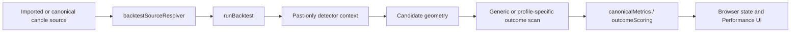
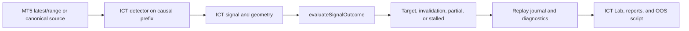
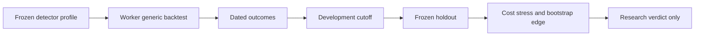

# BT0 Backtest Subsystem Inventory

## Inventory

| Subsystem | Exact files | State / owner | Inputs and outputs | Handling and persistence | Consumers / weaknesses |
|---|---|---|---|---|---|
| Generic browser backtester | `src/lib/backtesting/backtestTypes.ts`, `backtestConfig.ts`, `runBacktest.ts`, `outcomeScoring.ts` | Active research UI; browser-era | Candle array + one of five profiles -> candidates/outcomes/metrics | Past-only generic slices; static tick-like costs; browser/localStorage config | IFVG/CMD/consensus UI; futures-only symbol sanitizer, no durable lineage/resume, inconsistent entries |
| Replay dataset loader | `src/lib/backtesting/replayEngine.ts`, `backtestSourceResolver.ts`, `src/lib/candleSources/*` | Active/experimental | Canonical/imported candles -> replay-ready source | Memory/browser resolution | Limited history and browser lifecycle |
| Detector Worker wrapper | `src/lib/researchCycle/runDetectorProfileBacktest.ts`, `detectorProfileBacktest.worker.ts` | Active browser worker | Frozen detector profile + candles -> generic run | 120-second timeout/cancel; compact result | Inherits generic semantics; one browser worker, not a durable pool |
| ICT rolling replay | `src/lib/ict-strategy-suite/ictReplayValidation.ts`, `ictReplayValidationTypes.ts` | Active research | Signal + causal window -> classified replay outcome | Conservative same-bar invalidation; no costs; localStorage journal | Broad ICT suite; assumes fill, MFE-based `rrAchieved`, random IDs |
| MT5 real replay wrapper | `ictRealReplayRunner.ts`, `ictRealReplayRunnerTypes.ts`, `mt5ReadOnlyClient.ts` | Active research | Latest/range MT5 candles -> ICT report | Compact localStorage, max 100 reports | Current/latest windows; weak fingerprint, random IDs, no durable dataset |
| Generic walk-forward | `src/lib/walkForward/*` | Active research | Backtest config + candles -> chronological windows | In-sample/validation/OOS labels; compact browser state | Same frozen config per split, overlapping windows, no fit protocol or resume |
| Detector-profile holdout | `src/lib/detectorProfileWalkForward/*`, `scripts/test-detector-profile-walk-forward.mjs` | Active/frozen validation | Frozen profile + dated candidates -> OOS verdict | Minimum trade/date checks, cost stress, frozen cutoff | Strongest current workflow; not backed by canonical historical dataset identity |
| ICT OOS script | `scripts/test-ict-out-of-sample-validation.mjs` | Script-only/experimental | Chunked MT5 history + existing profile -> 30-day summaries | Fixed MC seeds; compact output | No training optimizer; 15-day overlap; cap/context mismatch documented |
| ICT Monte Carlo | `ictMonteCarlo.ts`, `ictMonteCarloTypes.ts` | Active research | ICT outcome classes -> R paths | IID replacement; additive R; localStorage max 100 | No costs/correlation/compounding; default seed time-based; ruin means drawdown threshold |
| Edge bootstrap | `src/lib/statistics/edgeStatistics.ts` | Active helper | R sample -> bootstrap CI | Seeded IID; default 1,000 iterations | Mean R only; minimum 20; no time dependence |
| Performance/account | `src/lib/performance/canonicalMetrics.ts`, `simulatedAccount.ts` | Active UI helper | Outcomes -> metrics/linear equity | Fixed $50k and 1% per R | Not a risk engine; limited metrics |
| Historical import | `src/lib/historicalData/historicalCandleImport.ts` | Active browser tool | CSV/XLSX/JSON -> candles | IndexedDB + localStorage active ID; first duplicate wins | Futures-only, machine-timezone parsing, naive gaps, no checksum/time authority/costs |
| Phase 3F manifest | `src/lib/v2/evidence/v2HistoricalDatasetManifest.ts`, `v2HistoricalDatasetManifestTypes.ts` | Frozen strong contract | Closed OHLCV + verified time policy -> SHA-256 manifest | Canonical identity; manifest only; raw candles excluded | Best piece to preserve; blocks unverified historical time; not integrated with runner storage |
| MT5 history API | `scripts/mt5-readonly-upstream.py` | Active read-only upstream | MT5 latest/range OHLC and spread -> JSON | Max 5,000 rows; range sorted then last `count` returned | No cursor/pagination or symbol-spec endpoint; not a two-year dataset service |
| Runtime hydration | `scripts/gotrader-historical-context-hydrator-core.mjs` | Qualified current-live runtime | Small multi-timeframe windows -> hydration | Max 300/timeframe; historical ineligible; no raw persistence | A3 current-live context, explicitly not a backtest source |
| Risk scaffolding | `src/lib/risk/riskDecisionTypes.ts` | Safety placeholder | Research decision -> fail-closed shape | No historical account state | No sizing, caps, exposure, or portfolio simulation |

## Call Graphs

### Generic Browser Path

### ICT Replay Path

### Detector-Profile Validation Path

### Phase 3F / B1 Lineage Path

The final graph is the intended lineage backbone, but no current two-year runner connects all nodes.

## Duplication And Ownership

- Entry, same-bar ordering, R calculation, classifications, and persistence are independently implemented in generic and ICT paths.
- Walk-forward/OOS is not one method: generic windows, detector-profile holdout, and script-only ICT windows differ materially.
- Monte Carlo consumes ICT labels rather than one immutable canonical trade ledger.
- UI/localStorage owns run lifecycle where a headless job service is needed.
- Phase 3F dataset lineage and B1 artifact lineage should own identity. Legacy engines should become temporary adapters.

## Test-Harness Reproducibility Finding

In a clean isolated worktree, `test:ict-replay-validation` and `test:ict-real-replay-runner` fail before assertions because their temporary ESM compiler includes `ictAdvisorEngine.ts` but does not copy/rewrite `../currentOpportunity`. BT0 did not modify code. This dependency-closure gap reduces reproducibility confidence but does not by itself prove the replay formulas wrong.
