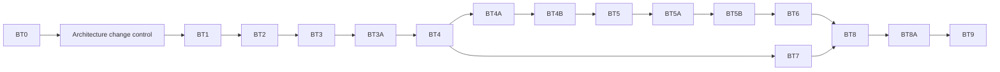

# BT0 Implementation Roadmap

## Program Rules

Each phase requires explicit authorization, a clean isolated worktree, a frozen parent commit, deterministic tests, authority `none/none/none`, and a committed report. No phase may infer production adoption from profitability. Phase names retain the requested BT0-BT9 structure. BT3A-BT8A are proposed details pending approval of `bt0-draft-change-control-record.md`; they are not adopted Architecture Index phases.

## BT0 - Forensic Audit

Status: complete in this branch with documented limitations.

Deliverables: concurrency preflight, inventory/call graphs, strategy matrix, historical/time, causality/simulation, R:R/CFD/cost, risk/portfolio, statistics/OOS/MC, scored gaps, requirements, architecture, and roadmap.

Gate: source reliably characterized; limitations explicit; no code or strategy changes.

## BT1 - Historical Dataset And Time Foundation

Build read-only paged MT5/import adapters, partitioned immutable storage, Phase 3F-derived manifests, symbol-spec snapshots, gap/revision ledgers, and resumable ingestion.

Acceptance: deterministic checksum on rerun; winter/summer/DST transition and maintenance-boundary time probes; two-year completeness for representative symbols/timeframes; point/pip metadata; restart/resume; bounded storage; no strategy execution.

BT1 is the recommended next phase, after `ACC-BT-B1.4` approves the subsystem boundary and after live-probe concurrency is safe.

## BT2 - Canonical Opportunity And Trade Simulation

Implement the as-of detector capability, opportunity schema, order/fill lifecycle, conservative/ambiguous intrabar policies, gaps, exits, immutable trade ledger, and gross/net cost plumbing.

Acceptance: future-append invariance, HTF-close timing, all OHLC ambiguity matrices, deterministic seals, restart/resume, raw price/point/pip/R distinction, no strategy modifications.

## BT3 - Strategy Adapter Migration And Parity

Adapt executable manifest profiles one family at a time. Start with IFVG v2 negative control and IFVG v3 positive canary, then IFVG v1/v4, CMD, Silver Bullet, Turtle Soup, CISD, session raid, and Phase 2 strategies. Placeholder/diagnostic entries remain non-trading.

Acceptance: same identified inputs, opportunity geometry/blocker parity or approved explained delta, frozen hashes unchanged, representative session/ambiguity fixtures, coverage matrix updated.

### BT3A - Strategy Parameter Schemas

After each adapter reaches parity, inventory every detector, filter, geometry, execution, cost, and risk dimension. Publish typed ranges/distributions/resolutions, defaults, frozen state, causal status, identity effect, and sweep authorization. Mark hardcoded or coupled behavior `NOT_EXPOSED` or `INSEPARABLE` rather than inventing controls.

Acceptance: every executable family has a versioned schema; frozen canaries remain unchanged; invalid/range/dependency fixtures pass; detector-rerun and post-detection dimensions are distinguished; authority remains `none/none/none`.

## BT4 - R:R, Cost, And Performance Analytics

Implement native geometry and separately identified RR sweeps, versioned broker cost models, one metric formula registry, performance cubes, and gross/net attribution.

Acceptance: formula fixtures, null/denominator policies, point/pip/R/cash conversions, static/dynamic cost sensitivity, native geometry never mutated.

### BT4A - Canonical Metrics And Experiment Hierarchy

Implement research-program -> strategy-family -> experiment-family -> configuration -> instrument/era child identities, an immutable all-trial ledger, and the canonical net-daily-return Sharpe contract. Add complete funnel counts, trial dispositions, full population/survivor distributions, complexity, and predeclared parameter-neighborhood reporting.

Acceptance: deterministic content identities; every attempted/rejected/canceled/failed trial retained; daily Sharpe includes eligible zero-return days and identified annualization/risk policy; trade-return quality is separately named; top-only reporting cannot satisfy the gate.

### BT4B - Statistical Correction, Nulls, And Ablation

Implement preregistered family statistics, raw and adjusted p-values, BH-FDR, Holm/Bonferroni, accepted dependent-selection diagnostics, constrained null generators, paired ablation children, and assumption/applicability reporting.

Acceptance: known-distribution fixtures; correction parity fixtures; dependency assumptions explicit; null seed/run/cost/population identity retained; Monte Carlo never substitutes for a no-edge null; frozen profiles are not mutated.

## BT5 - Walk-Forward And OOS

Implement frozen chronological plans, warmup, rolling/anchored choices, trial ledger, development/validation/untouched OOS boundaries, minimum dates/trades, and independent window reporting.

Acceptance: no overlap unless declared; no OOS selection; deterministic selection replay; negative/positive controls behave as frozen; insufficient samples fail honestly.

### BT5A - Era And Cold-Instrument Validation

Add predeclared era splits, decay/concentration summaries, and sealed instrument roles. When cross-instrument generalization is claimed, discovery instruments and all selections freeze before the cold instrument is unlocked. Instrument-specific strategies may explicitly decline that claim.

Acceptance: median/worst/best/dispersion by era; cold instrument cannot influence discovery; symbol specs and CFD event calendars remain broker identified; failures and insufficient samples are immutable outcomes.

### BT5B - Sealed Holdout Governance

Implement a one-way `sealed -> unlocked -> consumed` controller linked to dataset, configuration freeze, parent experiment family, authorization, and result seal. Viewing a pass, failure, or insufficient result consumes the holdout.

Acceptance: transition and tamper fixtures; no reset or retuning path; post-consumption research requires a new experiment family and genuinely untouched holdout; no holdout-derived calibration or authority.

## BT6 - Monte Carlo Robustness

Consume immutable net-R ledgers with retained seeds. Add IID and block/regime-aware resampling, confidence intervals, drawdown/time-under-water, literal ruin definitions, and cost uncertainty.

Acceptance: seed reproducibility, known-distribution fixtures, sequence sensitivity, transparent assumptions, no promotion authority.

## BT7 - Risk And Portfolio Simulation

Implement separate sizing/risk policies, compounding options, MT5 lot rounding where enabled, simultaneous trades, capital/margin contention, governors, combined equity, correlation, and diversification.

Acceptance: strategy ledger unchanged across risk policies; concurrency/capital fixtures; gap/margin tests; deterministic portfolio ordering and seals.

## BT8 - Comparison And Reporting

Add headless report generation and UI read models for strategy/profile/dataset/cost/RR/risk comparisons, trade drill-down, uncertainty, and artifact lineage. GBrain remains compact advisory retrieval only.

Acceptance: UI cannot mutate authoritative artifacts; native and RR-sweep results are visually distinct; large reports stay bounded; exports reproduce parent hashes.

### BT8A - Large-Scale Search Operations

Add resumable exact-grid and deterministic bounded random/low-discrepancy plans, search budgets, cached causal parent reuse, staged elimination, bounded workers, and full trial/funnel exports. Adaptive/Bayesian search may be added only with preregistered seed, prior/acquisition policy, budget, and stopping rule inside the same family.

Acceptance: interrupted searches resume identically; parallel order does not change IDs/results; every trial remains reportable; detector-rerun and post-filter costs are benchmarked; 25,000-configuration planning fails closed when projected time/disk/memory/null expansion exceeds the authorized budget.

## BT9 - Two-Year Acceptance

Run the accepted two-year program across every eligible strategy/profile and representative broker symbol/timeframe set.

Acceptance requires:

- verified complete dataset and historical time/DST;
- exact committed code/profile/cost/risk identities;
- deterministic rerun and successful interruption/resume;
- zero lookahead violations and documented ambiguity counts;
- full executable strategy adapter coverage;
- walk-forward/OOS/Monte Carlo and portfolio results with sample sufficiency;
- bounded wall-clock, memory, disk, and worker concurrency;
- sealed canonical artifacts and report lineage;
- all authority/readiness/production/execution fields unchanged and disabled.

A failed strategy edge is a valid BT9 research result. A failed infrastructure, identity, time, or safety criterion is not.

## Dependencies

## Explicitly Not Authorized

BT0 does not authorize production code implementation, deep-history downloads, strategy/filter changes, risk-policy changes, calibration, evidence creation, Paper Demo, B1.4 activation, broker access beyond future approved read-only probes, production adoption, or execution.
