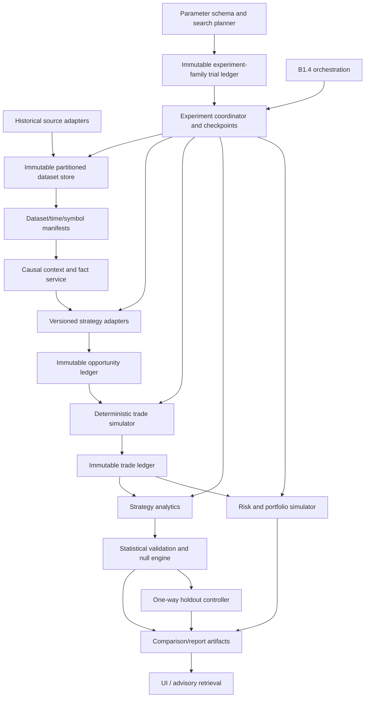

# BT0 Recommended Architecture

## Decision

Build a `NEW_CANONICAL_BACKTEST_SUBSYSTEM`. Do not put the implementation directly inside B1.4 and do not refactor legacy engines in place.

B1.4 should call the subsystem through sealed B1 research contracts. B1.4 owns authorization, scheduling, request/artifact lineage, and policy. The backtest subsystem owns historical datasets, causal adapters, deterministic simulation, analytics, job checkpoints, and reports. This keeps the engine reusable by the UI, CLI, future strategies, risk simulation, and controlled B1 jobs.

## Component Model



## Ownership Boundaries

| Component | Owns | Must not own |
|---|---|---|
| Dataset service | Paging, normalization, time contracts, checksums, gaps/revisions, symbol specs | Strategy results or authority |
| Context/fact service | As-of causal derived facts and warmup | Future candles or trade outcomes |
| Strategy adapter | Frozen detector/profile and native opportunity geometry | Costs, sizing, readiness |
| Trade simulator | Fill, intrabar, gap, exit, costs, immutable trade ledger | Parameter selection or portfolio sizing |
| Strategy analytics | Gross/net trade metrics and validation tables | Account risk rules |
| Parameter/search service | Typed family schemas, deterministic plans, budgets, seeds, trial identities | Mutating frozen profiles or discarding weak trials |
| Statistical validation | Funnel, corrected significance, nulls, ablations, complexity, neighborhoods, era/cold analysis | Choosing parameters from holdout or granting authority |
| Holdout controller | Sealed/unlocked/consumed state and immutable authorization/result seals | Retuning, reset, or result deletion |
| Risk/portfolio simulator | Sizing, contention, equity, exposure/correlation | Detector mutation |
| Experiment coordinator | Identity, dependency DAG, checkpoints, retries, sealing | Trading or evidence authority |
| B1.4 | Authorized job request, lineage, scheduling, policy, compact result consumption | Internal engine semantics |
| UI/GBrain | Compare/read compact derived results | Authoritative storage, mutation, promotion |

## Canonical Artifacts

1. `HistoricalDatasetManifest`: Phase 3F-derived checksum/time/source identity plus partition index and symbol spec.
2. `BacktestExperimentManifest`: strategy/profile/parameters, geometry, costs, simulator, code commit, seed, date/timeframe scope.
3. `CanonicalOpportunity`: as-of decision and immutable native trade geometry.
4. `TradeSimulationRecord`: activation, fill, path policy, exit, gross/net R, costs, MAE/MFE, ambiguity.
5. `TradeLedgerSeal`: ordered record hashes and counts.
6. `ValidationPlan`: train/validation/OOS windows, warmup, trial selection, minimum samples.
7. `AnalyticsReport`: versioned formulas and parent seals.
8. `RiskPortfolioExperiment`: independent risk policy and parent trade-ledger seal.
9. `ParameterSchema`: typed dimensions, distributions/resolutions, frozen/causal/sweep status, and namespace.
10. `ExperimentFamilyLedger`: hierarchy, search plan/budget/seed, every trial disposition, and stage counts.
11. `StatisticalValidationReport`: formulas, canonical Sharpe, corrections, nulls, ablations, neighborhoods, eras, cold-instrument state, and full survivor distributions.
12. `HoldoutSeal`: dataset/freeze/family identity plus one-way sealed/unlocked/consumed timestamps and result seal.
13. `JobCheckpoint`: stage/partition cursors and dependency hashes.

Every artifact is content-addressed or canonically hashed, finalized atomically, and immutable after seal.

## Native And Standardized Geometry

A detector emits only native strategy geometry. The simulator runs `NATIVE_STRATEGY_GEOMETRY` first. An RR sweep creates child opportunities/results labeled `STANDARDIZED_RR_EXPERIMENT`, preserving the parent and target derivation. UI comparison must not blend those modes.

## Adapter-First Migration

```text
legacy engine + canonical adapter
        -> same identified fixture/dataset
        -> shadow opportunity/trade comparison
        -> explained differences
        -> parity seal
        -> explicit adoption
```

Migration protections:

- IFVG v3 stays the positive canary.
- IFVG v2 stays the negative control.
- Frozen strategy/profile hashes are unchanged.
- Legacy results remain readable and immutable.
- A difference in entry, stop, target, blocker, cost, or outcome fails parity unless explicitly approved.
- No legacy path is retired until its adapter has representative normal, blocker, ambiguous, and session-transition parity.

## Storage And Execution

Use filesystem-backed or embedded-database authoritative storage in an isolated research root, with compact columnar partitions and JSON manifests/reports. IndexedDB/localStorage may cache views only. Run a headless coordinator with bounded workers. Partition by dataset/symbol/time slice for ingestion and by sealed dataset/strategy for detection; preserve deterministic ordering before sealing.

Large searches separate detector-rerun dimensions from cheap post-detection filters. Causal fact/opportunity caches are content-addressed parents and may be reused only when every upstream identity matches. Staged elimination retains all trial rows and reasons. Adaptive search cannot escape its original experiment family. Search, null, ablation, era, cold-instrument, and holdout runs are deterministic child jobs with independent checkpoints and bounded expansion budgets.

## B1.4 Change Control

The frozen roadmap currently describes B1.4 historical replay/walk-forward after time authority. The recommended responsibility split is a material clarification. Before implementation, create an Architecture Change Control record titled approximately:

`ACC-BT-B1.4: Canonical Backtest Subsystem Boundary And B1.4 Orchestration Contract`

It should record scope, parent baseline, interfaces, migration controls, authority matrix, storage ownership, historical-time gate, parameter/search ownership, experiment-family lineage, statistical/null services, holdout lifecycle, compatibility tests, rollback/read-only behavior, and the exact roadmap/index wording. Do not silently edit the Architecture Index.

BT0's proposed, explicitly unadopted record is `bt0-draft-change-control-record.md`.

## Safety

All subsystem and B1 responses retain:

```text
executionAuthority: none
brokerAuthority: none
readinessOverrideAuthority: none
productionAdoptionAllowed: false
canCreateEvidence: false
canApproveReadiness: false
canApplyCalibration: false
canCreateTradeIntent: false
```

Historical results can recommend further research only. Any later evidence/readiness phase requires separate explicit governance and cannot inherit authority from BT0-BT9.
