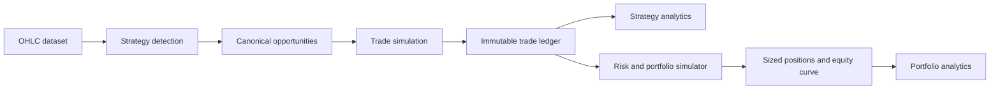

# BT0 Risk And Portfolio Audit

## Current Risk Logic

| Capability | Current state |
|---|---|
| Fixed R | Present as outcome normalization and simple account projection |
| Fixed dollar | Hardcoded through a $50,000 illustrative account and $500 per R |
| Fixed percent | Illustrative 1% per R; not a historical sizing engine |
| Equity compounding | Not implemented |
| Daily / weekly loss caps | Not implemented historically |
| Concurrent risk | Not implemented |
| Correlated exposure | Not implemented |
| Drawdown throttle | Not implemented |
| Loss-streak throttle | Not implemented |
| News governor | Research/runtime context exists, not portfolio replay |
| Session governor | Detector/context filters exist, not account risk policy |
| Margin / leverage / stop-out | Not implemented |
| Position sizing in MT5 lots | Not implemented in backtesting |

`src/lib/risk/riskDecisionTypes.ts` is fail-closed safety scaffolding. It does not replay account state. `simulatedAccount.ts` creates a linear illustrative equity series and must not be interpreted as portfolio risk validation.

## Signal Quality Versus Risk

Current architecture conceptually separates research signals from authority, but some result surfaces mix:

- target-first classification;
- MFE-derived `rrAchieved`;
- realized/marked R;
- fixed-percent account projection.

The canonical boundary should be an immutable trade ledger. Strategy analytics consume trades without changing sizing. Risk simulation consumes the same trades and applies a separately identified risk policy. This permits one strategy result to be evaluated under multiple sizing policies without changing detector quality.

## Portfolio Capability

Current infrastructure cannot reliably simulate:

- overlapping trades from different strategies;
- two opportunities on the same symbol;
- cross-symbol positions;
- shared capital or margin contention;
- strategy priority when risk capacity is exhausted;
- combined mark-to-market equity;
- common-session and common-factor exposure;
- strategy return/drawdown correlation;
- portfolio loss caps or recovery rules.

The generic profile runner suppresses some overlapping candidates with an `activeUntilIndex` mechanism, but that is single-stream duplicate avoidance, not portfolio simulation.

## Required Risk Policy Identity

A future risk experiment must include:

- `riskModelId` and version;
- initial equity and account currency;
- fixed-R, fixed-cash, or fixed-percent sizing mode;
- MT5 lot rounding policy and broker symbol-spec snapshot when cash sizing is enabled;
- compounding policy;
- per-trade, per-symbol, per-strategy, and aggregate risk limits;
- daily/weekly drawdown and loss-streak governors;
- exposure/correlation grouping;
- conflict and priority policy;
- gap, margin, and stop-out assumptions;
- seed where stochastic fills/slippage are used.

## Recommended Flow

This target fits GoTrader's compatibility-first and authority-separated architecture. It prevents risk policy changes from silently changing strategy evidence.

## Safety Boundary

Historical risk output is research-only. It cannot approve readiness, apply calibration, create trade intent, enable Paper Demo, or affect broker/production execution. GBrain may retrieve compact advisory summaries only after a separate contract is approved; it is never authoritative storage.
