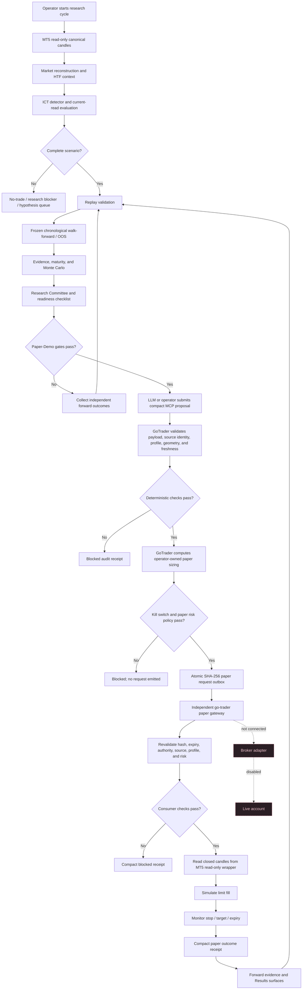

# GoTrader Cycle To Paper Execution Flow

## Implemented Boundary

The implemented path follows this rule:

> The LLM proposes and initiates. GoTrader validates and sizes. The independent paper gateway simulates and monitors.

The final clause is deliberately paper-only today. The gateway has no broker imports, credentials, or live mode. Current IFVG v3 evidence remains `not_ready`, so no request is emitted until deterministic readiness and untouched forward-evidence gates pass.

## Process Diagram



## Independent Consumer

From the sibling execution-engine repository:

```powershell
cd "C:\Users\andre\OneDrive\Documents\go-trader"

$env:GOTRADER_PAPER_CONSUMER_ENABLED="true"
$env:GOTRADER_PAPER_CONSUMER_KILL_SWITCH="false"
$env:GOTRADER_PAPER_CONSUMER_MAX_DAILY_LOSS_R="4"
$env:GOTRADER_PAPER_CONSUMER_MAX_ACTIVE="1"

python shared_scripts/gotrader_paper_gateway.py `
  --request-dir "C:\Users\andre\OneDrive\Documents\gotrader\.gotrader\paper-demo-outbox" `
  --receipt-dir "C:\Users\andre\OneDrive\Documents\gotrader\.gotrader\paper-demo-receipts" `
  --state-file "local\gotrader-paper-gateway-state.json" `
  --mt5-wrapper-url "http://127.0.0.1:7341"
```

The default policy is disabled with the kill switch active and zero risk capacity. The consumer only issues HTTP GET requests to the MT5 read-only wrapper. Ambiguous candles that touch both stop and target resolve to the stop, and the entry candle is not used to claim an outcome because intrabar ordering is unknown.

## Future Broker-Demo Boundary

A real broker-demo gateway is not implemented by this change. It must be a separately reviewed service that independently revalidates the same deterministic approval, uses demo-only credentials, reconciles acknowledgements and positions, and fails closed on disconnect. Live execution requires a later explicit authorization project; neither the LLM nor this paper gateway can grant it.
