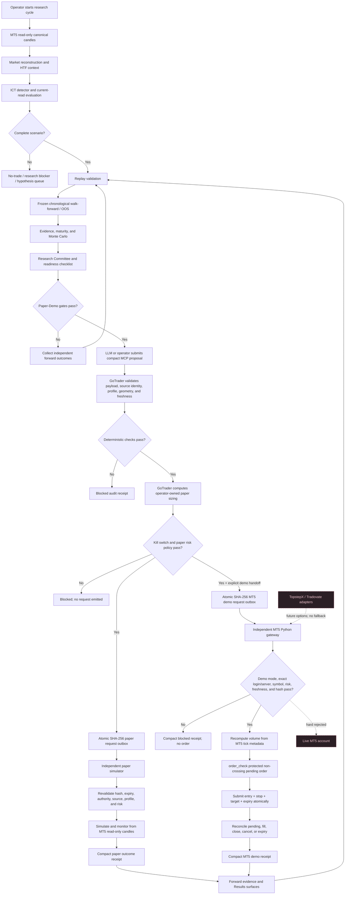

# GoTrader Cycle To Paper Execution Flow

## Implemented Boundary

The implemented path follows this rule:

> The LLM proposes and initiates. GoTrader validates and sizes. The independent MT5 gateway executes and monitors on a positively verified demo account.

The independent paper simulator remains the first outcome lane. A separate MT5 gateway can submit only protected demo pending orders and monitor their state. It rejects live accounts, defaults disabled, and has its own kill switch, exact account/server allowlists, risk sizing, one-active-order policy, immutable request validation, and reconciliation. Current IFVG v3 evidence remains `not_ready`, so no MT5 request is emitted until deterministic readiness and untouched forward-evidence gates pass.

## Process Diagram



## Independent Consumer

From the sibling execution-engine repository:

```powershell
cd "C:\Users\andre\OneDrive\Documents\go-trader"

$env:GOTRADER_PAPER_CONSUMER_ENABLED="true"
$env:GOTRADER_PAPER_CONSUMER_KILL_SWITCH="false"
$env:GOTRADER_PAPER_CONSUMER_MAX_DAILY_LOSS_R="4"
$env:GOTRADER_PAPER_CONSUMER_MAX_ACTIVE="1"

python shared_scripts/gotrader_paper_gateway.py `
  --request-dir "C:\Users\andre\OneDrive\Documents\gotrader\.gotrader\paper-demo-outbox" `
  --receipt-dir "C:\Users\andre\OneDrive\Documents\gotrader\.gotrader\paper-demo-receipts" `
  --state-file "local\gotrader-paper-gateway-state.json" `
  --mt5-wrapper-url "http://127.0.0.1:7341"
```

The default policy is disabled with the kill switch active and zero risk capacity. The consumer only issues HTTP GET requests to the MT5 read-only wrapper. Ambiguous candles that touch both stop and target resolve to the stop, and the entry candle is not used to claim an outcome because intrabar ordering is unknown.

## MT5 Demo Broker Boundary

The sibling `go-trader` repository contains `shared_scripts/gotrader_mt5_demo_gateway.py`. It is the only GoTrader component allowed to import `MetaTrader5`. It consumes the compact MT5 demo outbox, verifies the local terminal is logged into an exact allowlisted demo account and server, independently sizes the request, sends one protected pending order, and reconciles compact status receipts.

Live MT5 accounts are hard blocked. TopstepX and Tradovate remain future options and are not automatic fallbacks. Neither the LLM nor the research app can grant broker authority, change the demo-account requirement, bypass risk checks, or promote readiness.

See the exact setup and operator commands in the sibling repository at `docs/gotrader-mt5-demo-gateway.md`.

The normal `Start-GoTrader.cmd` supervisor starts research and read-only services only. It deliberately does not auto-start the broker-capable MT5 demo gateway. Starting that process requires the separate explicit demo-account configuration and probe described in the runbook.
