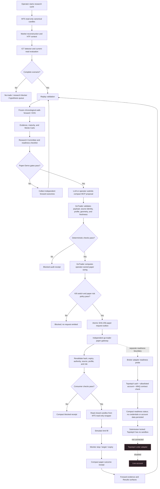

# GoTrader Cycle To Paper Execution Flow

## Implemented Boundary

The implemented path follows this rule:

> The LLM proposes and initiates. GoTrader validates and sizes. The independent paper gateway simulates and monitors.

The final clause is deliberately paper-only today. The gateway has no broker imports, credentials, or live mode. Current IFVG v3 evidence remains `not_ready`, so no request is emitted until deterministic readiness and untouched forward-evidence gates pass.

## Process Diagram



## Independent Consumer

From the sibling execution-engine repository:

```powershell
cd "C:\Users\andre\OneDrive\Documents\go-trader"

$env:GOTRADER_PAPER_CONSUMER_ENABLED="true"
$env:GOTRADER_PAPER_CONSUMER_KILL_SWITCH="false"
$env:GOTRADER_PAPER_CONSUMER_MAX_DAILY_LOSS_R="4"
$env:GOTRADER_PAPER_CONSUMER_MAX_ACTIVE="1"

python shared_scripts/gotrader_paper_gateway.py `
  --request-dir "C:\Users\andre\OneDrive\Documents\gotrader\.gotrader\paper-demo-outbox" `
  --receipt-dir "C:\Users\andre\OneDrive\Documents\gotrader\.gotrader\paper-demo-receipts" `
  --state-file "local\gotrader-paper-gateway-state.json" `
  --mt5-wrapper-url "http://127.0.0.1:7341"
```

The default policy is disabled with the kill switch active and zero risk capacity. The consumer only issues HTTP GET requests to the MT5 read-only wrapper. Ambiguous candles that touch both stop and target resolve to the stop, and the entry candle is not used to claim an outcome because intrabar ordering is unknown.

## Broker Adapter Readiness Boundary

The sibling `go-trader` repository now contains `shared_scripts/gotrader_broker_adapter.py`. It provides a non-network local demo adapter and a TopstepX readiness probe that authenticates, verifies an allowlisted account, and resolves an active MNQ contract. It does not import the existing live adapter and cannot submit, cancel, modify, close, or reconcile broker state.

TopstepX currently has no sandbox, so a real broker-demo submission route cannot be made safe merely by setting `live: false` on contract search. Broker submission remains locked until an account class can be positively verified, the deterministic forward-evidence gate passes, and a separately reviewed gateway can submit protected orders and reconcile acknowledgements independently. Neither the LLM nor the research app can grant that permission.
