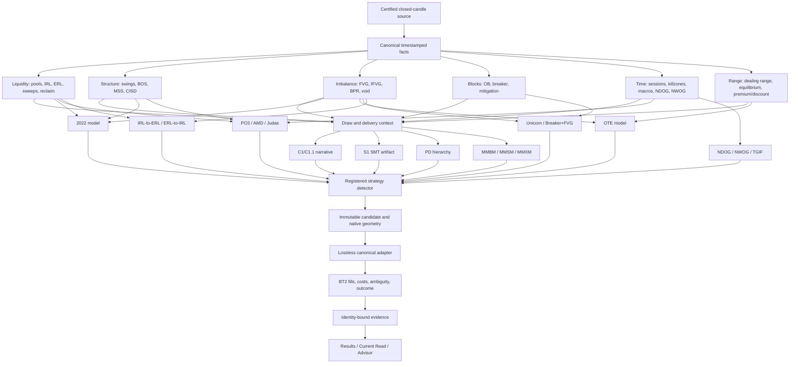

# I0 Canonical Dependency Graph

## Shared Dependency Estimate

I1 has eight shared ownership packages: time identity, swing/structure, liquidity/IRL/ERL, imbalance, block taxonomy,
dealing-range/PD hierarchy, C1 projection contract, and S1 projection contract. A ninth cross-cutting package is the
strategy model/adapter identity contract. Reusing these nine packages avoids detector forks across roughly twenty
requested model names.

## Boundary Rules

- Facts are closed-candle causal and expose validFrom/confirmedAt where recognition needs later candles.
- C1/C1.1 provides structuralBias, currentFlowDirection, setupMaturationDirection, retracementState,
  continuationState, and liquidity path. Strategies declare policy; they do not rebuild flat timeframe voting.
- S1 is the only SMT owner. Models declare disabled, optional, required, or opposing-blocks.
- Strategies own detection, state progression, blockers, expiry, and geometry intent.
- Adapters are lossless and fail closed. BT2 owns fills, spread, slippage, commission, same-bar ordering, and outcome.
- Evidence and UI may not repair, override, or reinterpret a detector identity.

## Critical Path

Canonical time/swing/liquidity identity precedes IRL/ERL, opening-gap models, 2022, PO3, MMXM, and TGIF. Block and FVG
parity precedes Unicorn. Dealing-range parity precedes OTE. Charter work remains off the graph until source packets
resolve whether its labels map to existing nodes.
