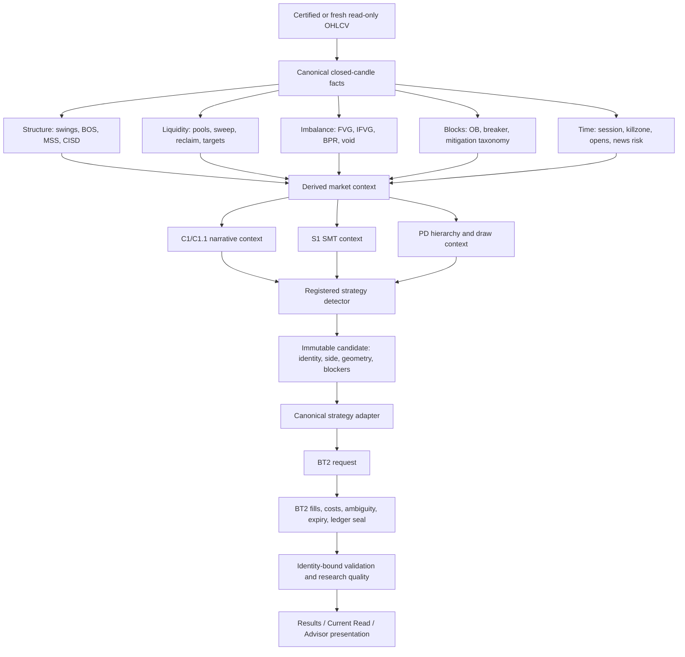

# I0 Canonical Dependency Graph

## Boundary Rules

- Data adapters may normalize timestamps and symbols but may not create ICT direction.
- Canonical facts are timestamped and closed-candle causal.
- Context can block or qualify a setup; it cannot manufacture detector geometry.
- Strategy detectors own setup semantics and native entry/stop/target intent.
- Adapters are lossless and fail closed.
- BT2 owns simulation mechanics and ledger truth.
- Evidence binds strategy, profile, parameters, source, dataset/certificate, code, and run.
- Presentation reads immutable records and labels unavailable or historical data honestly.

## Current Dependency Gaps

- Duplicate fact implementations prevent a single canonical lineage across all strategies.
- C1/C1.1 adoption is limited to Current Read.
- S1 cannot supply accepted live/historical context until peer freshness/certification passes.
- Several strategy catalog rows terminate at recognition or placeholder layers.
- Results and readiness remediation remain separate product-integrity slices and are not solved by this audit.
