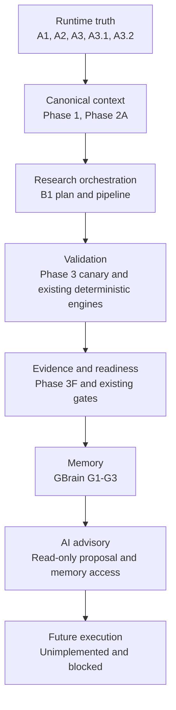
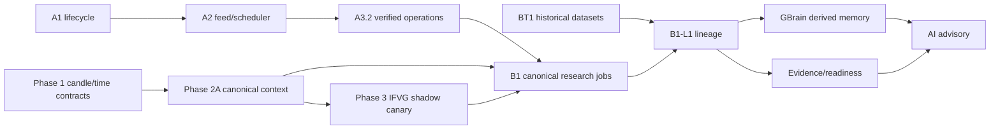

# GoTrader Architecture Index

Status: frozen accepted-architecture index

Index revision basis: `2cc5a2afccdc0f3043e2d471f9261b18d6f657ca`

Planning branch: `codex/gotrader-runtime-freeze-baseline`

Frozen runtime baseline:
`e605c10ed6681512da89fa2a4b29791b03a67168`

## 1. Purpose

This is the first document reviewers must consult before changing GoTrader
architecture. It records accepted designs, implemented baselines, operational
acceptance, governing dependencies, and implementation gates.

This index does not authorize runtime work. It introduces no service,
repository, scheduler, contract, lineage runtime, MCP capability, GBrain
mutation, strategy promotion, evidence authority, readiness authority, broker
authority, or execution authority.

The repository and the frozen Git objects listed here are the source of truth.
Branch names are informational because branches move. A frozen record is
identified by:

1. repository or worktree;
2. document path;
3. source commit;
4. Git blob ID.

## 2. Status Model

Every record uses three independent status axes.

### 2.1 Document status

| Status | Meaning |
| --- | --- |
| `planning` | Draft architecture not yet accepted. |
| `accepted` | Reviewed architecture or evidence retained as authoritative. |
| `superseded` | Retained for history but replaced by a named record. |
| `deprecated` | No longer suitable for new work. |
| `merged` | Accepted content incorporated into a later governing record. |
| `blocked` | Document acceptance awaits a named prerequisite. |
| `archived` | Historical record only. |

### 2.2 Implementation status

| Status | Meaning |
| --- | --- |
| `not_started` | No implementation exists. |
| `partial` | Some governed behavior exists. |
| `complete` | Defined implementation and deterministic tests exist. |
| `not_applicable` | The record is policy, evidence, or planning only. |

### 2.3 Operational status

| Status | Meaning |
| --- | --- |
| `not_run` | No operational observation is required or available. |
| `blocked` | A required operational gate has not passed. |
| `partial_acceptance` | Useful live evidence exists but the full gate is open. |
| `accepted_with_limitations` | The gate passed with named limitations. |
| `accepted` | The full named operational gate passed. |

An accepted design is not proof of an accepted runtime. A complete
implementation is not permission to adopt it in production.

## 3. Current Baseline

| Area | Current status |
| --- | --- |
| V2 architecture | Accepted compatibility-first direction. |
| Runtime A1 | Implemented; accepted with documented limitations. |
| Runtime A2 | Implemented; accepted with feed/observation limitations. |
| Runtime A3 | Implemented but operationally blocked; superseded by A3.1/A3.2 qualification. |
| Runtime A3.1 | Four-hour observation complete; partial acceptance only. |
| Runtime A3.2 | Implementation complete; accepted with one documented observer-transition limitation. |
| Runtime Freeze | Complete; exact runtime and allowlisted file hashes frozen. |
| Baseline Review | Complete; integrity, lineage, compatibility, and authority checks passed. |
| Phase 2A | Deterministic shadow canonical context engine complete. |
| Phase 3A-3F | IFVG shadow canary chain implemented in stages; no production adoption. |
| GBrain G1-G2 | Read-only sidecar and MCP research-memory facade accepted. |
| GBrain G3 | Accepted in isolation; now eligible for a separate baseline-integration decision. |
| B1.0 | Contracts, authority, validation, identity, and fixtures are accepted in an isolated worktree; no runtime adoption. |
| B1.1 | Local deterministic engine and compact repository are accepted in isolation with zero production consumers. |
| B1.2 | Live context-lineage canary implemented and authorized in an isolated shadow profile; operational acceptance pending. |
| B1.3-B1.6 | Unauthorized until each separate prerequisite and gate passes. |
| BT1 | Canonical historical dataset foundation complete in isolation with documented MT5 historical time/DST limitations. |
| BT2 | Blocked pending accepted historical time/DST authority, a verified two-year dataset, and separate authorization. |
| B2-B4 | Reserved names only; unspecified and unauthorized. |
| Future execution | Unimplemented and blocked. |

## 4. Frozen Commit Registry

The short labels below are used in the master tables.

| Label | Repository/worktree | Source commit |
| --- | --- | --- |
| `V2-SPEC` | GoTrader planning lineage | `15e55d439b1394b6be2d8271aff32f9b7a70bedf` |
| `V2-VERIFY` | GoTrader planning lineage | `a432d9e74c331045fef0cc7c0c8779fd24be8c0c` |
| `V2-P0` | GoTrader planning lineage | `247b59c483bdf5a182319a8277741639de41a0a1` |
| `V2-MANIFEST` | GoTrader planning lineage | `96de5a1cd69bbf0a7503e3bf0477bb263808af81` |
| `V2-TESTS` | GoTrader planning lineage | `e2b0609394ebf423c8c174f6c9c8f9762f4c1b1c` |
| `P1-DESIGN` | GoTrader planning lineage | `76b68ef8c8987ac56c37cd91e5248ffd9e55afb6` |
| `P1-REPORT` | GoTrader planning lineage | `5ed99fec3d6cefa0d335c1bb907e563b606d2eb9` |
| `P1.5` | GoTrader planning lineage | `02ef325957b6a087045b0166048ffc41e1e649c0` |
| `P1.6` | GoTrader planning lineage | `f364d322930b877d507d71586f93dc3a930a6f55` |
| `P1.7` | GoTrader planning lineage | `9c9747ee7227634d2d37fb76c9e6227dd86d7d9c` |
| `P1.7-REPORT` | GoTrader planning lineage | `345ea12712e8dc875d0f6ab106ae8f24ede9c781` |
| `P2A0` | GoTrader planning lineage | `5f873b24d94857b08eccdd95c62f2974576d3b34` |
| `P2A1` | GoTrader planning lineage | `a1c50861a35ef249324704c745f8fa275e0f3e87` |
| `P2A2` | GoTrader planning lineage | `b7f8171daf911fe5eb9bd2d3ffd96f96d67fe06e` |
| `P2A3` | GoTrader planning lineage | `1361c0377e4dd339c1607a411f84467d9852352c` |
| `P2A4` | GoTrader planning lineage | `095d45a808f7d4831d1245e3665cda26f2ea0dc8` |
| `P2A5` | GoTrader planning lineage | `aba81c5f823b58916dedf04d0b36fcb77966df35` |
| `P2A6` | GoTrader planning lineage | `4655c37117c1d712d18fb33a08bf76ddf9512cb4` |
| `P2A-COMPLETE` | GoTrader planning lineage | `e2b0609394ebf423c8c174f6c9c8f9762f4c1b1c` |
| `P2A-REPORT` | GoTrader planning lineage | `5e0c280bf339f5eb8d5f28fe984eaf4ed26b7d92` |
| `P3A` | GoTrader planning lineage | `46503319fe8650e86d2363c0d725323b20a019b7` |
| `P3A1` | GoTrader planning lineage | `8811d0b649c0a628d357659f8ce068ecdee1d0ee` |
| `P3B` | GoTrader planning lineage | `6e2136039c8cdeb0cddb2f58bb983b24d71cb32d` |
| `P3C` | GoTrader planning lineage | `6eb199d59042f984e63fed4a9176f9f8f435972f` |
| `P3D` | GoTrader planning lineage | `a9e5defc49009f3fd91bcffb4b86bf56391972de` |
| `P3E` | GoTrader planning lineage | `a62d7a52055be9fe94da4355b3cac9823be33d6e` |
| `P3E-HANDOFF` | GoTrader planning lineage | `1e553d623b3dad63b9d81d4afa9fdb468d95b121` |
| `P3F` | GoTrader planning lineage | `dadee75f962e13682aa62083a08201d63a3ba273` |
| `A1` | Runtime lineage | `d1d47b53c3d6756a8d01e19451c82c53ef1865d2` |
| `A2` | Runtime lineage | `f6645b919475f46e99d3639274b15de0bc06752c` |
| `A3` | Runtime lineage | `168ee5a776b13f9e4522e459e68c3e728afc0499` |
| `A3-OPS` | Runtime lineage | `1e10113b72f216746ea4957463f8f1116134177d` |
| `A3.1` | Runtime lineage | `b1f7b7f8718faecfeebb53dcdf9d1f82f1f83da1` |
| `A3.2` | Runtime lineage | `e605c10ed6681512da89fa2a4b29791b03a67168` |
| `A3.2-OBSERVED` | Runtime lineage | `841cf965172b04d4dfd5dcfc797d12d907bd56b6` |
| `A3.2-OBSERVER-FIX` | Runtime lineage | `e91baa633ad52be67ab07d040562824e83dcb994` |
| `RUNTIME-FREEZE-AUDIT` | Runtime Freeze lineage | `908c3abf6573f2c5902f39c0a3689bc6ba85aa0c` |
| `RUNTIME-FREEZE` | Runtime Freeze lineage | `2cc5a2afccdc0f3043e2d471f9261b18d6f657ca` |
| `GB-G1` | Isolated GBrain lineage | `7a64d97d02c166f3bfb7105060a8f8f1780d9625` |
| `GB-G2` | Isolated GBrain lineage | `29ae35634007f2fea9a1b74f0a71abe809c26e86` |
| `GB-G3-BACKFILL` | Isolated GBrain lineage | `0cda33388cd08d0389d249751780bd6e90d1b385` |
| `GB-G3` | Isolated GBrain lineage | `7b8853ca3a62a1e3c4d259d4c03fd6129fe33d88` |
| `B1-PLAN` | B1 planning worktree | `33e10e34c65b0d7fb18368d8c9ff9518d322abe0` |
| `B1-FIXTURES` | B1 planning worktree | `d4261e6e39f7a0e0f821ab333002be6573a29fe8` |
| `B1-PIPELINE` | B1 planning worktree | `a9564d888b86b2548f37b882f39c7229af6c11f4` |
| `B1-L1` | B1 planning worktree | `f73b219d9574586f49340138a6a99b5bacb59210` |
| `B1.0-IMPLEMENTATION` | `codex/gotrader-b1-0-authorized` | `149c53a84df537296b46ffdd694fedc054d43a8d` |
| `B1.0-ACCEPTANCE` | `codex/gotrader-b1-0-authorized` | `25b2c1acab0bbf76e9d65860995b51d12431b1d4` |
| `B1.1-IMPLEMENTATION` | `codex/gotrader-b1-1-authorized` | `43beff495af6a470979e4f5f7956433f26407f04` |
| `B1.1-ACCEPTANCE` | `codex/gotrader-b1-1-authorized` | `92da83b7b550eac31d3114acffc4e8748d880cfe` |
| `B1.2-IMPLEMENTATION` | `codex/gotrader-b1-2-authorized` | `820a6278fcdadf061c354c4e30c89af034d20780` |
| `B1.2-AUTHORIZATION` | `codex/gotrader-b1-2-authorized` | `89ba4b276fdfdc5dd5396959636fb0e86bdba436` |
| `BT1-AUTHORIZATION` | `codex/gotrader-backtest-bt1-dataset-foundation` | `02e7393d842475747ac7d1f36f44c45d1bf58902` |
| `BT1-IMPLEMENTATION` | `codex/gotrader-backtest-bt1-dataset-foundation` | `feac1841efd0203c75d723de9f1ff64705b2e20c` |
| `BT1-REPORTS` | `codex/gotrader-backtest-bt1-dataset-foundation` | `b80338bb9d0e7a86e275c8bd3b0ff22662380275` |

## 5. Master Document Index

### 5.1 Core V2 and migration baseline

| Specification | Doc | Impl | Ops | Commit | Blob | Domain |
| --- | --- | --- | --- | --- | --- | --- |
| `docs/architecture/gotrader-v2-audit.md` | accepted | not_applicable | not_run | V2-VERIFY | `d8d5bf8cb2ac046444a494eb2f50d27ca2328495` | Governance |
| `docs/architecture/gotrader-v2-architecture-specification-rev1.md` | accepted | not_applicable | not_run | V2-SPEC | `f57dd908f308c83d0d1dc39ca61fbfcec74b2434` | Governance |
| `docs/architecture/gotrader-v2-verification-report.md` | accepted | not_applicable | not_run | V2-VERIFY | `28b657455e5dd72ed3c8f84ff9383d2f229d0dc4` | Governance |
| `docs/gotrader-v2/golden-fixture-policy.md` | accepted | complete | not_run | V2-VERIFY | `57b8fbeb3982097788090b3126d247de105459a7` | Compatibility |
| `docs/gotrader-v2/migration-baseline.md` | accepted | complete | not_run | V2-P0 | `f13c6c7aa9e2474a5e35942fb50d9052ac49dca1` | Migration |
| `docs/gotrader-v2/migration-parity-policy.md` | accepted | complete | not_run | V2-VERIFY | `3b422bfcc709704fd55476c18b41f1259d52baff` | Compatibility |
| `docs/gotrader-v2/phase-0-baseline-report.md` | accepted | complete | accepted | V2-P0 | `19225e6f69d817a425dcaa62a7850af95c0acfff` | Baseline |
| `docs/gotrader-v2/phase-0-5-isolation-report.md` | accepted | complete | accepted | V2-P0 | `7b8af9d8494cc2d2bfa11d4e96d99243304507ea` | Isolation |
| `docs/gotrader-v2/phase-0-5-preservation-manifest.md` | accepted | complete | not_run | V2-P0 | `fe392d7a3c66d34ef760f2fcefaab0051ed5ae96` | Preservation |
| `docs/gotrader-v2/strategy-manifest.md` | accepted | complete | not_run | V2-MANIFEST | `7cdf217187dc0e6b4b9ab7a725edc784a8144f69` | Strategy |
| `docs/gotrader-v2/test-manifest.md` | accepted | complete | not_run | V2-TESTS | `67b7323466fa8d0472d695f9a280374bd83d4a59` | Validation |

### 5.2 Phase 1 candle and time contracts

| Specification | Doc | Impl | Ops | Commit | Blob | Domain |
| --- | --- | --- | --- | --- | --- | --- |
| `docs/gotrader-v2/phase-1-candle-repository-design.md` | accepted | complete | accepted | P1-DESIGN | `5f71da102ef8667d253d7edd9cd69ce082efc231` | Market data |
| `docs/gotrader-v2/phase-1-candle-repository-report.md` | accepted | complete | accepted | P1-REPORT | `020afb688b337bd79022d51e38494af2dc4d9a92` | Market data |
| `docs/gotrader-v2/phase-1-adapter-matrix.md` | accepted | complete | not_run | P1-DESIGN | `d502b81c0351eb6ac8cecc2a2a1ed48e803d976c` | Compatibility |
| `docs/gotrader-v2/phase-1-parity-policy.md` | accepted | complete | not_run | P1-DESIGN | `295dafd1a44e1f80371f4b15065795231a457a46` | Compatibility |
| `docs/gotrader-v2/phase-1-5-mt5-time-contract.md` | accepted | complete | accepted_with_limitations | P1.5 | `6538014981f79105f5d99dd6fe64d50e608849ae` | Time |
| `docs/gotrader-v2/phase-1-5-time-normalization-report.md` | accepted | complete | accepted_with_limitations | P1.5 | `e7425a807e7ec94880b4a6efea44f83a996bd752` | Time |
| `docs/gotrader-v2/phase-1-5-time-fixture-matrix.md` | accepted | complete | not_run | P1.5 | `4aa8cf0d35be95ec709ccf646555dc7699382528` | Time |
| `docs/gotrader-v2/phase-1-5-live-parity-runbook.md` | accepted | complete | not_run | P1.5 | `673a59b3970fdf32b9bc10032742f3aaa4355293` | Operations |
| `docs/gotrader-v2/phase-1-6-upstream-time-contract.md` | accepted | complete | accepted_with_limitations | P1.6 | `09bf8d2d79be244541beb0e7a689dacee5e9a0b5` | Time |
| `docs/gotrader-v2/phase-1-6-upstream-time-contract-report.md` | accepted | complete | accepted_with_limitations | P1.6 | `19b6aa59bffb562fb161076cf9acfef3c944ed41` | Time |
| `docs/gotrader-v2/phase-1-6-time-verification-policy.md` | accepted | complete | not_run | P1.6 | `f188a465b11955ac4bd460ea5f065c2b2813767b` | Time |
| `docs/gotrader-v2/phase-1-6-live-verification-runbook.md` | accepted | complete | not_run | P1.6 | `e144fd48bd6a32e26f7e8e1dea8713b24702dbe1` | Operations |
| `docs/gotrader-v2/phase-1-7-terminal-clock-probe.md` | accepted | complete | accepted_with_limitations | P1.7 | `61cd3f9ece56d73036f0fcd4282d5b8a270592d0` | Time |
| `docs/gotrader-v2/phase-1-7-timestamp-basis-policy.md` | accepted | complete | not_run | P1.7 | `9db0c6cef628703e782819bbad8090ffdb569931` | Time |
| `docs/gotrader-v2/phase-1-7-live-probe-runbook.md` | accepted | complete | not_run | P1.7 | `2b82559ce8855021b1f1944aa9ca6960469e3e89` | Operations |
| `docs/gotrader-v2/phase-1-7-terminal-clock-probe-report.md` | accepted | complete | accepted_with_limitations | P1.7-REPORT | `3577fc62dbc28c85d39465a88f8426e2eb2dae95` | Time |
| `docs/gotrader-v2/phase-1-7a-contract-integration-report.md` | accepted | complete | accepted_with_limitations | P1.7-REPORT | `435c49442acc2865b284141ce81baac7ebfb188c` | Time |

### 5.3 Phase 2A canonical context

| Specification | Doc | Impl | Ops | Commit | Blob | Domain |
| --- | --- | --- | --- | --- | --- | --- |
| `docs/gotrader-v2/phase-2a0-context-eligibility-policy.md` | accepted | complete | not_run | P2A0 | `502cefb115892bc9c97e384d242fa23216af1e93` | Context |
| `docs/gotrader-v2/phase-2a0-context-foundation-design.md` | accepted | complete | not_run | P2A0 | `49dea4e9bcd4eea640e706a85dd7f313c91b6acc` | Context |
| `docs/gotrader-v2/phase-2a0-context-foundation-report.md` | accepted | complete | accepted | P2A0 | `434d78aece3a21c6857b5fb0865bb4efa59b0a42` | Context |
| `docs/gotrader-v2/phase-2a1-offset-regime-ledger-design.md` | accepted | complete | not_run | P2A1 | `49d7389382aa69854f34f37ef527abeb2ce08121` | Context |
| `docs/gotrader-v2/phase-2a1-offset-regime-ledger-report.md` | accepted | complete | accepted | P2A1 | `bfa536f53535fd62d1ba41559d3b50ec98ff2933` | Context |
| `docs/gotrader-v2/phase-2a2-shadow-collector-report.md` | accepted | complete | accepted | P2A2 | `eda9aa59e82d5c4cdc6d75d92646c925567576ae` | Context |
| `docs/gotrader-v2/phase-2a2-shadow-collector-runbook.md` | accepted | complete | not_run | P2A2 | `c2294aca14e60f877115eef6cfa7f3320532d9e9` | Operations |
| `docs/gotrader-v2/phase-2a3-session-opening-facts-design.md` | accepted | complete | not_run | P2A3 | `9c66212c8dbe38fee48ae433b65bae32500c2d72` | Context |
| `docs/gotrader-v2/phase-2a3-session-opening-facts-report.md` | accepted | complete | accepted | P2A3 | `9564f449b5aacecade7e5a9e1852d34d48ab4f7e` | Context |
| `docs/gotrader-v2/phase-2a3-live-shadow-runbook.md` | accepted | complete | not_run | P2A3 | `422238d56a35e3d04134833673b1e7227e636685` | Operations |
| `docs/gotrader-v2/phase-2a4-range-liquidity-facts-design.md` | accepted | complete | not_run | P2A4 | `0e26ad9bc7ad2184b37ddadd69f376dcdc9a7852` | Context |
| `docs/gotrader-v2/phase-2a4-range-liquidity-facts-report.md` | accepted | complete | accepted | P2A4 | `f22c5a86564868c1593de72da96ee4eaf1fd952a` | Context |
| `docs/gotrader-v2/phase-2a5-displacement-fvg-facts-design.md` | accepted | complete | not_run | P2A5 | `e76cbd927fd0279a9b7b4a3cd5da3689cc44ef01` | Context |
| `docs/gotrader-v2/phase-2a5-displacement-fvg-facts-report.md` | accepted | complete | accepted | P2A5 | `6fc16349ee8c6930369f6cf319e98e545c3139c6` | Context |
| `docs/gotrader-v2/phase-2a6-htf-context-design.md` | accepted | complete | not_run | P2A6 | `ea56682978d9b8141b150ea445d3ba6c9386617e` | Context |
| `docs/gotrader-v2/phase-2a6-htf-context-report.md` | accepted | complete | accepted | P2A6 | `df1c91ce8c2e57ac41c65d6922a25fd005f4f354` | Context |
| `docs/gotrader-v2/phase-2a-context-compatibility-policy.md` | accepted | complete | not_run | P2A-COMPLETE | `52fa50956d38ae977d992b051723fa92a6d789fb` | Compatibility |
| `docs/gotrader-v2/phase-2a-completion-report.md` | accepted | complete | accepted | P2A-COMPLETE | `8b90f72a3dd7edb6ac3ff4560bc161eba02a51f6` | Context |
| `docs/gotrader-v2/phase-2a-context-engine-report.md` | accepted | complete | accepted | P2A-REPORT | `e62b9c874be5d863fb573179d89db35c619a088a` | Context |

### 5.4 Phase 3 IFVG canary

| Specification | Doc | Impl | Ops | Commit | Blob | Domain |
| --- | --- | --- | --- | --- | --- | --- |
| `docs/gotrader-v2/phase-3a-ifvg-legacy-mapping.md` | accepted | complete | not_run | P3A | `77996aff5ce6fed7a7d70212dae9546a17e790cb` | Strategy |
| `docs/gotrader-v2/phase-3a-ifvg-shadow-report.md` | superseded | complete | blocked | P3A | `91a04480894067b89fd6217130952405fc32a3c0` | Strategy |
| `docs/gotrader-v2/phase-3a1-ifvg-lifecycle-lineage-report.md` | accepted | complete | accepted_with_limitations | P3A1 | `a2a60b9de49cccfd4fbde72510ce943f2d1720b0` | Strategy |
| `docs/gotrader-v2/phase-3b-ifvg-geometry-shadow-report.md` | accepted | complete | accepted_with_limitations | P3B | `dc95fa4ac6161b4e3ab600374dc560588b360530` | Strategy |
| `docs/gotrader-v2/phase-3c-ifvg-selection-shadow-report.md` | accepted | complete | accepted_with_limitations | P3C | `320eb09516ec56b7e35f000b0984128a85d8bcdb` | Strategy |
| `docs/gotrader-v2/phase-3d-ifvg-live-shadow-report.md` | accepted | complete | blocked | P3D | `fa816cebd81612456f2b91da283c6c6d174b6d91` | Strategy |
| `docs/gotrader-v2/phase-3d-ifvg-live-shadow-runbook.md` | accepted | complete | not_run | P3D | `79b4b2ae9aff593e917fef7af0e4fb564be01333` | Operations |
| `docs/gotrader-v2/phase-3e-ifvg-canary-gate-report.md` | accepted | complete | blocked | P3E | `1529d49a4d585eb738f6d8490e9e1d4910b8cd13` | Validation |
| `docs/gotrader-v2/phase-3e-ifvg-canary-gate-runbook.md` | accepted | complete | not_run | P3E | `fad556469977f5d330f96751bcc57cc5b98d00ff` | Operations |
| `docs/gotrader-v2/phase-3e-continuation-handoff.md` | accepted | not_applicable | not_run | P3E-HANDOFF | `ee58da4776c461fc1d06fc3a857412aa99f53790` | Governance |
| `docs/gotrader-v2/phase-3f-ifvg-evidence-report.md` | accepted | complete | blocked | P3F | `da32c6e24f3798c92a5967bc7784fdd0a1cd4563` | Evidence |

### 5.5 Runtime tracks

| Specification | Doc | Impl | Ops | Commit | Blob | Domain |
| --- | --- | --- | --- | --- | --- | --- |
| `docs/gotrader-runtime/track-a1-runtime-design.md` | accepted | complete | accepted_with_limitations | A1 | `470276be1afdb76a20947a19f222d60b489f92e3` | Runtime |
| `docs/gotrader-runtime/track-a1-runtime-report.md` | accepted | complete | accepted_with_limitations | A1 | `67199f840c17c6a7e9a2bbcb05cade39af3fc423` | Runtime |
| `docs/gotrader-runtime/track-a1-service-registry.md` | accepted | complete | accepted_with_limitations | A1 | `bd1d45a86564ca2868a9d5fac9014865739b040c` | Runtime |
| `docs/gotrader-runtime/track-a1-operations-runbook.md` | accepted | complete | accepted_with_limitations | A1 | `07a57084caadc4d54d14b5a0b0497f871cb8ef1f` | Operations |
| `docs/gotrader-runtime/track-a1-recovery-runbook.md` | accepted | complete | accepted_with_limitations | A1 | `cc5562a50ec76260c676e0ce886aad98123e27fe` | Recovery |
| `docs/gotrader-runtime/track-a2-continuous-feed-design.md` | accepted | complete | accepted_with_limitations | A2 | `456cf5bd64d80cc4bb53db5b6c58db3e5ff4c9bf` | Runtime |
| `docs/gotrader-runtime/track-a2-scheduler-design.md` | accepted | complete | accepted_with_limitations | A2 | `d6159d94aa9372a20c57afabe898a3cc3ec4debf` | Runtime |
| `docs/gotrader-runtime/track-a2-task-registry.md` | accepted | complete | accepted_with_limitations | A2 | `f4639fad3d685198b40bc3215fbc6fa57375ce00` | Runtime |
| `docs/gotrader-runtime/track-a2-runtime-report.md` | accepted | complete | accepted_with_limitations | A2 | `0bbfcdf987ba406aa726e1e7c178f8ae9e544f1f` | Runtime |
| `docs/gotrader-runtime/track-a2-operations-runbook.md` | accepted | complete | accepted_with_limitations | A2 | `c412e580acbcb4503f8789160dcc5468f4b20794` | Operations |
| `docs/gotrader-runtime/track-a2-recovery-runbook.md` | accepted | complete | accepted_with_limitations | A2 | `e3b3f61b1dcbf9b85efb2b449e4dfe8739627692` | Recovery |
| `docs/gotrader-runtime/track-a3-verified-time-context-design.md` | accepted | complete | blocked | A3 | `738b23452cb0ba94505c58101b4438b4025f0a0d` | Runtime |
| `docs/gotrader-runtime/track-a3-runtime-report.md` | superseded | complete | blocked | A3 | `706d30cf9b7cf6c15f0d06c7e5b99287063b2f9d` | Runtime |
| `docs/gotrader-runtime/track-a3-operations-runbook.md` | accepted | complete | not_run | A3-OPS | `530083a98c569f5d0267a2da3869c27a2fa404aa` | Operations |
| `docs/gotrader-runtime/track-a3-1-operational-acceptance-report.md` | accepted | complete | partial_acceptance | A3.1 | `9213f4e48d21f2706316748a232532f3f3e223e1` | Acceptance |
| `docs/gotrader-runtime/track-a3-2-operational-report.md` | accepted | complete | accepted_with_limitations | A3.2 | `9c86600d780343e5126e6f95d714006d4dc72697` | Acceptance |
| `docs/gotrader-runtime/track-a3-2-operator-acceptance-decision.md` | accepted | not_applicable | accepted_with_limitations | A3.2 | `94949d17b31c9f051406937e56a733c5a3b398f4` | Governance |
| `docs/gotrader-runtime/track-a3-2-operator-acceptance-decision.json` | accepted | not_applicable | accepted_with_limitations | A3.2 | `8d754d644713694dbbfa3602fbd485126256cbd1` | Governance |

### 5.6 GBrain records

These records live in the isolated GBrain worktree and are frozen from committed
Git objects, not from its current dirty working tree.

| Specification | Doc | Impl | Ops | Commit | Blob | Domain |
| --- | --- | --- | --- | --- | --- | --- |
| `docs/gbrain-gotrader-research-memory.md` | accepted | complete | accepted | GB-G2 | `fcafa2350a4a93a63e3692fb9417c250ce13d227` | Memory |
| `docs/gbrain-local-sidecar-runbook.md` | accepted | complete | accepted_with_limitations | GB-G3 | `949a2084d9731d991dd36e35fef313f046ac4657` | Operations |
| `docs/gotrader-runtime/gbrain-sidecar-integration-report.md` | accepted | complete | accepted | GB-G2 | `4ff0b51788f42f3e7b51623ff4869f25321ca338` | Memory |
| `docs/gotrader-runtime/gbrain-mcp-research-memory-facade.md` | accepted | complete | accepted | GB-G2 | `b19c56aef9d91f4d37f31cdd03251c91fbe30332` | MCP |
| `docs/gotrader-runtime/gbrain-native-evidence-backfill-report.md` | accepted | complete | accepted_with_limitations | GB-G3-BACKFILL | `91cb0649f2171ef30588396935cb9fdd6f6a2e54` | Memory |
| `docs/gotrader-runtime/gbrain-real-mcp-client-acceptance.md` | accepted | complete | accepted_with_limitations | GB-G3 | `0a135b370d9fb751bee16672941e6195f4e19a3c` | MCP |
| `docs/gotrader-runtime/gbrain-g3-baseline-integration-report.md` | accepted | complete | blocked | GB-G3 | `3a65bd8e8db1fe83389acbf459de04d1605d7af2` | Baseline |

G3 is technically accepted in its isolated worktree. A3.2 and the baseline
review no longer block a separate GBrain baseline-integration decision, but no
production merge is implied by this index update.

### 5.7 B1 planning and accepted implementation records

| Specification | Doc | Impl | Ops | Commit | Blob | Domain |
| --- | --- | --- | --- | --- | --- | --- |
| `docs/gotrader-runtime/track-b1-autonomous-canonical-research-engine-plan.md` | accepted | not_started | blocked | B1-PLAN | `d4cb0082e4024d0f02b2de2aeaace372d7c97caf` | Research |
| `docs/gotrader-runtime/track-b1-contract-fixture-spec.md` | accepted | partial | not_run | B1-FIXTURES | `7056a6dccaf9cafad59b8e023fa3852dcca917e3` | Contracts |
| `docs/gotrader-runtime/track-b1-autonomous-research-pipeline-specification.md` | accepted | not_started | blocked | B1-PIPELINE | `8ad12dc24770e5166c183b3008d1778ba58f451b` | Research |
| `docs/gotrader-runtime/track-b1-stage-reference.md` | accepted | not_started | blocked | B1-PIPELINE | `f7e19fb2e2973b18e535f78fce7fc3bb133a68cc` | Research |
| `docs/gotrader-runtime/track-b1-authority-matrix.md` | accepted | not_started | blocked | B1-PIPELINE | `3db7835834e5169843c1d68943fdad37c60d90bb` | Authority |
| `docs/gotrader-runtime/track-b1-canonical-lineage-graph-specification.md` | accepted | not_started | blocked | B1-L1 | `2731f1891a096a96afe8e0a2ae6db1baf032086e` | Lineage |
| `docs/gotrader-runtime/track-b1-lineage-node-reference.md` | accepted | not_started | blocked | B1-L1 | `808451cf85d7bc0095f01aba923adad500d6e87c` | Lineage |
| `docs/gotrader-runtime/track-b1-lineage-edge-reference.md` | accepted | not_started | blocked | B1-L1 | `a781fd040d430915f389fc0f92c291ec261999f6` | Lineage |
| `docs/gotrader-runtime/track-b1-0-implementation-report.md` | accepted | complete | not_applicable | B1.0-ACCEPTANCE | `bf566acd3505d23323f5cc89d111b0d8b243afc1` | Research |
| `docs/gotrader-runtime/track-b1-0-authorization-record.json` | accepted | complete | not_applicable | B1.0-ACCEPTANCE | `d44e8cd82d4efc9e89045f0e0fad6fa1489941b4` | Governance |
| `docs/gotrader-runtime/track-b1-1-implementation-report.md` | accepted | complete | not_applicable | B1.1-ACCEPTANCE | `acda598a2ab118bf6c4240377a308355549e83bb` | Research |
| `docs/gotrader-runtime/track-b1-1-authorization-record.json` | accepted | complete | not_applicable | B1.1-ACCEPTANCE | `8dc5f610e6fae778a065cb2096e81b763a1f527d` | Governance |
| `docs/gotrader-runtime/track-b1-2-implementation-report.md` | accepted | complete | blocked | B1.2-AUTHORIZATION | `04cb66695846d68d23d96700bec02ec92d0e19f6` | Research |
| `docs/gotrader-runtime/track-b1-2-authorization-record.json` | accepted | complete | blocked | B1.2-AUTHORIZATION | `b91f869345e5f2c6b849905dacc57e12cd6a897f` | Governance |

`B1-L1` is the lineage planning subtrack. It does not rename or replace the
runtime milestone `B1.2`.

### 5.8 Runtime Freeze records

| Specification | Doc | Impl | Ops | Commit | Blob | Domain |
| --- | --- | --- | --- | --- | --- | --- |
| `docs/gotrader-runtime/runtime-freeze-preparation-manifest.json` | accepted | not_applicable | accepted | RUNTIME-FREEZE | `4337d70e3b6950033c1c0e06fc109c937fbe8f64` | Baseline |
| `docs/gotrader-runtime/runtime-freeze-baseline-record.json` | accepted | not_applicable | accepted | RUNTIME-FREEZE | `ec8ab01548eb043ed394f1fa12aed75e488389c5` | Baseline |
| `docs/gotrader-runtime/runtime-freeze-baseline-review.md` | accepted | not_applicable | accepted | RUNTIME-FREEZE | `b84e7feba0aa1bdb8e5967c956bb0db0deaea6d8` | Governance |

### 5.9 BT1 canonical historical dataset foundation

| Specification | Doc | Impl | Ops | Commit | Blob | Domain |
| --- | --- | --- | --- | --- | --- | --- |
| `docs/gotrader-backtest/bt1-architecture-and-concurrency-authorization.md` | accepted | not_applicable | not_run | BT1-AUTHORIZATION | `89833057dbf88954a1595cdf2fa0b6c847d1f2b2` | Governance |
| `docs/gotrader-backtest/bt1-dataset-foundation-report.md` | accepted | complete | accepted_with_limitations | BT1-REPORTS | `c6b38dd931c9825f61707ddcf58470c4ff9b2996` | Historical Data |
| `docs/gotrader-backtest/bt1-dataset-identity-specification.md` | accepted | complete | not_run | BT1-REPORTS | `6efdc0ea196d5e1f0e78c722bfe9c70177944017` | Identity |
| `docs/gotrader-backtest/bt1-historical-time-authority.md` | accepted | complete | blocked | BT1-REPORTS | `9ad9e2935a45709f26eb784edb50e9da58812c33` | Historical Time |
| `docs/gotrader-backtest/bt1-symbol-normalization.md` | accepted | complete | not_run | BT1-REPORTS | `a7611160114a9caebc9b8f2c24c99c226f80e224` | Symbol Contract |
| `docs/gotrader-backtest/bt1-storage-and-lineage.md` | accepted | complete | not_run | BT1-REPORTS | `6295e3e6b59748b37d6da2c8d12e619efa500b05` | Storage And Lineage |

## 6. Acceptance Evidence

| Milestone | Evidence | Honest conclusion |
| --- | --- | --- |
| A1 | Runtime report and deterministic lifecycle tests. | Passed with operating limitations. |
| A2 | Continuous feed, scheduler, task registry, and observation report. | Passed with feed/observation limitations. |
| A3 | Verified-time context tests and operational report. | Blocked; insufficient verified close/context idempotency evidence. |
| A3.1 | Four-hour observation, 21 verified M5 closes, exact-once checks, zero duplicate/conflict/ledger gaps. | Partial acceptance; A4 remained blocked. |
| A3.2 | Four-hour scheduled-break observation, 35 verified closes, 32 contexts, 100% proof uptime, zero safety/integrity failures, and one bounded observer-transition sample. | Accepted with the limitation preserved in `A3.2-ACCEPTANCE-2026-08-03`. |
| Runtime Freeze | Clean exact runtime HEAD, allowlisted file hashes, profile validation, and preserved evidence identities. | Frozen at `e605c10ed6681512da89fa2a4b29791b03a67168`. |
| Baseline Review | Integrity-hashed preparation manifest with zero blockers and authority `none / none / none`. | Accepted. |
| Phase 2A | Deterministic fact-family reports and compatibility policy. | Complete shadow context engine; no production adoption. |
| Phase 3 | Detection, geometry, selection, live gate, and evidence reports. | Canary chain only; evidence completion remains blocked. |
| GBrain G1-G2 | Sidecar and read-only MCP acceptance reports. | Accepted research-memory integration. |
| GBrain G3 | Backfill and real MCP acceptance reports. | Accepted with limitations in isolation; baseline integration blocked. |
| B1.0 | Signed authorization record, exact 20-file implementation allowlist, fixture parity, negative safety checks, and full regression/build validation. | Accepted contracts-and-identity milestone; zero production consumers and no runtime adoption. |
| B1.1 | Signed authorization record, exact 10-file implementation allowlist, recovery/lease/conflict safety tests, and full regression/build validation. | Accepted local engine-and-repository milestone; zero production consumers and no live runtime adoption. |
| B1.2 | Signed authorization record, exact 14-file implementation allowlist, deterministic identity/restart/lookahead/profile tests, runtime regressions, and an integrity-hashed observer. | Implementation complete in the isolated shadow profile; four-hour operational acceptance has not yet run. |
| BT1 | Approved architecture boundary, deterministic paging/identity/restart/time/integrity fixtures, stable cross-root checksums, and B1-L1 external-authoritative lineage. | Dataset foundation passed with MT5 broker-historical time/DST and the actual two-year dataset still unverified. |

## 7. Governance Map



The arrows describe dependency, not delegated authority. Memory and AI cannot
create evidence, approve readiness, mutate calibration, create trade intent, or
execute.

## 8. Architecture Dependency Graph



## 9. Global Authority Contract

All current and planned subsystems must preserve:

```text
executionAuthority: none
brokerAuthority: none
readinessOverrideAuthority: none
productionAdoptionAllowed: false
canCreateEvidence: false
canApproveReadiness: false
canApplyCalibration: false
canCreateTradeIntent: false
```

Primary enforcing records:

- `gotrader-v2-architecture-specification-rev1.md`;
- `migration-parity-policy.md`;
- `phase-2a-context-compatibility-policy.md`;
- every Phase 3 canary report;
- every A1-A3.2 runtime design/report;
- `track-b1-autonomous-canonical-research-engine-plan.md`;
- `track-b1-autonomous-research-pipeline-specification.md`;
- `track-b1-authority-matrix.md`;
- `track-b1-canonical-lineage-graph-specification.md`;
- `track-b1-0-authorization-record.json`;
- `track-b1-1-authorization-record.json`;
- `track-b1-2-authorization-record.json`;
- GBrain G1-G3 reports.

No accepted record grants execution, broker, evidence, readiness, production,
or calibration-apply authority.

## 10. Current Implementation Gate

The B1.0, B1.1, and B1.2 implementation milestones completed all of the
following:

1. A3.2 final operational acceptance - complete with limitations;
2. runtime baseline freeze - complete;
3. baseline review against this index - complete;
4. an isolated B1 implementation worktree - complete;
5. explicit authorization of B1.0 - complete and accepted at
   `25b2c1acab0bbf76e9d65860995b51d12431b1d4`;
6. explicit authorization of B1.1 - complete and accepted at
   `92da83b7b550eac31d3114acffc4e8748d880cfe`;
7. explicit authorization and deterministic implementation of B1.2 - complete
   at `89ba4b276fdfdc5dd5396959636fb0e86bdba436`.

The independent BT1 historical dataset foundation is complete at
`feac1841efd0203c75d723de9f1ff64705b2e20c` with reports at
`b80338bb9d0e7a86e275c8bd3b0ff22662380275`. It grants no runtime or strategy
authority. BT2 remains blocked until MT5 broker-historical time/DST and an
actual two-year dataset are accepted under a separate gate.

The active gate is the B1.2 four-hour operational observation. B1.2 remains
isolated and shadow-only; its implementation does not authorize B1.3 or any
production, strategy, evidence, readiness, memory, broker, or execution path.

Permitted now:

- documentation correction;
- committed-fixture verification;
- architecture review;
- B1.0 and B1.1 acceptance and frozen-hash verification;
- B1.2 operational preflight and four-hour isolated observation;
- verification and preservation of its integrity-hashed report.
- fixture-only BT1 dataset verification and architecture review;
- isolated operational qualification of historical time and one two-year dataset under a new concurrency preflight.

Blocked now:

- B1.2 production adoption outside its isolated shadow profile;
- B1.3 implementation or authorization;
- B2-B4 implementation;
- BT2 simulation, strategy migration, search, statistics, Monte Carlo, risk, or portfolio implementation;
- GBrain baseline merge;
- evidence or readiness authority;
- production adoption;
- future execution.

## 11. Reserved And Unresolved Records

| Item | Status | Resolution required |
| --- | --- | --- |
| A3.2 operational acceptance | accepted_with_limitations | Preserve the single observer-transition limitation and optional follow-up monitoring. |
| Historical DST/time-basis authority | blocked | Obtain terminal-authoritative historical verification. |
| Phase 3F evidence completion | blocked | Resolve historical source identity and collect sufficient live ledger evidence. |
| GBrain G3 baseline integration | pending decision | Perform a separate integration and compatibility review. |
| B1.0 contracts and identity | accepted | Preserve the signed 20-file scope and zero-production-consumer boundary. |
| B1.1 engine and repository | accepted | Preserve the signed 10-file scope, bounded repository, and zero-production-consumer boundary. |
| B1.2 live shadow context-lineage canary | implementation complete / operationally blocked | Run and preserve the required four-hour maintenance-break observation. |
| BT1 historical dataset foundation | complete with documented time limitations | Verify broker-historical time/DST and seal one accepted two-year dataset. |
| BT2 historical simulation | blocked | Requires accepted historical time/DST, a verified two-year dataset, and separate architecture authorization. |
| B2 strategy expansion | reserved / unspecified | New accepted specification required. |
| B3 consensus | reserved / unspecified | New accepted specification required. |
| B4 AI supervision | reserved / unspecified | New accepted specification required. |
| Future execution | unimplemented / blocked | Separate future architecture and explicit authority review required. |

## 12. Frozen Status

```text
GOTRADER ARCHITECTURE INDEX FROZEN

Accepted Architecture Indexed

A3.2 Accepted With Limitations

Runtime Frozen

Baseline Review Accepted

B1.0 Contracts And Identity Accepted

B1.1 Local Engine And Repository Accepted

B1.2 Implementation Complete - Operational Acceptance Pending

BT1 Dataset Foundation Complete - Historical Time Limitations Preserved

BT2 Blocked

B1.3 Not Authorized
```
