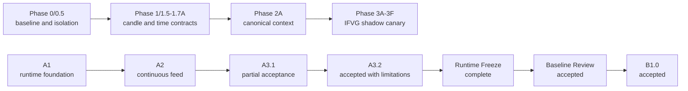
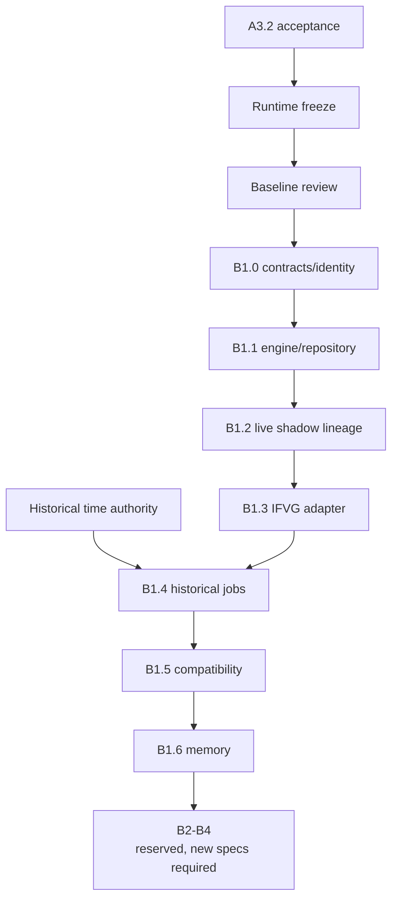

# GoTrader Architecture Roadmap

Status: frozen implementation roadmap

Governing index:
`docs/gotrader-runtime/architecture-index.md`

## 1. Current Position

GoTrader has an implemented read-only runtime foundation, a deterministic
canonical market-context engine, an IFVG shadow-canary path, and accepted
read-only GBrain research-memory integration.

The A3.2 operational gate, Runtime Freeze, and Baseline Review are complete:

```text
A3.2 ACCEPTED WITH LIMITATIONS

RUNTIME FROZEN

BASELINE ACCEPTED

B1.0 CONTRACTS AND IDENTITY ACCEPTED
```

The exact runtime baseline is frozen at
`e605c10ed6681512da89fa2a4b29791b03a67168`. The preserved observer artifact
remains `observation_incomplete`; one distributed break-transition sample is
accepted under change record `A3.2-ACCEPTANCE-2026-08-03`. B1.0 is accepted at
`25b2c1acab0bbf76e9d65860995b51d12431b1d4`. The next gate is explicit
authorization of B1.1; no later milestone is authorized by B1.0 acceptance.

## 2. Milestone Namespace Rules

Milestone labels are immutable identifiers.

- `A1-A3.2` govern always-on runtime infrastructure.
- `Phase 0-3F` govern compatibility-first V2 migration and shadow canaries.
- `G1-G3` govern GBrain research-memory integration.
- `B1.0-B1.6` govern future canonical autonomous research implementation.
- `B1-L1` is a lineage planning subtrack, not a replacement for `B1.2`.
- `B2-B4` are reserved names only.

A new document may refine a milestone but may not silently reuse its number for
a different responsibility.

## 3. Completed Foundation



These tracks established compatibility and operational evidence. They did not
grant production, evidence, readiness, broker, or execution authority.

## 4. Implementation Milestone Map

| Milestone | Prerequisite | Governing specification | Implementation | Gate |
| --- | --- | --- | --- | --- |
| A1 | V2 baseline | A1 runtime design | complete | accepted with limitations |
| A2 | A1 | A2 continuous feed and scheduler designs | complete | accepted with limitations |
| A3 | A2, verified-time contracts | A3 verified-time context design | complete | superseded operationally |
| A3.1 | A3 | A3.1 acceptance report | complete | partial acceptance |
| A3.2 | A3.1 | A3.2 operational report and operator decision | complete | accepted with limitations |
| Runtime Freeze | A3.2 accepted | freeze manifest and baseline record | complete | accepted |
| Baseline Review | Runtime Freeze | baseline review and change control | complete | accepted |
| B1.0 | Baseline Review | B1 plan, fixtures, pipeline, authority matrix, authorization record | complete | accepted |
| B1.1 | B1.0 | B1 local engine/repository design | partial in isolation | awaiting explicit authorization |
| B1.2 | B1.1 | B1 live shadow context-lineage canary | preparation only | blocked pending prior milestone adoption |
| B1.3 | B1.2 | IFVG v3 canonical research adapter | not_started | blocked |
| B1.4 | B1.3, historical time authority | historical job design | not_started | blocked |
| B1.5 | B1.4 | compatibility projection design | not_started | blocked |
| B1.6 | B1.5, GBrain baseline review | memory projection design | not_started | blocked |
| B2 | New accepted specification | reserved | not_started | unspecified / blocked |
| B3 | New accepted specification | reserved | not_started | unspecified / blocked |
| B4 | New accepted specification | reserved | not_started | unspecified / blocked |
| Future Execution | Separate explicit architecture | none accepted | not_started | unimplemented / blocked |

## 5. Immediate Next Milestone

### 5.1 A3.2 operational acceptance - complete

Completed evidence:

1. 14,400-second operational observation;
2. scheduled market maintenance break coverage;
3. 100% active-market proof uptime;
4. fail-closed maintenance pause and fresh-proof resume;
5. 35 verified M5 closes and 32 completed contexts;
6. zero verification, transport, hydration, restart, duplicate, conflict,
   ledger-gap, or authority failures;
7. integrity-valid observer and operator-decision records.

One observer-transition sample is retained as an explicit limitation. It does
not waive any other acceptance predicate or authority boundary.

### 5.2 Runtime freeze - complete

The exact runtime commit, profile, allowlisted files, evidence, and decision
identities are frozen in the Runtime Freeze records.

### 5.3 Baseline review - complete

The review proved:

- A3.2 evidence matches the frozen runtime;
- Phase 2A and Phase 3 compatibility remains intact;
- GBrain remains derived and read-only;
- no hidden runtime profile grants new authority;
- B1 prerequisites still match the accepted specifications.

### 5.4 B1.0 contracts and identity - complete

The fixture-backed contracts, authority invariants, validators, canonical
identity, lineage identity contracts, and accepted fixture oracle are frozen in
the isolated B1.0 branch. The signed record proves an exact 20-file implementation
diff, zero production consumers, and authority `none / none / none`.

### 5.5 B1.1 explicit authorization - next

The next decision may authorize only the local deterministic engine and compact
repository milestone. Existing B1.1 and B1.2 preparation commits remain isolated
and unadopted until their named gates pass.

## 6. B1 Implementation Sequence

### B1.0 - contracts and identity

Implement accepted fixture-backed contracts, identity derivation, status
enums, and authority invariants. No always-on B1 job processing.

### B1.1 - local engine and repository

Implement a local research-only job engine and compact immutable artifact
repository. Raw candles remain in canonical candle storage and are referenced
by identity rather than copied into research artifacts.

### B1.2 - live shadow context-lineage canary

Consume verified closed-candle events, rebuild canonical context, and persist
shadow lineage/artifacts. It cannot create evidence or readiness. `B1-L1`
supplies the lineage specification for this milestone.

### B1.3 - IFVG v3 canonical research adapter

Run the allowlisted IFVG v3 profile through the canonical B1 path and compare
against frozen legacy behavior. Legacy remains authoritative until explicit
parity acceptance.

### B1.4 - explicit historical jobs

Add resumable historical replay/walk-forward jobs only after historical time
basis and DST authority are verified. Deep history must not be a live-close or
page-load side effect.

### B1.5 - compatibility projections

Project compact B1 results into existing browser-facing validation and research
views through adapters. Do not rewrite the existing domains.

### B1.6 - memory projections

Project accepted compact research artifacts into GBrain as derived memory.
Native deterministic evidence remains authoritative.

## 7. Current Approved And Blocked Work

### Approved now

- documentation and frozen-hash verification;
- fixture validation;
- non-runtime architecture review;
- explicit B1.1 authorization review;
- non-runtime verification of isolated B1.1 preparation artifacts;
- optional corrected-observer follow-up monitoring that does not alter the
  frozen evidence.

### Blocked now

- B1.1 engine/repository runtime adoption;
- B1 scheduler services;
- lineage runtime persistence;
- new always-on profiles;
- GBrain production-baseline merge;
- historical B1 jobs;
- B2-B4 design or implementation without new specifications;
- strategy production adoption;
- evidence or readiness promotion;
- broker or execution work.

## 8. Long-Term Governance Sequence



## 9. Exit Criteria For Planning

Planning is complete only in the narrow sense that the accepted architecture is
indexed and governed. Runtime progression remains conditional.

```text
GOTRADER ARCHITECTURE INDEX FROZEN

Accepted Architecture Indexed

A3.2 Accepted With Limitations

Runtime Frozen

Baseline Review Accepted

B1.0 Contracts And Identity Accepted

B1.1 Runtime Implementation Not Authorized
```
