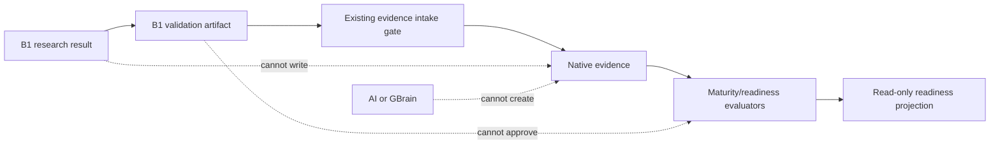
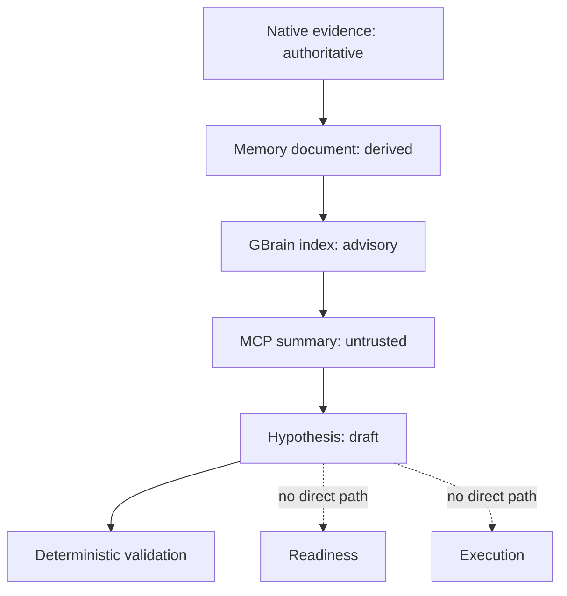

# GoTrader Track B1 - Authority Matrix

Status: normative planning reference; no authority granted

Specification ID: `gotrader-b1-authority-matrix-v1`

Parent specification:
`track-b1-autonomous-research-pipeline-specification.md`

## 1. Universal B1 Authority

Every B1 stage, artifact, service, projection, and consumer must carry:

```text
executionAuthority: none
brokerAuthority: none
readinessOverrideAuthority: none
productionAdoptionAllowed: false
canCreateEvidence: false
canApproveReadiness: false
canApplyCalibration: false
canCreateTradeIntent: false
```

`marketDataCapability: read_only` describes the upstream data transport. It
does not grant broker authority to B1 research artifacts.

## 2. Stage Authority Matrix

| Stage or subsystem | Market data | Execution | Broker | Readiness override | Create evidence | Approve readiness | Apply calibration | Create trade intent | Production adoption |
|---|---|---|---|---|---:|---:|---:|---:|---:|
| Verified close intake | read-only reference | none | none | none | false | false | false | false | false |
| Job admission | compact reference | none | none | none | false | false | false | false | false |
| Input verification | compact reference | none | none | none | false | false | false | false | false |
| Context rebuild | bounded read-only windows | none | none | none | false | false | false | false | false |
| Context identity verification | compact identity | none | none | none | false | false | false | false | false |
| Shadow strategy detection | bounded read-only context | none | none | none | false | false | false | false | false |
| Result validation | no provider access | none | none | none | false | false | false | false | false |
| Result seal | no provider access | none | none | none | false | false | false | false | false |
| Operator projection | compact artifact read | none | none | none | false | false | false | false | false |
| Historical manifest verification | read-only manifest | none | none | none | false | false | false | false | false |
| Replay adapter | process-local read-only data | none | none | none | false | false | false | false | false |
| Walk-forward/OOS adapter | process-local read-only data | none | none | none | false | false | false | false | false |
| Monte Carlo adapter | outcome summaries only | none | none | none | false | false | false | false | false |
| Historical result seal | no provider access | none | none | none | false | false | false | false | false |
| Compatibility projection | compact artifact read | none | none | none | false | false | false | false | false |
| Native evidence reader | native API read | none | none | none | false | false | false | false | false |
| Memory document builder | native evidence read | none | none | none | false | false | false | false | false |
| GBrain sidecar delivery | sanitized document | none | none | none | false | false | false | false | false |
| GBrain read-only MCP facade | bounded summary read | none | none | none | false | false | false | false | false |
| Advisory AI review | sanitized summary | none | none | none | false | false | false | false | false |
| Hypothesis draft | no provider access | none | none | none | false | false | false | false | false |
| Hypothesis admission | allowlisted identity read | none | none | none | false | false | false | false | false |

The matrix is monotonic. A consumer may reduce available capability. It cannot
increase it.

## 3. AI Boundary Matrix

| Activity | AI allowed | AI output authority | Deterministic gate required |
|---|---:|---|---:|
| Verified candle-close proof | no | n/a | yes |
| Source and time validation | no | n/a | yes |
| Canonical context facts | no | n/a | yes |
| Research identity | no | n/a | yes |
| Strategy detection and geometry | no | n/a | yes |
| Replay | no | n/a | yes |
| Walk-forward and OOS | no | n/a | yes |
| Monte Carlo | no | n/a | yes |
| Native evidence creation | no | n/a | existing evidence gate |
| Maturity/readiness decision | no | n/a | existing readiness gate |
| Memory document derivation | no | n/a | yes |
| Memory search query suggestion | yes | advisory only | yes |
| Retrieved-memory interpretation | yes | advisory only | yes |
| Research narrative | yes | advisory only | yes |
| Gap analysis | yes | advisory only | yes |
| Hypothesis proposal | yes | draft only | yes |
| Research-job proposal | yes | draft only | yes |
| Calibration proposal | yes | draft only | existing dry-run and review gate |
| Calibration application | no | none | prohibited in B1 |
| Profile mutation | no | none | prohibited in B1 |
| Trade-intent creation | no | none | prohibited in B1 |
| Broker execution | no | none | prohibited in B1 |

AI retrieval content must be marked:

```text
untrustedRetrievedContent: true
advisoryOnly: true
nativeEvidenceAuthoritative: true
```

## 4. Read And Write Matrix

| Component | Allowed reads | Allowed writes |
|---|---|---|
| Current-market B1 engine | Verified close, canonical windows, context policies, allowlisted profile | B1 requests, stages, relationships, result, checkpoint, projection |
| Historical B1 engine | Verified dataset manifest, frozen profile, existing deterministic engines | B1 historical stages, result, checkpoint, projection |
| Strategy adapter | Verified context and frozen profile | Compact B1 strategy result only |
| Existing evidence intake | Identity-matched validated artifacts | Native evidence under existing policy only |
| Memory builder | Committed native evidence | Sanitized derived memory document/outbox |
| GBrain sidecar | Sanitized memory documents | Derived Markdown/PGLite index and receipts |
| MCP facade | Bounded sidecar status/search/summary | Bounded audit entries only |
| Advisory AI | Sanitized projections and memory summaries | Narrative or draft proposal only |
| Operator UI | Compact projections | Explicit B1 research controls allowed by current product policy |

None may write account, order, position, broker, execution, readiness override,
production-adoption, evidence, calibration, or profile state.

## 5. Evidence And Readiness Boundary



B1 can supply a candidate artifact to the existing evidence intake gate in a
future authorized phase. The intake gate must independently verify exact
source, profile, parameter, cost, replay, OOS, and time identity.

A B1 artifact never becomes evidence merely because it is positive, repeated,
or generated autonomously.

## 6. Memory Authority Boundary



The GBrain sidecar and MCP facade may be offline without changing deterministic
research, native evidence, maturity, readiness, or runtime health.

## 7. Future Systems

B2 strategy expansion, B3 consensus, and B4 AI supervision inherit the same
authority matrix.

No B1-B4 completion event authorizes:

- Paper-Demo order creation;
- execution intent;
- broker routing;
- account-risk mutation;
- live execution;
- readiness override.

A future execution program is a separate governance domain and is not specified
or authorized here.

## 8. Forbidden Capability Scan

Every B1 implementation gate must verify the absence of:

```text
/execute
Place Order
Buy Market
Sell Market
Close Position
Enable Live Trading
Connect Live Broker
account endpoint enablement
order endpoint enablement
position endpoint enablement
readiness override
auto-apply
profile mutation
```

Safety text and negative-test fixtures may mention forbidden terms. No
actionable control, route, task, tool, or service may expose them.

## 9. Fail-Closed Rule

Unknown authority, missing authority, unsupported capability fields, conflicting
authority, or an attempt to omit a required false capability must block the
request or artifact.

The safe default is never inferred from a favorable strategy result. It must be
present and validated explicitly.
