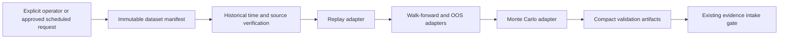
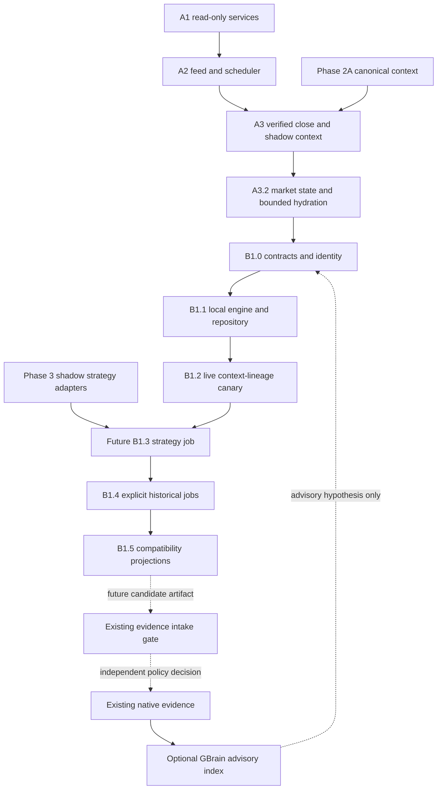
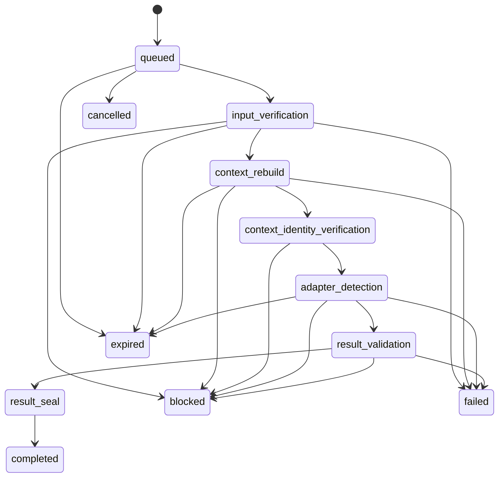
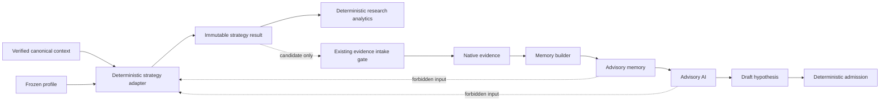
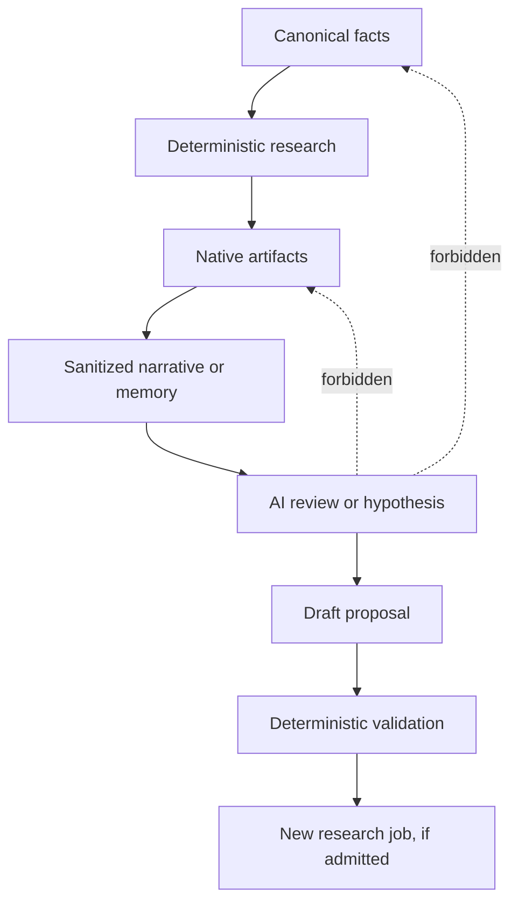
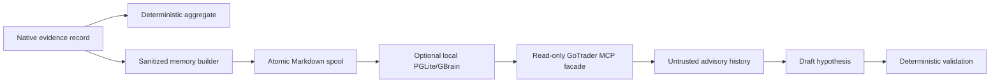

# GoTrader Track B1 - Autonomous Research Pipeline Specification

Status: normative planning specification; runtime implementation not authorized

Specification ID: `gotrader-b1-autonomous-research-pipeline-v1`

Date: 2026-07-27

Planning branch: `codex/gotrader-infrastructure-track-b1-planning`

Planning baseline: `ad8608a6f40361a3a9a84b92c93a4da4d64e59b1`

Contract-fixture baseline: `d4261e6e39f7a0e0f821ab333002be6573a29fe8`

## 1. Purpose And Precedence

This document is the normative architecture for future Track B1 autonomous
research work. It defines contracts, authority, lifecycle, provenance, failure
behavior, compatibility, persistence semantics, and implementation order.

The current repository remains the source of truth. Where this specification
conflicts with accepted runtime behavior, frozen strategy behavior, source
identity, replay semantics, evidence policy, readiness policy, or safety
contracts, implementation must stop and the conflict must be reviewed.

Precedence is:

1. fail-closed authority and broker-safety contracts;
2. accepted A1-A3.2 runtime and source contracts;
3. frozen Phase 2A and Phase 3 behavior and identities;
4. native evidence and readiness contracts;
5. this specification;
6. implementation details and operator projections.

This specification is versioned. It is not self-modifying. Changes require a
reviewed specification version and must not rewrite accepted artifacts.

Normative terms:

- **MUST** and **MUST NOT** are required.
- **SHOULD** indicates the default unless a reviewed compatibility reason
  exists.
- **MAY** indicates an optional capability that still obeys every safety rule.

## 2. Current Boundary

Track B1 extends the accepted read-only runtime. It does not replace it.

The accepted foundation provides:

- A1 browser-independent MT5 read-only service supervision;
- A2 bounded continuous feed, durable close events, and an allowlisted
  scheduler;
- A3 current-live time verification and canonical shadow context;
- A3.2 market-state awareness and bounded multi-timeframe hydration;
- Phase 2A canonical market-context facts and compatibility policy;
- Phase 3 IFVG v3 shadow detector, geometry, selection, live comparison, and
  frozen research-lifecycle contracts;
- B1 canonical identity fixtures and fail-closed safety cases.

The isolated GBrain G1-G3 work provides a compatible future memory dependency:

- native evidence remains authoritative;
- GBrain is an optional derived advisory index;
- the MCP facade is read-only;
- retrieved content is untrusted and advisory;
- GBrain cannot create evidence, readiness, calibration, trade intent, or
  authority.

GBrain G1-G3 is an architectural input to this specification. It is not assumed
to be merged into the A3.2 runtime baseline.

Current A3.2 operational qualification remains pending. Therefore this
specification authorizes documentation only.

## 3. Non-Negotiable Invariants

Every B1 request, stage, result, projection, memory document, and diagnostic
MUST preserve:

```text
executionAuthority: none
brokerAuthority: none
readinessOverrideAuthority: none
shadowOnly: true
canCreateEvidence: false
canApproveReadiness: false
canApplyCalibration: false
canCreateTradeIntent: false
readinessChanged: false
productionAdoptionAllowed: false
```

B1 MUST NOT:

- call account, order, position, deal, or broker-mutation APIs;
- create an execution or Paper-Demo order;
- promote evidence, maturity, readiness, or production status;
- apply calibration or mutate a frozen strategy profile;
- accept raw candle arrays in persisted research artifacts;
- persist raw MT5 snapshots, imported OHLCV arrays, screenshots, or base64;
- persist or expose credentials, secrets, tokens, or personal account data;
- let AI create facts, alter deterministic results, or grant authority;
- use current-live time proof as historical time authority;
- treat a positive strategy result as infrastructure acceptance;
- make browser rendering a prerequisite for research execution.

## 4. Architecture Decision

The autonomous research pipeline is a directed acyclic graph with three
separately gated lanes. It is not one linear pipeline.

### 4.1 Current-market shadow lane

```mermaid
flowchart LR
  VC["Verified candle_closed event"] --> JA["Job admission"]
  JA --> IV["Identity and input verification"]
  IV --> CR["Canonical context rebuild"]
  CR --> CI["Context identity verification"]
  CI --> SD["Optional shadow strategy detection"]
  SD --> RV["Result validation"]
  RV --> RS["Immutable result seal"]
  RS --> OP["Compact operator projection"]
```



This lane is low latency, bounded, current-live, and shadow-only. It never runs
deep replay, walk-forward, OOS, Monte Carlo, evidence, or readiness work.

### 4.2 Explicit historical validation lane



This lane remains disabled until historical provider time basis and DST policy
are verified. Historical validation artifacts cannot create native evidence by
themselves. The existing evidence intake gate remains authoritative.

### 4.3 Memory and advisory lane


Memory is downstream from native evidence. It is not an input to deterministic
current-market detection. An AI hypothesis can become only a draft request.
Deterministic admission must reconstruct all authoritative identity fields from
allowlisted GoTrader state.

### 4.4 Future trade boundary

Trade execution is not a B1 stage. A future trade system, if separately
authorized, would consume an independently approved and risk-validated handoff.
Nothing in B1 grants or implies that authority.

## 5. Dependency Graph



Dependencies are additive. A later component cannot upgrade the authority of an
earlier artifact.

## 6. Canonical Identity

### 6.1 Hashing

B1 MUST use the existing canonical hash version:

```text
gotrader-v2-sha256-v1
```

Canonical serialization:

1. removes `undefined` object values;
2. recursively sorts object keys;
3. preserves array order;
4. serializes UTF-8 JSON without whitespace;
5. hashes the hash-version string, newline, and canonical JSON;
6. returns `sha256:<64 lowercase hexadecimal characters>`.

Fields representing mathematical sets MUST be deduplicated and lexically
sorted before hashing.

### 6.2 Logical job identity

The logical job identity core MUST include:

- job type and job version;
- trigger event ID and trigger candle identity;
- requested and broker symbols;
- primary timeframe;
- context artifact ID and context identity;
- strategy, profile, and profile version when applicable;
- parameter hash and cost model when applicable;
- required facts and required timeframes;
- source fingerprint;
- time-contract ID;
- all relevant schema and policy versions.

`requestedAt` is excluded from logical identity and included in payload
identity. The same logical ID with a different payload hash is a conflict, not
an update.

### 6.3 Artifact identity

Each immutable stage and result artifact MUST include:

- schema version;
- stage or result version;
- logical job ID;
- ordered input artifact IDs;
- previous-stage artifact ID or genesis marker;
- complete compact output core;
- payload hash;
- authority and capability fields.

Mutable timestamps and telemetry MUST NOT alter the deterministic domain result.
They MAY be included in a separate attempt envelope.

### 6.4 Relationship identity

Every parent-child relationship MUST identify:

- relationship type and version;
- parent artifact ID;
- child artifact ID;
- logical job ID;
- creation stage;
- integrity status.

Relationships are append-only. A changed edge creates a new relationship
version and cannot mutate prior lineage.

## 7. Contract Family

The initial B1 contract family is:

- `CanonicalResearchJobRequest`;
- `CanonicalResearchJobIdentity`;
- `CanonicalResearchStageArtifact`;
- `CanonicalResearchJobCheckpoint`;
- `CanonicalResearchResultArtifact`;
- `CanonicalResearchProjection`;
- `CanonicalResearchRelationship`;
- `CanonicalResearchAttemptTelemetry`.

Detailed stage requirements are defined in
`track-b1-stage-reference.md`.

The fixture behavior in
`tests/fixtures/v2-research-b1/` is normative for:

- stable serialization;
- identity drift;
- idempotent duplicate handling;
- payload conflict quarantine;
- cancellation and stale-lease sealing;
- forbidden-field rejection;
- authority `none / none / none`.

## 8. Research Object Lifecycle

### 8.1 States



Terminal states:

- `completed`;
- `blocked`;
- `failed`;
- `cancelled`;
- `expired`.

No-setup and rejected-strategy outcomes are completed research results when the
engine operated correctly.

### 8.2 Restart behavior

On restart the engine MUST:

1. verify repository identity and artifact hashes;
2. rebuild the checkpoint from immutable stages when necessary;
3. resume only from the first incomplete stage;
4. acquire a new bounded lease;
5. reject stale or foreign lease completion;
6. recheck cancellation immediately before result sealing;
7. avoid rerunning completed deterministic stages.

### 8.3 Supersession

A newer market event MAY make an unsealed current-market job obsolete.
Supersession must be explicit and append-only. A superseded job cannot seal a
result. A completed historical job is never silently superseded.

## 9. Retry, Timeout, And Backpressure

Retry policy is versioned and stage-specific.

Deterministic blockers MUST NOT retry:

- identity mismatch;
- source conflict;
- schema incompatibility;
- authority conflict;
- insufficient required facts;
- ineligible time contract;
- strategy no-setup or deterministic rejection.

Bounded retries MAY apply to:

- loopback transport interruption;
- atomic file rename contention;
- temporary repository lock contention;
- optional advisory-memory transport failure.

Initial default policy classes:

| Policy | Timeout | Retries | Intended use |
|---|---:|---:|---|
| `live_admission_v1` | 2 seconds | 1 | Admission and compact identity checks |
| `live_context_v1` | 5 seconds | 1 | Bounded context rebuild and identity check |
| `live_adapter_v1` | 5 seconds | 1 | One allowlisted shadow adapter |
| `artifact_seal_v1` | 2 seconds | 1 | Hash verification and atomic seal |
| `memory_projection_v1` | 8 seconds | 0 | Optional, nonblocking local advisory copy |
| `historical_manifest_v1` | 30 seconds | 0 | Dataset and source verification |
| `historical_replay_v1` | 15 minutes | 0 | Explicit replay stage |
| `historical_walk_forward_v1` | 30 minutes | 0 | Explicit walk-forward/OOS stage |
| `historical_monte_carlo_v1` | 15 minutes | 0 | Explicit Monte Carlo stage |

Timeout values are policy configuration, not proof of success and not part of a
strategy result. A policy change requires a new policy version.

Backpressure rules:

- current-market queue depth is bounded;
- duplicate logical jobs coalesce;
- only unstarted current-market work may use newest-state coalescing;
- historical jobs are never discarded by newest-state coalescing;
- ledger gaps and dropped authoritative events block reconciliation;
- no browser page owns or expands the queue.

## 10. Persistence Model

### 10.1 Semantic repository

B1 persistence MUST provide:

- append-first immutable requests, stages, relationships, and results;
- rebuildable checkpoints and projections;
- atomic writes;
- integrity verification on every read;
- path traversal protection;
- bounded artifact and response sizes;
- bounded retention with explicit tombstone or archive records;
- quarantine for corrupt and conflicting payloads;
- worktree and runtime-profile identity;
- no browser storage dependency for the engine.

The initial planned local binding is:

```text
.gotrader/runtime/<profile>/research/
  requests/
  stages/
  relationships/
  results/
  checkpoints/
  projections/
  quarantine/
```

This path is a deployment binding, not the domain contract. Repository adapters
must preserve the same semantics.

### 10.2 Raw-data boundary

Canonical candles MAY be read through the candle repository and passed through
bounded in-memory stage inputs. Candle arrays MUST NOT be serialized into B1
requests, stages, results, projections, memory documents, logs, or MCP output.

Historical dataset manifests store identity, boundaries, counts, time policy,
and checksums only.

### 10.3 Retention

Retention MUST be deterministic and observable. It cannot delete:

- an artifact referenced by a retained child;
- the latest terminal result for a retained logical job;
- a quarantined conflict before its audit retention expires;
- an artifact currently needed for checkpoint recovery.

Retention cannot create evidence loss because B1 artifacts are not native
evidence.

## 11. Provenance

```mermaid
flowchart LR
  VC["Verified close ID"] --> CW["Canonical window IDs"]
  CW --> CT["Context artifact ID"]
  CT --> RJ["Research job ID"]
  RJ --> SA["Stage artifact chain"]
  SA --> RR["Research result ID"]
  RR --> VP["Validation projection ID"]
  VP -. "separate existing gate" .-> NE["Native evidence ID"]
  NE --> MD["Memory document ID"]
  MD --> GR["GBrain receipt ID"]
  GR --> HP["Hypothesis proposal ID"]
  HP --> NR["New deterministic request ID"]
```



Each link MUST reference its immutable predecessor. Narrative text is never a
lineage link. Missing lineage fails closed.

Provenance MUST distinguish:

- provider data from requested-symbol labels;
- current-live from historical eligibility;
- canonical facts from strategy interpretation;
- strategy result from replay/OOS validation;
- validation artifact from native evidence;
- native evidence from advisory memory;
- advisory hypothesis from deterministic request.

## 12. Strategy Consumer Model

### 12.1 Deterministic detector consumers

A deterministic strategy detector MAY read:

- one verified canonical context;
- bounded referenced candle windows in memory when its frozen profile requires
  local structure;
- one immutable strategy/profile/version;
- one parameter fingerprint;
- one cost-model identity when geometry requires it.

It MUST NOT read:

- GBrain or LLM narrative memory;
- readiness or Paper-Demo state as a signal input;
- account, balance, order, or position state;
- mutable calibration outside its versioned profile;
- a different source or time contract than the job identity.

### 12.2 Research-analysis consumers

Research analytics MAY read immutable strategy results and validation
artifacts. They may summarize performance and blockers. They cannot modify the
source artifacts or create native evidence without the existing evidence gate.

### 12.3 Memory consumers

Memory builders MAY read committed native evidence and exact identity metadata.
GBrain and MCP consumers receive only sanitized, bounded summaries marked
untrusted and advisory.

### 12.4 Consumer outputs

Every consumer output MUST be:

- versioned;
- source-traceable;
- compact;
- immutable when sealed;
- authority-safe;
- explicit about blockers and missing data.



## 13. AI Governance

AI is downstream from deterministic facts and results.



AI MAY:

- search bounded advisory memory;
- explain completed artifacts;
- identify gaps;
- propose a hypothesis;
- propose an allowlisted candidate family or validation request;
- ask follow-up questions.

AI MUST NOT:

- create or change canonical facts;
- select or replace a source fingerprint;
- alter causal timestamps;
- change a frozen profile or threshold;
- skip replay, OOS, evidence, maturity, or readiness gates;
- create native evidence;
- apply calibration;
- create a trade intent;
- approve readiness;
- call MT5 or a broker;
- change authority.

AI unavailability must not block deterministic research. Unsafe or malformed AI
output is blocked without changing an existing artifact.

## 14. Memory Lifecycle

Native evidence is the system of record. GBrain is an optional derived index.



Memory rules:

- memory cannot precede native evidence for an evidence-derived record;
- memory cannot create or repair evidence;
- a missing sidecar cannot fail a completed research cycle;
- GBrain content cannot enter deterministic detector scoring;
- exact filters use GoTrader-owned metadata, not inferred prose;
- backfill is bounded, idempotent, and uses native evidence APIs or sanitized
  exports;
- retrieval is marked untrusted;
- write, update, delete, SQL, filesystem, and command tools are not exposed by
  the read-only MCP facade.

## 15. Failure And Conflict Model

All ambiguity fails closed.

| Conflict | Required disposition |
|---|---|
| Logical identity collision with different payload | Quarantine and block |
| Source fingerprint or symbol conflict | Block |
| Time-contract or normalization conflict | Block |
| Context artifact mismatch | Block |
| Schema or policy incompatibility | Block |
| Stage hash or lineage conflict | Quarantine and block |
| Foreign or expired lease | Expire or block; never seal |
| Cancellation before seal | Cancel; discard delayed output |
| Durable event ledger gap | Block reconciliation |
| Historical dataset manifest conflict | Quarantine and block |
| Replay/OOS identity conflict | Block evidence intake |
| Native evidence conflict | Existing native evidence policy remains authoritative |
| Memory duplicate with same identity/hash | Coalesce idempotently |
| Memory identity with changed content | Quarantine; never replace evidence |
| Scheduler task not allowlisted | Block |
| Authority or capability drift | Block and emit critical diagnostic |
| Optional LLM or GBrain unavailable | Warn/degrade advisory lane only |

`failed` is reserved for an internal processing failure in the research
service itself.
`blocked` is used when deterministic safety or eligibility requirements are
not met.

## 16. Versioning And Compatibility

The following versions are independent:

- schema version;
- pipeline version;
- stage version;
- retry/timeout policy version;
- hash version;
- relationship version;
- context and fact-policy versions;
- source and time-normalization versions;
- strategy/profile/version;
- parameter fingerprint;
- cost-model version;
- validation adapter version;
- memory document version;
- consumer projection version.

Compatibility rules:

1. Hash-version changes never reinterpret an existing ID.
2. Removing or changing a required field requires a major schema version.
3. Additive optional fields require readers to ignore unknown fields safely.
4. Strategy/profile changes create a new identity.
5. Source, time, context, parameter, or cost drift cannot be normalized away.
6. Legacy adapters remain available until golden parity and rollback tests
   pass.
7. No one-shot migration of browser storage is permitted.
8. Existing source provider IDs, validation-chain states, frozen snapshots,
   and route contracts remain readable.

## 17. Observability

Each stage MUST report compact operational telemetry:

- logical job and attempt IDs;
- stage and policy versions;
- start, completion, and duration;
- retry count;
- timeout classification;
- blocker and warning codes;
- input and output artifact IDs;
- source, context, and profile identity;
- lineage integrity status;
- queue and lease status;
- authority and capability fields;
- CPU and memory samples when available.

CPU and memory telemetry:

- is not part of domain identity;
- may be unavailable with an explicit reason;
- must not include process command secrets;
- must remain bounded.

Logs and metrics MUST NOT contain raw candles, raw queries, credentials,
account/order/position data, screenshots, or complete untrusted memory text.

## 18. Operator And Compatibility Projections

Operator projections MAY show:

- current job and stage;
- source and time eligibility;
- strategy/profile identity;
- result classification;
- blockers and next action;
- freshness;
- artifact IDs;
- queue and retry health;
- authority.

They MUST NOT:

- start deep research on page render;
- infer evidence or readiness;
- display raw candles from B1 persistence;
- expose apply, readiness promotion, Paper-Demo order, or execution controls.

Existing Dashboard, Advisor, Validation, Results, and specialist views remain
legacy-authoritative until a compatibility adapter has passed parity.

## 19. Implementation Roadmap

The planning activity represented by this document is named **B1 Pipeline
Specification**, not B1.1. The name avoids collision with the existing B1.1
engine milestone.

### B1.0 - Contracts and identity

- typed contract family;
- canonical serialization and hashes;
- authority and forbidden-field assertions;
- fixture parity with `test:b1-contract-fixtures`.

Runtime effect: none.

### B1.1 - Local deterministic engine and repository

- stage runner;
- immutable local repository;
- leases, cancellation, timeout, retry, and recovery;
- fixture-only context-lineage handler.

Runtime effect: CLI tests only.

### B1.2 - Live shadow context-lineage canary

- additive runtime profile;
- verified close admission;
- context rebuild and exact identity comparison;
- compact projection.

Runtime effect: current-live context lineage only.

### B1.3 - IFVG v3 shadow strategy job

- frozen IFVG v3 adapter;
- in-memory context handoff;
- detected, rejected, blocked, and expired compact results;
- parity against the accepted legacy path.

Runtime effect: shadow strategy research only.

### B1.4 - Explicit historical research jobs

- immutable dataset manifest;
- replay, walk-forward, OOS, and Monte Carlo adapters;
- resumable background stages;
- exact identity and cost-model linkage.

Runtime effect: explicit background research only.

### B1.5 - Compatibility projections

- read-only adapters for existing operator and specialist views;
- materialized compact projections;
- legacy fallback.

Runtime effect: query and display only.

### B1.6 - Memory builder and analytics

- native-artifact-to-memory projection;
- optional GBrain G1-G3 compatibility adapter;
- compact deterministic aggregates;
- advisory analytics with exact provenance.

Runtime effect: derived advisory memory only.

### B2 - Strategy consumer expansion

Add one frozen strategy at a time behind profile-specific canary gates.

### B3 - Deterministic consensus research

Combine immutable strategy results through versioned deterministic policy.
Consensus remains research-only and cannot create evidence or readiness.

### B4 - Advisory AI supervisor

Allow AI to explain, search memory, and propose draft research jobs through
deterministic admission. No authority or calibration application.

### Future execution program

Execution is not authorized by B1-B4. Any future execution program requires a
separate architecture, risk, security, broker, account, and operator-approval
review.

## 20. Authorization Gates

### Planning

Documentation and fixtures are authorized now.

### B1.0 implementation

Requires:

- passing final A3.2 operational acceptance;
- reviewed integrity-hashed A3.2 report;
- clean and frozen accepted A3.2 commit;
- a new B1 implementation worktree from that commit.

### B1.1 local engine

Requires B1.0 contracts, identity, and safety tests to pass. No scheduler
registration.

### B1.2 live canary

Requires repository recovery, idempotency, conflict, cancellation, stale-lease,
tamper, and raw-data-exclusion tests.

### B1.3 IFVG strategy job

Requires the separate Phase 3 adapter and evidence gate to authorize its input
contract. Positive metrics alone are insufficient.

### B1.4 historical jobs

Requires verified historical provider time basis, DST policy, and immutable
dataset manifests.

### B1.6 GBrain compatibility

Requires accepted G1-G3 integration on the selected runtime baseline. GBrain
remains optional and advisory.

## 21. Validation Of This Specification

This specification has been checked against:

- A1 runtime design, service registry, and report;
- A2 feed, scheduler, task registry, and report;
- A3 verified-time context design and report;
- A3.2 operational report;
- Phase 2A context completion, compatibility, and eligibility policies;
- Phase 3A-3F IFVG lineage and research-lifecycle reports;
- B1 plan and contract fixtures;
- GBrain G1-G3 integration, backfill, and MCP acceptance reports.

It intentionally:

- introduces no runtime code;
- introduces no scheduler task or profile;
- introduces no repository implementation;
- changes no replay, OOS, evidence, maturity, or readiness behavior;
- changes no strategy threshold or frozen hash;
- adds no AI authority;
- creates no execution path.

## 22. Final Status

```text
TRACK B1 PIPELINE SPECIFICATION COMPLETE

Architecture and authority boundaries defined
No runtime implementation performed
No scheduler or MCP change performed
A3.2 operational acceptance still required
B1.0 implementation not yet authorized
```
