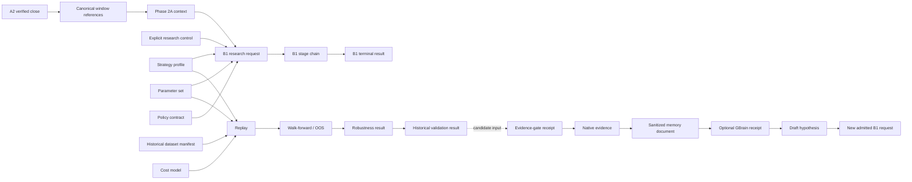
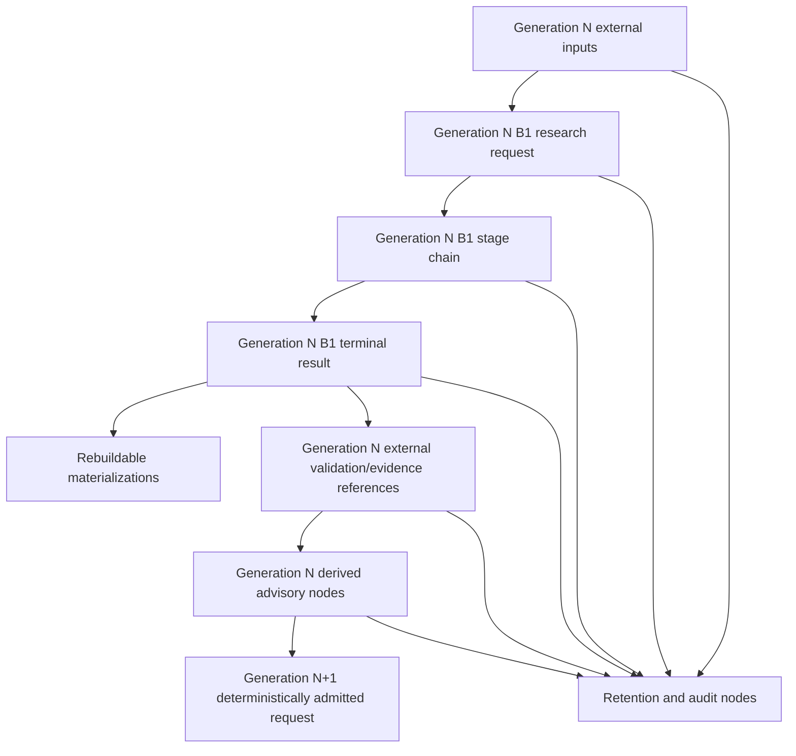
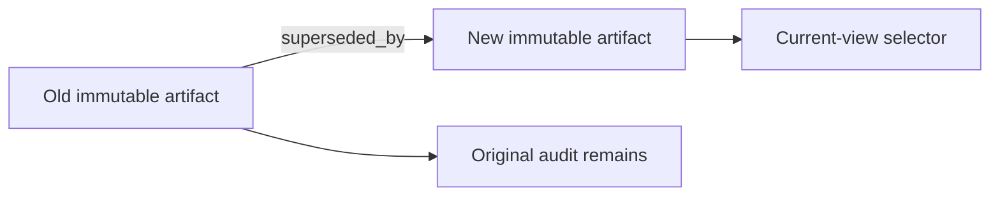
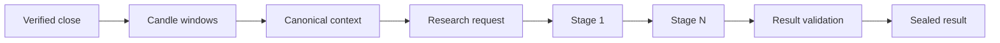
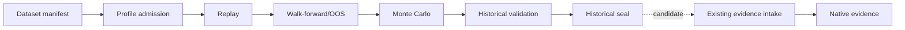
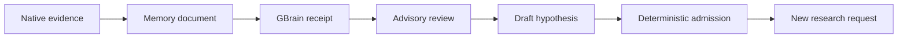
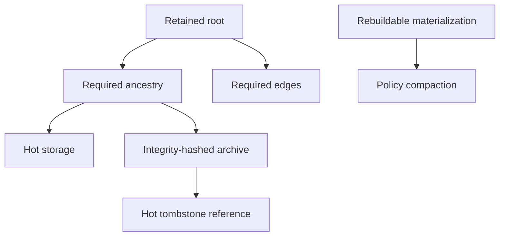

# GoTrader Track B1-L1 - Canonical Lineage Graph Specification

Status: normative planning specification; runtime implementation not authorized

Specification ID: `gotrader-b1-canonical-lineage-graph-v1`

Milestone: `B1-L1`

Date: 2026-07-27

Planning branch: `codex/gotrader-infrastructure-track-b1-planning`

Planning baseline: `a9564d888b86b2548f37b882f39c7229af6c11f4`

Runtime baseline: `ad8608a6f40361a3a9a84b92c93a4da4d64e59b1`

## 1. Purpose And Naming

This specification defines the canonical lineage contract for future B1
research artifacts. It governs node references, immutable relationships,
bounded traversal, supersession, audit reconstruction, retention, and
compatibility.

The milestone is named **B1-L1**, not B1.2. The accepted B1 roadmap already
reserves B1.2 for the live shadow context-lineage canary. B1-L1 is a planning
subtrack that supplies lineage contracts to B1.0 and B1.1 without renumbering
the accepted pipeline.

This document does not authorize:

- a repository or graph database;
- a runtime service or scheduler task;
- an MCP or GBrain change;
- a query API or visualization;
- an evidence, readiness, calibration, Paper-Demo, or execution path.

## 2. Precedence

The current repository and accepted artifacts remain authoritative.

Precedence is:

1. fail-closed authority and broker-safety contracts;
2. accepted A1-A3.2 runtime and source contracts;
3. existing V2 identity and canonical hashing contracts;
4. frozen Phase 2A and Phase 3 artifacts and metrics;
5. native evidence and readiness ownership;
6. the B1 Autonomous Research Pipeline Specification;
7. this lineage specification;
8. future repository, traversal, and display adapters.

If a lineage adapter cannot preserve an existing artifact identity, payload
hash, authority, source identity, time policy, or owner semantics, it must
block. It must not mint a replacement identity to hide incompatibility.

## 3. Architecture Boundary

The lineage graph is a **relationship ledger over existing identities**. It is
not a new domain store.

The graph may:

- register a compact reference to an existing immutable artifact;
- validate that the owning subsystem still recognizes the artifact and hash;
- append a typed relationship between registered references;
- reconstruct bounded ancestry and descendants;
- expose integrity, completeness, retention, and compatibility status.

The graph must not:

- copy raw domain payloads;
- become the source of canonical market facts;
- become the native evidence ledger;
- become the GBrain memory store;
- reinterpret legacy IDs;
- create evidence or readiness;
- grant a consumer more authority than its inputs.

## 4. Existing Provenance Domains

The initial graph spans four ownership domains without merging them.

### 4.1 Runtime and canonical market domain

- verified close events from the durable A2 feed ledger;
- canonical candle-window identities;
- V2 canonical context artifacts;
- source fingerprints and time-contract references.

### 4.2 B1-owned research domain

- research requests;
- immutable stage artifacts;
- terminal research results;
- historical validation results;
- quarantine, archive, and tombstone records.

### 4.3 External authoritative research domain

- historical dataset manifests;
- existing replay and OOS artifacts;
- existing deterministic robustness artifacts;
- native research evidence records.

These artifacts retain their current owners. B1 records external references and
cannot mutate or supersede them.

### 4.4 Derived advisory domain

- sanitized memory documents;
- GBrain delivery receipts;
- advisory reviews;
- draft hypotheses.

This domain is optional, untrusted for deterministic scoring, and downstream
from native evidence.



The dotted evidence edge is not evidence creation. The existing intake gate
must independently accept the candidate, issue its receipt, and create its own
native record. Runtime and historical branches may reference the same frozen
profile and policy identities without sharing mutable payloads.

## 5. Universal Authority

Every lineage node reference, edge, query, traversal result, audit report,
retention record, and diagnostic must carry:

```text
executionAuthority: none
brokerAuthority: none
readinessOverrideAuthority: none
productionAdoptionAllowed: false
canCreateEvidence: false
canApproveReadiness: false
canApplyCalibration: false
canCreateTradeIntent: false
```

The graph records authority; it never derives or grants it.

Market-data capability remains read-only. No lineage operation may call MT5,
broker, account, order, position, deal, or mutation APIs.

## 6. Graph Topology

The canonical topology is a directed acyclic graph.

Every causal edge points from an older input or cause toward a newer derived,
consuming, validating, projecting, superseding, or advisory artifact.



The advisory-to-next-generation path is restricted to
`hypothesis -> admitted research request`. Deterministic admission reconstructs
authoritative fields from GoTrader-owned registries. Advisory content is never
consumed by a detector. The generation boundary keeps this topology acyclic.

## 7. Node Classes

Four primary classes and one control class are defined.

### 7.1 Owned immutable

B1 owns the artifact and payload integrity:

- research request;
- research stage;
- research result;
- historical validation result.

### 7.2 External authoritative reference

Another subsystem owns the artifact:

- verified close;
- candle window;
- canonical context;
- dataset manifest;
- strategy profile;
- parameter set;
- cost model;
- policy contract;
- evidence-gate receipt;
- replay/OOS/robustness result;
- native evidence.

The graph stores only owner namespace, canonical artifact ID, schema/version,
payload-hash reference, authority, trust class, and compact audit metadata.

### 7.3 Derived advisory

The artifact is non-authoritative:

- memory document;
- GBrain receipt;
- advisory review;
- hypothesis.

Missing derived advisory nodes never invalidate deterministic research.

### 7.4 Rebuildable materialization

The artifact is a cache or projection:

- checkpoint;
- operator projection.

It is not a required canonical ancestor. It may be rebuilt from immutable
artifacts and is not a permanent retention root.

### 7.5 Control and retention

- quarantine record;
- tombstone;
- archive manifest;
- compatibility mapping record.

These preserve audit and storage decisions without modifying source artifacts.

Detailed requirements are in `track-b1-lineage-node-reference.md`.

## 8. Node Reference Identity

The graph must reuse the canonical ID owned by each artifact. It must not
replace it.

A lineage lookup key may be derived as:

```text
lineageNodeKey = canonicalHash({
  graphSchemaVersion,
  ownerNamespace,
  nodeType,
  canonicalArtifactId
})
```

`lineageNodeKey` is an index key, not a new domain identity.

Each node reference contains:

- graph and node-reference schema versions;
- node class and type;
- owner namespace and owner contract version;
- canonical artifact ID;
- owner-supplied payload hash or checksum;
- source and time identities when relevant;
- authority and capability fields;
- lifecycle and retention classes;
- integrity and resolution status;
- compact created/sealed timestamps;
- no raw payload.

An owner adapter validates the existing artifact. The graph does not recompute
a different domain identity.

## 9. Edge Identity

Each immutable edge contains:

- graph and edge schema versions;
- relationship type and relationship version;
- parent and child lineage node keys;
- creation stage or external gate receipt;
- ordinal when input order is meaningful;
- compact relationship metadata;
- authority;
- integrity status;
- payload hash.

The edge ID is a canonical hash over the stable edge identity core:

```text
edgeId = canonicalHash({
  graphSchemaVersion,
  edgeSchemaVersion,
  relationshipType,
  relationshipVersion,
  parentNodeKey,
  childNodeKey,
  creationStageId,
  ordinal,
  identityMetadata
})
```

Operational timestamps and traversal telemetry do not affect edge identity.

The same edge ID and payload hash is idempotent. The same edge ID with a
different payload hash is quarantined and blocks required lineage.

Detailed edge semantics are in `track-b1-lineage-edge-reference.md`.

## 10. Integrity Rules

### 10.1 DAG admission

Before appending an edge, the graph must prove:

- parent and child keys differ;
- both endpoints resolve under compatible owner adapters;
- the edge type permits the endpoint types;
- the edge points in the canonical causal direction;
- adding it cannot create a cycle within the bounded admission traversal;
- authority is exactly `none / none / none`.

If acyclicity cannot be proven inside the admission policy bound, admission
blocks pending an explicit offline audit. It never assumes safety.

### 10.2 Required and optional lineage

Required causal edges include source, context, job, stage, result, and
historical-validation relationships declared by the artifact contract.

Optional edges include memory delivery, advisory review, hypotheses, and
operator projections.

- missing required edge: block validation and evidence intake;
- missing optional edge: warn or mark advisory lineage incomplete;
- missing rebuildable materialization: rebuild or report unavailable;
- missing external owner: unresolved, never accepted as verified.

### 10.3 Duplicate and conflict handling

- exact duplicate node reference: coalesce;
- same node key with changed owner identity/hash: quarantine;
- exact duplicate edge: coalesce;
- same edge ID with changed payload: quarantine;
- unknown node/edge version: display-only at most, never validation-eligible;
- dangling required edge: block;
- dangling optional advisory edge: warn and exclude from deterministic queries.

### 10.4 Cardinality

Node contracts declare required incoming and outgoing relationships.

Examples:

- a B1 stage has one logical request and one previous-stage/genesis relation;
- a terminal result has one validated stage-chain root;
- an OOS artifact references one exact replay parent;
- a memory document references at least one native evidence record;
- a GBrain receipt references exactly one memory document;
- a hypothesis cites one or more advisory/native references;
- an admitted request may reference one hypothesis but reconstructs all
  authoritative identity independently.

Cardinality ambiguity blocks.

## 11. Supersession

Supersession is an append-only relationship from old artifact to new artifact.
It does not mutate, delete, or reinterpret the old artifact.



### 11.1 Current-market jobs

An unsealed job made obsolete by a newer verified close may be marked
superseded or expired. The old job cannot subsequently seal. A completed result
remains a completed historical fact.

### 11.2 Historical artifacts

A new dataset, profile, parameter set, cost model, split, replay, or OOS result
creates a new identity. It may supersede an older result for a versioned
operator view, but cannot overwrite the old result or frozen baseline.

### 11.3 Native evidence

The lineage graph cannot supersede native evidence. Only the native evidence
owner may create a correction or successor under its own policy. The graph may
record that external relationship after verification.

### 11.4 Memory

A new memory document may supersede a prior derived document when its source
evidence set or sanitizer version changes. A GBrain reindex receipt never
supersedes native evidence.

### 11.5 Current selection

"Current" is a versioned read-model decision derived from immutable
supersession edges. It is not stored by rewriting a node.

## 12. Canonical Traversal

Traversal is always bounded and policy-versioned.

Initial planning defaults:

| Limit | Interactive query | Explicit audit query |
|---|---:|---:|
| Maximum depth | 16 | 64 |
| Maximum nodes | 500 | 10,000 |
| Maximum edges | 1,000 | 20,000 |
| Maximum response | 1 MiB | 8 MiB |
| Timeout | 2 seconds | 30 seconds |

These values are policy inputs, not domain identity. A later implementation
must benchmark and version changes.

Every query includes:

- query and traversal-policy versions;
- root node key;
- direction: ancestors or descendants;
- edge-type allowlist;
- owner/node-type filters;
- required-lineage-only flag;
- advisory-node inclusion flag, default false;
- depth, node, edge, response, and timeout bounds;
- continuation cursor when needed.

Every result includes:

- visited node and edge counts;
- ordered node and edge references;
- missing/unresolved references;
- integrity failures;
- cycle/conflict status;
- `complete`, `truncated`, `blocked`, or `unavailable`;
- continuation cursor when truncated;
- authority.

A truncated traversal must never claim complete ancestry or descendants.

## 13. Canonical Queries

The initial query contract supports:

- complete bounded ancestry for an artifact;
- complete bounded descendants for an artifact;
- verified close and window ancestry for a context or result;
- strategy/profile/parameter/cost ancestry for a result;
- replay parent for an OOS artifact;
- validation artifacts for a result;
- candidate artifacts submitted to the native evidence gate;
- native evidence records accepted by their owner;
- memory documents derived from native evidence;
- GBrain receipts for a memory document;
- hypotheses citing an artifact;
- admitted research requests originating from a hypothesis;
- supersession chain and current-view selection;
- archive/tombstone/quarantine status.

Queries are read-only. They cannot create missing edges, repair hashes, or
promote a node.

## 14. Audit Reconstruction

### 14.1 Current-market reconstruction



Required checks:

- every owner ID resolves;
- every payload hash/checksum validates under its owner;
- source, time, symbol, context, profile, and policy identities match;
- stage order and previous-stage links are exact;
- no cycle or conflicting edge exists;
- authority and capabilities remain locked.

### 14.2 Historical reconstruction



The graph cannot convert `HS` into `NE`. The native evidence node appears only
after the owner exposes an accepted evidence record and a verifiable gate
receipt or source reference.

### 14.3 Advisory reconstruction



Missing `GR`, `AR`, or `HY` does not invalidate `NE` or deterministic research.
The advisory chain is never a strategy input.

### 14.4 Reconstruction result

An audit report contains:

- requested root and traversal policy;
- required and optional path results;
- owner-resolution and hash status;
- source/time/profile/cost/policy identity status;
- missing, orphaned, conflicting, quarantined, archived, or tombstoned nodes;
- completeness and truncation;
- authority.

Missing required links, broken hashes, cycles, cardinality conflicts, and
unknown required versions block. Optional advisory gaps warn.

## 15. Orphans And External References

An orphan is a node or edge whose required counterpart cannot be resolved.

Disposition:

| Condition | Disposition |
|---|---|
| New owned node with missing required parent | Reject admission |
| Existing owned node loses required parent | Quarantine and block |
| External authoritative reference unresolved | Mark unresolved; block required traversal |
| Legacy compatibility reference unresolved | Mark compatibility incomplete |
| Optional GBrain/advisory reference missing | Warn; advisory lane unavailable |
| Projection/checkpoint source missing | Discard/rebuild projection after source repair |
| Tombstoned node with valid tombstone | Resolve identity through tombstone |
| Archived node with valid archive manifest | Resolve metadata; hydrate only through archive policy |

The graph never invents an external artifact to repair an orphan.

## 16. Retention, Archive, And Garbage Collection

The graph must be bounded. "Append-only" means accepted history is not silently
rewritten; it does not require every payload to remain in hot storage forever.

### 16.1 Retention classes

- `owner_managed_external`;
- `retained_root`;
- `audit_retained`;
- `quarantine_hold`;
- `derived_rebuildable`;
- `operational_rebuildable`;
- `eligible_for_archive`;
- `eligible_for_tombstone`.

### 16.2 Retained closure

The following cannot be removed from hot or archived storage while retained:

- a retained root;
- its required transitive ancestry;
- required edge records;
- quarantine evidence before hold expiry;
- artifacts required for active checkpoint recovery;
- the latest accepted terminal result for a retained logical job.

### 16.3 Tombstones

A tombstone preserves:

- original node key and canonical artifact ID;
- owner namespace;
- schema/version and payload hash/checksum;
- lifecycle and authority;
- deletion/compaction reason and policy version;
- archive reference when present;
- required incoming/outgoing edge summaries.

A tombstone cannot fabricate a successful integrity result. Queries report
that the payload is not in hot storage.

### 16.4 Archives

Archive manifests are immutable, integrity-hashed, and list contained node/edge
keys plus archive checksum and location class. Secrets and raw candles remain
forbidden from lineage archives.

### 16.5 Eligible data

Rebuildable checkpoints, projections, duplicate attempt telemetry, and derived
advisory copies may be compacted under policy when their immutable sources and
audit summaries remain.

Native evidence and external artifacts remain governed by their owners. The
lineage system never deletes them.



## 17. Versioning And Compatibility

Independent versions:

- graph schema;
- node-reference schema;
- edge schema;
- relationship type;
- traversal policy;
- audit policy;
- retention policy;
- owner adapter;
- compatibility mapping.

Rules:

1. Existing artifact IDs and hashes are never reinterpreted.
2. New graph versions reference old nodes through their original owner adapter.
3. Unknown required versions block deterministic validation.
4. Unknown optional/advisory versions are excluded with a warning.
5. A changed relationship semantic requires a new relationship version.
6. A changed edge identity core creates a new edge.
7. Compatibility mappings are one-way, versioned, and never claim identity
   equality unless the owning compatibility test proves it.
8. Legacy remains authoritative until a profile-specific migration gate passes.
9. No global graph migration may rewrite native evidence or frozen baselines.

## 18. Observability

Every graph admission or traversal reports compact diagnostics:

- operation and policy versions;
- duration;
- nodes and edges examined;
- duplicates coalesced;
- conflicts quarantined;
- missing and unresolved references;
- orphan count;
- cycle-check result;
- broken owner hashes;
- unknown versions;
- traversal truncation and cursor status;
- archive/tombstone resolution count;
- authority verification.

CPU and memory may be sampled but are not part of node or edge identity.

Diagnostics must not contain raw candles, complete artifact payloads, GBrain
document bodies, prompts, secrets, credentials, account/order/position data,
screenshots, or base64.

## 19. Failure Model

| Failure | Required response |
|---|---|
| Node key collision with different owner identity/hash | Quarantine and block |
| Edge ID collision with different payload | Quarantine and block |
| Cycle detected or acyclicity unprovable | Reject edge |
| Required parent missing | Block |
| Optional advisory parent missing | Warn/degrade advisory lane |
| Owner hash invalid | Quarantine and block |
| Unknown required version | Block |
| Cardinality conflict | Block |
| Supersession fork without policy resolution | Block current selection |
| Archive manifest mismatch | Quarantine and block hydration |
| Tombstone mismatch | Quarantine and block |
| Query bound reached | Return truncated, never complete |
| GBrain unavailable | Advisory lineage unavailable only |
| Authority/capability drift | Critical block |

No graph repair may mutate the source artifact. Repair appends a correction,
quarantine resolution, compatibility mapping, or supersession relationship
under a reviewed policy.

## 20. Implementation Alignment

This planning subtrack maps into the accepted B1 roadmap:

### B1-L1 - Lineage specification

Current documentation only.

### B1-L2 - Lineage fixtures

Future B1.0 work:

- node and edge fixtures;
- stable identity and idempotency;
- cycles, orphans, version conflicts, and authority failures;
- bounded traversal and tombstone/archive cases.

### B1-L3 - Local lineage repository adapter

Future B1.1 work:

- append-only node references and edges;
- atomic writes and quarantine;
- owner-adapter registry;
- no graph database.

### B1-L4 - Bounded traversal engine

Future B1.1 work after repository recovery tests.

### B1-L5 - Live lineage canary

Part of the existing B1.2 live shadow context-lineage canary. It may register
verified-close, context, request, stage, and result references only.

### B1-L6 - Audit read model

Future B1.5 compatibility projection work.

### B1-L7 - Optional visualization

Deferred until traversal, retention, security, and compatibility are accepted.
Visualization remains read-only and is not required for runtime operation.

## 21. Authorization Gates

Planning documents are authorized now.

Lineage fixture or runtime implementation requires:

- final A3.2 operational acceptance;
- reviewed integrity-hashed acceptance report;
- clean and frozen accepted runtime commit;
- a new B1 implementation worktree from that commit;
- B1.0 contract and authority tests;
- explicit authorization for that implementation phase.

No lineage repository, task, API, MCP tool, graph database, or visualization is
authorized by this document.

## 22. Validation Checklist

This specification must remain:

- append-only and immutable for canonical records;
- deterministic and idempotent;
- restart-safe;
- bounded in storage and traversal;
- source and owner traceable;
- compatible with existing IDs;
- explicit about required versus optional lineage;
- unable to create evidence or readiness;
- unable to mutate GBrain/native evidence;
- unable to access a broker;
- authority `none / none / none`.

## 23. Final Status

```text
TRACK B1-L1 PLANNING COMPLETE

Canonical Lineage Graph Defined
Existing B1.2 milestone preserved
No runtime implementation performed
No repository, scheduler, MCP, GBrain, or visualization change performed
A3.2 operational acceptance still required
```
