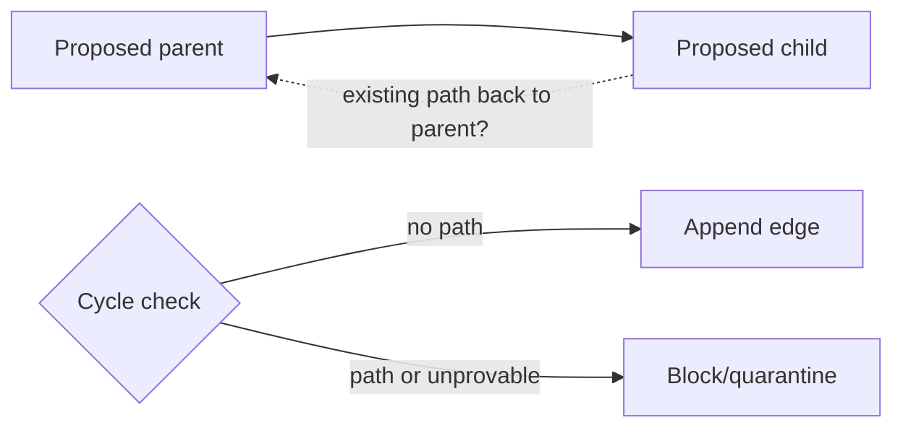
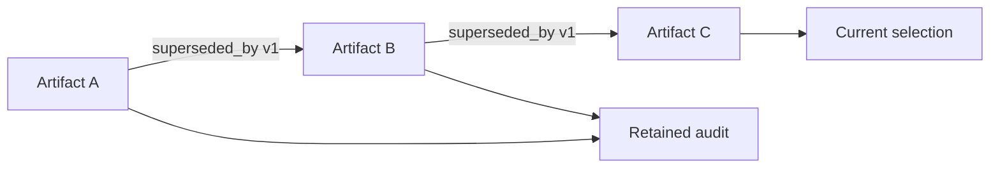
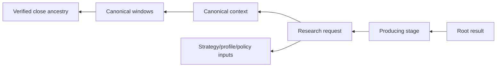

# GoTrader Track B1-L1 - Lineage Edge Reference

Status: normative planning reference; no repository implementation

Specification ID: `gotrader-b1-lineage-edge-reference-v1`

Parent:
`track-b1-canonical-lineage-graph-specification.md`

## 1. Edge Contract

Every edge is immutable and append-only.

Required fields:

| Field | Requirement |
|---|---|
| `graphSchemaVersion` | Exact graph schema |
| `edgeSchemaVersion` | Exact edge schema |
| `edgeId` | Canonical hash of stable edge identity core |
| `relationshipType` | Registered relationship |
| `relationshipVersion` | Exact semantic version |
| `parentNodeKey` | Older input/cause/source |
| `childNodeKey` | Newer derived/consumer/result |
| `creationStageId` | B1 stage or verified external gate receipt |
| `ordinal` | Required when input order is meaningful |
| `identityMetadata` | Compact allowlisted relationship identity |
| `payloadHash` | Hash of complete edge payload core |
| `integrityStatus` | Verified, unresolved, blocked, quarantined, archived |
| `authority` | Exactly `none / none / none` |
| `capabilities` | All B1 authority capabilities false |

Recorded/observed timestamps may exist in an operational envelope but do not
alter edge identity.

## 2. Direction Convention

All edges point from cause/input/older artifact to
effect/consumer/newer artifact.

This convention keeps ancestry traversal as reverse-edge traversal and
descendant traversal as forward-edge traversal.

An edge must never be added in both directions to express equivalence.
Compatibility is a one-way mapping with an explicit status.

## 3. Edge Categories

- `required_causal`: required for deterministic validation;
- `validation`: required when the child claims validation;
- `evidence_boundary`: records external gate outcomes without creating them;
- `advisory`: optional and excluded from detector traversal;
- `operational_projection`: rebuildable;
- `supersession`: immutable old-to-new selection history;
- `retention`: archive/tombstone/quarantine;
- `compatibility`: one-way legacy mapping.

Category is part of relationship semantics, not a grant of authority.

## 4. Registered Relationship Types

### 4.1 `triggered`

- **Direction:** verified close/control request -> research request.
- **Category:** required causal.
- **Allowed parents:** `verified_close` or `control_request`.
- **Allowed child:** `research_request`.
- **Cardinality:** exactly one primary trigger per request; additional cited
  controls use a different typed edge.
- **Required metadata:** trigger type/version and causal timestamp.

### 4.2 `window_constituent_of`

- **Direction:** canonical candle window -> canonical context or dataset
  manifest.
- **Category:** required causal.
- **Allowed parents:** `canonical_candle_window`.
- **Allowed children:** `canonical_context`, `historical_dataset_manifest`.
- **Cardinality:** one edge per ordered timeframe/window; ordinal required.
- **Required metadata:** timeframe, role, first/last close, count, checksum.
- **Restriction:** no candles.

### 4.3 `derived_into`

- **Direction:** source artifact -> deterministically derived artifact.
- **Category:** required causal or advisory according to endpoint types.
- **Examples:** context -> request input; native evidence -> memory document.
- **Required metadata:** derivation policy/version.
- **Restriction:** advisory derivation cannot target canonical context or
  detector result.

### 4.4 `consumed_by`

- **Direction:** immutable input artifact -> consuming research stage.
- **Category:** required causal.
- **Allowed parents:** canonical context, dataset manifest, strategy profile,
  parameter set, cost model, policy contract, or another registered immutable
  deterministic input.
- **Allowed children:** `research_request`, `research_stage`, `replay_result`,
  `oos_result`, `robustness_result`, or `historical_validation_result`.
- **Cardinality:** ordered inputs use ordinal.
- **Required metadata:** input role and consuming-stage version.
- **Restriction:** memory/advisory nodes cannot be consumed by deterministic
  context or detector stages.

### 4.5 `precedes`

- **Direction:** prior research stage -> next research stage.
- **Category:** required causal.
- **Allowed endpoints:** `research_stage`.
- **Cardinality:** one prior stage, except genesis.
- **Required metadata:** pipeline/stage sequence version.
- **Restriction:** skipping a required registered stage blocks.

### 4.6 `produced`

- **Direction:** producing stage -> output artifact.
- **Category:** required causal.
- **Allowed children:** research result, historical validation result, or
  registered compact B1 artifact.
- **Cardinality:** per stage output contract.
- **Required metadata:** output role and schema/version.

### 4.7 `validated_by`

- **Direction:** candidate/result -> validation artifact/stage.
- **Category:** validation.
- **Allowed parents:** research result, replay, OOS, robustness, historical
  result.
- **Allowed children:** corresponding deterministic validation artifact/stage.
- **Required metadata:** validation policy and exact outcome.
- **Restriction:** validation does not create evidence/readiness.

### 4.8 `sealed_as`

- **Direction:** validated stage-chain root -> terminal result.
- **Category:** required causal.
- **Allowed child:** research result or historical validation result.
- **Cardinality:** exactly one terminal seal per terminal identity.
- **Required metadata:** seal policy and stage-chain root hash.

### 4.9 `replayed_as`

- **Direction:** dataset/profile admission -> replay result.
- **Category:** required causal.
- **Required metadata:** replay engine, profile, parameters, cost, boundaries.
- **Restriction:** result metrics are referenced, not copied into the edge.

### 4.10 `evaluated_oos_as`

- **Direction:** replay result -> OOS result.
- **Category:** validation.
- **Cardinality:** each OOS result has exactly one replay parent.
- **Required metadata:** split plan and OOS engine version.

### 4.11 `stress_tested_as`

- **Direction:** eligible outcome set -> robustness result.
- **Category:** validation.
- **Required metadata:** simulation policy, seed policy, run count, cost model.
- **Restriction:** no mutable account risk state.

### 4.12 `submitted_to_evidence_gate`

- **Direction:** historical validation result -> `evidence_gate_receipt`.
- **Category:** evidence boundary.
- **Required metadata:** intake request/policy/version and submitted identity.
- **Restriction:** does not imply acceptance.

### 4.13 `accepted_as_evidence`

- **Direction:** accepted `evidence_gate_receipt` -> native evidence.
- **Category:** evidence boundary.
- **Admission requirement:** existing evidence owner exposes a verifiable
  accepted record/gate receipt.
- **Required metadata:** owner gate version and exact candidate/evidence IDs.
- **Restriction:** graph cannot append this edge from a positive result alone.

### 4.14 `indexed_as`

- **Direction:** memory document -> GBrain receipt.
- **Category:** advisory.
- **Required metadata:** document/sidecar version, content hash, and
  idempotency key.
- **Restriction:** never an input to deterministic detector traversal.

### 4.15 `cited_by`

- **Direction:** cited artifact -> advisory review or hypothesis.
- **Category:** advisory.
- **Cardinality:** one or more citations.
- **Required metadata:** citation role and bounded excerpt/summary identity, not
  full content.

### 4.16 `proposed_as`

- **Direction:** advisory review -> hypothesis.
- **Category:** advisory.
- **Required metadata:** proposal schema and safety-audit ID.
- **Restriction:** draft-only and `autoApplyAllowed: false`.

### 4.17 `admitted_as`

- **Direction:** hypothesis -> research request.
- **Category:** required causal only after deterministic admission.
- **Required metadata:** admission policy, explicit control request, and
  reconstructed authoritative identity hash.
- **Restriction:** the request may cite the hypothesis, but detectors cannot
  consume advisory text.

### 4.18 `projects_as`

- **Direction:** immutable source -> checkpoint/operator projection.
- **Category:** operational projection.
- **Required metadata:** projection version and source revision.
- **Restriction:** projection is rebuildable and cannot become evidence.

### 4.19 `superseded_by`

- **Direction:** old immutable artifact -> new immutable artifact.
- **Category:** supersession.
- **Required metadata:** supersession policy, reason, compatibility status, and
  effective selection time.
- **Restriction:** old artifact remains; native evidence requires owner action.

### 4.20 `quarantined_by`

- **Direction:** offending node/edge reference -> quarantine record.
- **Category:** retention/control.
- **Required metadata:** blocker, expected/observed identity, hold policy.
- **Restriction:** quarantine does not mutate source.

### 4.21 `archived_by`

- **Direction:** node/edge reference -> archive manifest.
- **Category:** retention.
- **Required metadata:** archive checksum, format/version, retention policy.
- **Restriction:** only the storage binding changes.

### 4.22 `tombstoned_by`

- **Direction:** compacted node reference -> tombstone.
- **Category:** retention.
- **Required metadata:** original identity/hash, archive reference, reason,
  policy/version.
- **Restriction:** tombstone cannot claim the hot payload exists.

### 4.23 `compatibility_maps_to`

- **Direction:** legacy/external artifact -> B1 compatibility reference.
- **Category:** compatibility.
- **Required metadata:** adapter/version, exact/documented-variance/incomplete/
  blocked status, and test/report ID.
- **Restriction:** one-way; does not replace the legacy ID.

## 5. Endpoint Rules

The edge registry must define for each relationship:

- allowed parent and child node types/classes;
- minimum and maximum cardinality;
- whether ordinal is required;
- required identity metadata;
- owner adapters required;
- whether the edge participates in required ancestry;
- whether it participates in cycle checking;
- retention strength;
- allowed query audiences.

Runtime registration from settings, AI, memory, or proposals is prohibited.

## 6. Edge Admission

Admission sequence:

1. validate schema and relationship registry entry;
2. resolve parent and child references;
3. validate owner identities and hashes;
4. validate endpoint types and direction;
5. validate cardinality and ordinal;
6. validate identity metadata;
7. validate authority/capabilities;
8. prove acyclicity under the admission policy;
9. calculate edge ID and payload hash;
10. coalesce exact duplicate or append atomically;
11. quarantine any conflict.

No partial edge is visible.

## 7. Cycle Prevention

All registered edges participate in a single DAG.

Before append:

- reject self-edge;
- reject reverse path from child to parent;
- reject supersession fork/cycle under policy;
- reject a traversal that exceeds admission proof bounds;
- never waive cycle checks for advisory or compatibility edges.

If a compatibility relationship cannot be oriented causally, it must remain
outside the canonical graph as diagnostic metadata.



## 8. Duplicate And Conflict Rules

| Condition | Result |
|---|---|
| Same edge ID, same payload hash | Idempotent duplicate |
| Same identity core, changed payload | Quarantine and block |
| Same endpoints/type, different relationship version | New edge; compatibility required |
| Same child violates max cardinality | Block |
| Missing endpoint | Reject or mark unresolved only for imported optional references |
| Unknown required relationship version | Block |
| Unknown optional advisory version | Exclude and warn |
| Authority drift | Critical block |

## 9. Supersession Rules

Supersession is not deletion.



Rules:

- one active successor per selection policy unless an explicit branch resolver
  exists;
- forks block "current" selection but retain all artifacts;
- cycles block admission;
- source/profile/cost/version changes remain visible;
- supersession never changes prior metrics;
- a newer result is not "better" merely because it is newer.

## 10. Required Path Templates

### 10.1 Current-market result

```text
verified_close
  -> triggered -> research_request
  -> consumed_by -> research_stage(s)
  -> precedes -> research_stage(s)
  -> produced/validated_by/sealed_as -> research_result
```

Context and window references attach through `window_constituent_of`,
`derived_into`, and `consumed_by`.

### 10.2 Historical validation

```text
historical_dataset_manifest
  -> replayed_as -> replay_result
  -> evaluated_oos_as -> oos_result
  -> stress_tested_as -> robustness_result
  -> validated_by/sealed_as -> historical_validation_result
```

The robustness node may be absent only when the validation contract explicitly
marks it optional and records the blocker.

### 10.3 Evidence boundary

```text
historical_validation_result
  -> submitted_to_evidence_gate -> evidence_gate_receipt
  -> accepted_as_evidence -> native_evidence
```

The second edge requires proof from the native evidence owner.

### 10.4 Advisory memory

```text
native_evidence
  -> derived_into -> memory_document
  -> indexed_as -> gbrain_receipt
  -> cited_by -> advisory_review
  -> proposed_as -> hypothesis
  -> admitted_as -> research_request
```

This path does not connect memory to context or detector stages.

## 11. Traversal Semantics

### Ancestry

Reverse traversal from child to parents using an edge allowlist. Ordered input
edges are returned by ordinal then edge ID.



### Descendants

Forward traversal from parent to children. Results are deterministically sorted
by causal timestamp, node key, relationship type, then edge ID.


The dashed descendants remain subject to their owner gate or optional-advisory
policy. Traversal never creates either relationship.

### Completeness

A traversal is complete only when:

- no required endpoint is unresolved;
- no edge/hash/version/cardinality conflict exists;
- no query bound was reached;
- all required owner adapters responded;
- no cycle exists.

Optional advisory omissions are reported separately.

### Pagination

Continuation cursors bind:

- root node;
- direction;
- edge allowlist;
- filter and policy versions;
- last deterministic sort key;
- graph snapshot/revision;
- expiry and integrity hash.

A cursor cannot change query scope or authority.

## 12. Retention Strength

Each edge declares:

- `strong`: parent and child required while either retained root needs the path;
- `weak_advisory`: absence degrades advisory history only;
- `operational`: rebuildable;
- `archive_preserved`: compact edge remains while payload is archived;
- `tombstone_preserved`: endpoint identity remains via tombstone.

Required causal, validation, and accepted-evidence edges are strong.
Advisory and projection edges are not promoted to strong merely through use.

## 13. Audit Diagnostics

Per edge operation:

- relationship/version;
- endpoint keys/types/owners;
- edge ID and payload-hash validation;
- duplicate/conflict outcome;
- cardinality;
- cycle-check nodes/edges examined;
- duration and policy;
- archive/tombstone resolution;
- authority.

No edge diagnostic includes raw artifact payloads.

## 14. Forbidden Relationships

The registry must reject any edge that implies:

- GBrain/advisory memory -> canonical context;
- GBrain/advisory memory -> deterministic detector result;
- positive result -> native evidence without owner gate proof;
- research result -> readiness approval;
- hypothesis -> calibration application;
- hypothesis -> trade intent;
- projection/checkpoint -> native evidence;
- graph node -> broker/account/order/position mutation;
- B1 artifact -> production adoption;
- any authority upgrade.

## 15. Final Rule

An edge proves one versioned relationship between two recognized identities. It
does not transfer trust, authority, evidence status, readiness, or production
eligibility from one endpoint to the other.
