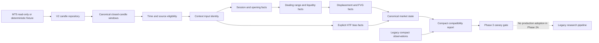

# GoTrader V2 Phase 2A Canonical Market Context Engine Report

## Executive Decision

GoTrader V2 Phase 2A is complete as a deterministic, source-bound,
shadow-only canonical market context engine.

The engine can derive seven compact market-context fact families from canonical
closed-candle windows:

1. sessions;
2. opening prices;
3. dealing ranges;
4. liquidity pools and sweeps;
5. displacement;
6. fair value gaps and lifecycle state;
7. explicit higher-timeframe bias.

Phase 2A is approved to enter a profile-scoped Phase 3 canary review. It is not
approved for general production adoption. The legacy GoTrader research pipeline
remains authoritative.

```text
Phase 2A status: complete
Production adoption: none
Legacy authority: retained
V2 mode: shadow only
Execution authority: none
Broker authority: none
Readiness override authority: none
```

## Scope

Phase 2A establishes a shared context vocabulary and deterministic fact lineage.
It does not create strategy signals, trade geometry, evidence, readiness,
Paper-Demo candidates, broker requests, or execution intent.

Included:

- normalized source and candle-window identity;
- current-live time-contract eligibility;
- MT5 offset-regime continuity;
- compact shadow fact generation;
- causal timestamps and derivation lineage;
- legacy/V2 compatibility reporting;
- deterministic fixtures and preservation baselines.

Excluded:

- strategy migration;
- IFVG entry/retest logic;
- order blocks, breakers, MSS, or strategy-specific confluence;
- candidate promotion;
- replay or walk-forward migration;
- evidence or maturity creation;
- Paper-Demo or execution integration;
- account, order, position, or broker mutation.

## Implementation History

| Phase | Commit | Result |
|---|---|---|
| 2A.0 | `5f873b2` | Shadow context contracts, identity, eligibility, and empty builder foundation. |
| 2A.1 | `a1c5086` | MT5 offset-regime continuity ledger. |
| 2A.2 | `b7f8171` | Manual loopback-only shadow continuity collector. |
| 2A.3 | `1361c03` | Session and opening-price facts. |
| 2A.4 | `095d45a` | Session dealing-range and liquidity facts. |
| 2A.5 | `aba81c5` | Displacement and FVG lifecycle facts. |
| 2A.6 | `4655c37` | Explicit higher-timeframe directional facts. |
| Completion gate | `e2b0609` | Legacy/V2 compatibility report and Phase 3 blocking policy. |

## Architecture



The builder is dependency ordered:

1. validate source, timing, and required windows;
2. build stable context input identity;
3. derive session and opening-price facts;
4. derive session-scoped ranges and liquidity from session facts;
5. derive displacement and FVG lifecycle from canonical candles and prior facts;
6. derive HTF direction from explicit timeframe windows;
7. return one immutable shadow context artifact.

Any blocked dependency prevents downstream fact construction.

## Core Contracts

The context engine centers on:

- `V2CanonicalMarketContextBuilder`;
- `V2ContextBuildRequest`;
- `V2CanonicalMarketState`;
- `V2ContextInputIdentity`;
- `V2MarketFact`;
- `V2FactEnvelope`;
- `V2ContextDiagnostics`;
- `V2ContextCompatibilityReport`.

Every fact carries:

- stable `factId`;
- context identity reference;
- fact kind and timeframe;
- observed market time;
- causal closed-candle time;
- validity timing;
- quality and blockers;
- policy-versioned derivation;
- input window hashes;
- input fact IDs;
- authority `none / none / none`.

Raw candle arrays are inputs to fact engines only. They are not included in
context facts or compatibility reports.

## Identity And Time Integrity

The context identity binds:

- provider and source ID;
- requested symbol;
- broker symbol;
- source fingerprint;
- source kind;
- read-only market-data capability;
- purpose;
- as-of market time;
- required timeframes;
- canonical input-window hashes;
- data-window start and end;
- last closed candle;
- candle counts;
- time normalization policy;
- terminal time-contract status;
- offset-regime identity where available;
- requested fact families;
- fact-policy versions.

Equivalent inputs generate the same context artifact regardless of window order
or build timestamp.

Current-live MT5 context requires a fresh accepted terminal contract and
continuous offset-regime coverage. A stale terminal observation, continuity
gap, terminal restart, offset change, incompatible build, or source mismatch
terminates eligibility.

Current-live verification does not grant historical DST verification. Replay,
walk-forward, and deep research remain separately gated.

## Fact Engines

### Session Facts

The session engine uses `America/New_York` boundaries and supports:

- Asia;
- London;
- New York AM;
- New York Lunch;
- New York PM.

Quality depends on exact M5 coverage. Partial sessions are visible as degraded;
missing data is not silently completed.

### Opening-Price Facts

The initial engine emits exact candle-open facts for:

- Sunday open;
- New York midnight;
- New York 09:30.

Missing boundary candles do not use a later-candle or manual fallback.

### Dealing-Range Facts

Ranges are session scoped and include:

- low and high;
- midpoint/equilibrium;
- premium and discount boundaries;
- direction;
- anchor start and end times;
- source session fact lineage;
- completion quality.

The engine does not guess a global or setup-local range.

### Liquidity Facts

The initial V2 policy creates confirmed session-high and session-low pools with:

- buy-side or sell-side classification;
- active, touched, swept, or inactive state;
- strict post-confirmation breach detection;
- rejection-back-inside or wick-through sweep state;
- pool-to-sweep lineage.

Equal-level tolerance, tick-size tolerance, spread-aware tolerance, and
broker-specific pool selection are not inferred in Phase 2A.

### Displacement Facts

The deterministic displacement policy uses:

- the mean body of the previous ten closed candles;
- a fixed `1.6x` minimum body multiple;
- candle direction and body-to-range ratio;
- structure-close checks against causally available liquidity facts;
- one subsequent closed candle before confirming whether an FVG was left.

This policy emits a causal fact set. It does not choose a trade.

### Fair-Value-Gap Facts

FVG facts use strict three-candle bullish or bearish geometry and track one
exclusive lifecycle state:

- `fresh`;
- `touched`;
- `partially_filled`;
- `filled`;
- `inverted`;
- `invalidated`.

Matching displacement lineage is retained when available. Phase 2A does not
create a separate IFVG candidate or retest entry.

### Higher-Timeframe Bias Facts

The HTF engine accepts explicit:

- M15;
- H1;
- H4;
- D1;
- W1.

It uses the last five closed candles and a fixed `0.10%` return threshold.
Close-through of the prior four-candle structure affects confidence.

Missing timeframes remain missing. D1 is never synthesized into W1 by the V2
engine. A shallow explicit window emits `insufficient_data`.

## Deterministic Fixture Results

The combined compatibility fixture produced:

| Fact family | Count |
|---|---:|
| Session | 5 |
| Opening price | 3 |
| Dealing range | 5 |
| Liquidity pool/sweep | 12 |
| Displacement | 5 |
| Fair value gap | 2 |
| Higher-timeframe bias | 5 |

Additional focused fixtures verified:

- daylight-saving-aware New York boundaries;
- complete and partial sessions;
- strict missing-boundary behavior;
- active, touched, and swept liquidity states;
- rejection and wick-through sweep distinctions;
- FVG lifecycle transitions;
- deterministic context and fact IDs;
- visible missing HTF windows;
- no W1 synthesis;
- no raw candle serialization.

## Legacy Compatibility Review

The Phase 2A compatibility fixture runs legacy session-range, liquidity-pool,
dealing-range, displacement, and FVG helpers against the same underlying fixture
used by the V2 builder. Opening prices are normalized from the same boundary
candles. Legacy HTF observations use the existing full-window bias formula
against the same explicit timeframe fixtures.

| Family | Outcome | Explanation |
|---|---|---|
| Session | `exact_parity` | Same five normalized sessions and completion set. |
| Opening price | `exact_parity` | Same Sunday, midnight, and 09:30 boundaries and prices. |
| Dealing range | `documented_variance` | Legacy full-window range versus V2 session-scoped ranges. |
| Liquidity | `documented_variance` | Legacy mixed swing/period/session selector versus V2 session pool lifecycle. |
| Displacement | `documented_variance` | Legacy latest match versus V2 causal fact set. |
| Fair value gap | `documented_variance` | Legacy selected FVG versus V2 lifecycle fact set. |
| Higher-timeframe bias | `documented_variance` | Legacy full-window direction versus V2 explicit last-five policy. |

Strict invariants include source fingerprint, symbols, authority, session IDs,
opening types, liquidity sides, latest displacement direction, latest FVG
direction, and explicit HTF set.

The following negative controls block Phase 3:

- source-fingerprint mismatch;
- strict direction mismatch;
- missing fact family;
- missing required comparison metric;
- unknown or missing variance policy;
- non-none authority.

The compatibility result is `ready_for_canary_review`. It is not a strategy
parity claim.

## Validation And Preservation

The completed Phase 2A matrix passed:

- `npm.cmd run typecheck`;
- `npm.cmd run build`;
- `npm.cmd run test`;
- `npm.cmd run test:core`;
- `npm.cmd run test:strategy-baselines`;
- `npm.cmd run test:source-integrity`;
- `npm.cmd run test:provenance`;
- `npm.cmd run test:safety`;
- `npm.cmd run test:browser-smoke`;
- all focused Phase 2A tests.

Browser smoke passed `44/44`.

Frozen behavior hashes remain unchanged:

- IFVG v3 positive canary:
  `1661113c11dccbb53516a5b42ba1dc70a9dbb4f5e7d33f4f03fb01e79116951a`;
- IFVG v2 negative control:
  `3dcf4a0a0be9689031d42f4ec11ea6813b26c2314f830ea9f5a6f29001479224`;
- strategy catalog:
  `43e146df111166e8ab508288ce42afae22aca4ca18e1be07320f374b0a3fa1de`.

The production build retains pre-existing Rollup circular-chunk and large-chunk
warnings. Phase 2A does not change those warnings.

## Safety Result

Phase 2A introduces no:

- execution route;
- trade placement;
- broker mutation;
- account, order, position, or deal access;
- readiness override;
- Paper-Demo promotion;
- OpenClaw authority;
- auto-apply behavior;
- raw candle persistence.

The MT5 safety suite confirms mutation and sensitive paths remain blocked. V2
context facts cannot grant broker or execution capability.

## Operational Limitations

1. The shadow offset-regime collector remains manual and loopback-only.
2. A process or machine restart creates a real continuity gap.
3. Historical DST correctness remains separately unverified.
4. Live facts require a fresh terminal clock contract and continuous coverage.
5. Phase 2A does not migrate any detector.
6. Context parity does not prove candidate, geometry, replay, OOS, evidence, or
   readiness parity.
7. Breakers, order blocks, MSS, IFVG retest semantics, and model-aware HTF
   alignment are intentionally deferred.
8. No automatic deep-history request was added.

## Rollback

Phase 2A is additive and has zero production consumers. Rollback requires
removing or disabling the isolated V2 shadow modules and tests. It does not
require:

- a data migration;
- a browser-storage migration;
- a strategy rollback;
- a readiness rollback;
- a broker or execution change.

## Phase 3 Entry Recommendation

Begin with one profile-scoped IFVG v3 shadow adapter:

1. keep the legacy IFVG v3 detector authoritative;
2. use the same canonical closed-candle windows for both paths;
3. adapt only V2 facts required by IFVG v3;
4. dual-run candidate detection in shadow;
5. compare candidate identity and causal timestamp;
6. compare entry, invalidation, target, and RR geometry;
7. compare blockers and supporting conditions;
8. rerun frozen replay and chronological OOS controls;
9. retain IFVG v2 as the negative control;
10. require source/provenance and authority parity;
11. add an immediate canary rollback switch;
12. keep readiness, Paper-Demo, and execution disconnected.

Any unexplained difference must stop the canary. A cleaner context architecture
is not permission to alter validated strategy behavior.

## Final Conclusion

The Phase 2A engine successfully establishes a deterministic canonical
market-context layer without disturbing GoTrader’s validated research behavior
or safety boundaries. It is ready to support a narrow Phase 3 compatibility
canary, but it is not yet a production strategy input.

```text
PHASE 2A COMPLETE
CANARY REVIEW READY
LEGACY AUTHORITATIVE
V2 SHADOW ONLY
NO EXECUTION OR READINESS AUTHORITY
```
