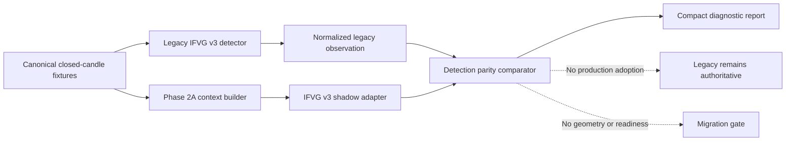

# GoTrader V2 Phase 3A IFVG v3 Shadow Adapter Report

## Executive Decision

Phase 3A implemented a shadow-only IFVG v3 detection adapter, a normalized
legacy observation, and a deterministic parity comparator. The implementation
and preservation tests pass, but the detection-parity migration gate does not.

The V2 context identifies IFVG inversions causally. It cannot yet prove the
legacy detector's unused-zone requirement because Phase 2A retains only the
final FVG lifecycle state. It also cannot reproduce the legacy detector's
selected candidate when multiple inverted FVG facts are present because that
selection currently depends on downstream geometry and blocker ranking.

```text
Phase 3A implementation: complete
Detection parity: not achieved
Production adoption: none
Legacy IFVG v3 authority: retained
V2 mode: shadow only
Execution authority: none
Broker authority: none
Readiness override authority: none
```

## Branch And Commit

- Branch: `codex/gotrader-v2-phase-3a-ifvg-shadow`
- Baseline: `5e0c280 Add Phase 2A context engine report`
- Phase 3A commit: this report and shadow-canary implementation

## Scope

Included:

- generic V2 strategy-adapter contract;
- IFVG v3 detection-only shadow adapter;
- normalized legacy IFVG v3 observation;
- semantic candidate identity;
- deterministic legacy/V2 comparison report;
- IFVG v2 frozen negative control;
- parity, causality, source-integrity, serialization, and safety tests;
- test-manifest registration and diagnostic command.

Excluded:

- entry, invalidation, target, or RR geometry;
- retest-entry migration;
- replay, walk-forward, OOS, evidence, or readiness migration;
- Paper-Demo promotion;
- production detector routing;
- broker, account, order, position, or execution integration.

## Files Created

- `src/lib/v2/strategyAdapters/v2StrategyAdapter.ts`
- `src/lib/v2/strategyAdapters/index.ts`
- `src/lib/v2/strategyAdapters/ifvg/index.ts`
- `src/lib/v2/strategyAdapters/ifvg/v2IfvgV3Types.ts`
- `src/lib/v2/strategyAdapters/ifvg/v2IfvgV3Identity.ts`
- `src/lib/v2/strategyAdapters/ifvg/v2IfvgV3Adapter.ts`
- `src/lib/v2/strategyAdapters/ifvg/v2IfvgV3LegacyObservation.ts`
- `src/lib/v2/strategyAdapters/ifvg/v2IfvgV3Comparison.ts`
- `scripts/test-v2-ifvg-shadow.mjs`
- `docs/gotrader-v2/phase-3a-ifvg-legacy-mapping.md`
- `docs/gotrader-v2/phase-3a-ifvg-shadow-report.md`

The V2 barrel, package scripts, and baseline test manifest were updated only to
expose and exercise the isolated shadow adapter.

## Adapter Architecture



The generic adapter contract binds:

- strategy, profile, adapter, and contract versions;
- required fact families and timeframes;
- source and context identity;
- immutable compact artifacts;
- diagnostics and explicit limitations;
- `shadowOnly: true`;
- authority `none / none / none`.

The IFVG artifact contains only detection identity and lineage:

- normalized candidate ID;
- direction;
- semantic FVG identity hash;
- inversion reference and causal close time;
- supporting displacement/liquidity fact IDs when available;
- blockers and limitations.

It does not serialize FVG price bounds, candles, trade geometry, account data,
orders, positions, secrets, or mutable state.

## Legacy And Fact Mapping

Legacy IFVG v3 remains the reference behavior:

1. find a strict three-candle FVG;
2. reject use of the zone before inversion;
3. require a full close through the far boundary within the legacy horizon;
4. apply detector and geometry blockers;
5. select the strongest candidate;
6. require a clean, current retest in the v3 wrapper.

Phase 2A represents:

- strict three-candle FVG identity;
- final FVG lifecycle;
- inversion time;
- displacement lineage;
- supporting liquidity lineage;
- source, timeframe, and causal timestamps.

Phase 2A does not currently represent:

- ordered lifecycle transitions before the final state;
- proof that the FVG was unused before inversion;
- fresh-retest history;
- the legacy detector's geometry-based candidate-ranking inputs.

These gaps are visible as limitations. The adapter does not infer missing
evidence.

## Detection Parity Result

| Canary | Legacy | V2 | Outcome |
|---|---:|---:|---|
| No-IFVG fixture | 0 | 0 | `exact_parity` |
| Positive full-context fixture | 1 | 2 | `v2_only` |
| Focused matching FVG | 1 | 1 | `insufficient_comparison_data` |

The positive full-context fixture exposes two inverted FVG facts. The legacy
detector selects one after applying its full blocker and geometry ranking. The
Phase 3A adapter correctly refuses to use geometry that is outside this phase,
so it reports the additional V2 candidate.

When comparison is narrowed to the semantically matching FVG, identity,
direction, and inversion time align. Complete detection parity still cannot be
claimed because the compact context cannot prove the zone was unused before
inversion.

Therefore:

```text
detectionParityAchieved = false
fullStrategyParityClaimed = false
```

## Comparison Policy

The comparator supports:

- `exact_parity`;
- `acceptable_normalized_variance`;
- `legacy_only`;
- `v2_only`;
- `regression`;
- `insufficient_comparison_data`.

Source fingerprint, profile identity, or context identity mismatches are
regressions. Unknown freshness is insufficient data, not parity. Additional or
missing candidates are explicit `v2_only` or `legacy_only` outcomes.

## Negative Control

The frozen IFVG v2 profile remains a negative control:

- it is not promoted;
- it gains no production consumer;
- its frozen behavior hash is unchanged;
- Phase 3A does not alter legacy IFVG files or strategy registration.

No shadow artifact creates evidence, readiness, Paper-Demo status, or an
execution request.

## Focused Test Coverage

`test:v2-ifvg-shadow` verifies:

- bullish and bearish inversion detection;
- no-IFVG exact parity;
- fresh, touched, partially filled, and filled FVGs do not become IFVGs;
- invalidated and stale facts expire;
- blocked context and mock/sample source fail closed;
- fact-order determinism;
- duplicate and ambiguous inverted-fact handling;
- source mismatch is a regression;
- compact serialization excludes raw candles, secrets, account/order/position
  data, and trade geometry;
- IFVG v3 and IFVG v2 frozen hashes remain unchanged;
- IFVG v2 stays non-promotable;
- no production consumer was added;
- authority remains `none / none / none`.

## Validation Results

The following passed:

- `npm.cmd run typecheck`;
- `npm.cmd run build`;
- `npm.cmd run test:v2-ifvg-shadow`;
- `npm.cmd run test:core`;
- `npm.cmd run test:strategy-baselines`;
- `npm.cmd run test:source-integrity`;
- `npm.cmd run test:provenance`;
- `npm.cmd run test:safety`;
- `npm.cmd run test:browser-smoke`.

Browser smoke passed `44/44`. The production build retains only the existing
Rollup circular-chunk and large-chunk warnings.

Focused diagnostic summary:

```text
positive canary outcome: v2_only
focused candidate outcome: insufficient_comparison_data
detection parity achieved: false
production adoptions: 0
raw candles serialized: false
trade geometry serialized: false
```

## Frozen Hashes

- IFVG v3 positive canary:
  `1661113c11dccbb53516a5b42ba1dc70a9dbb4f5e7d33f4f03fb01e79116951a`
- IFVG v2 negative control:
  `3dcf4a0a0be9689031d42f4ec11ea6813b26c2314f830ea9f5a6f29001479224`

## Safety And Authority

Phase 3A adds no:

- production strategy consumer;
- execution route or live control;
- broker mutation;
- account, order, position, or deal access;
- readiness override;
- Paper-Demo promotion;
- evidence creation;
- raw candle persistence.

Every adapter, observation, artifact, and comparison report carries:

```text
executionAuthority: none
brokerAuthority: none
readinessOverrideAuthority: none
```

## Rollback

The canary is additive and has zero production consumers. Rollback requires
removing the isolated strategy-adapter namespace, the focused diagnostic,
package/test-manifest registrations, and these Phase 3A documents. No data,
browser-storage, strategy, readiness, broker, or execution migration is needed.

## Phase 3B Prerequisites

Do not begin geometry parity yet. First add a narrow compatibility extension:

1. preserve ordered FVG lifecycle transitions or an equivalent compact
   pre-inversion usage observation;
2. expose enough deterministic detection-ranking context to reproduce the
   legacy selected candidate without importing entry/stop/target/RR behavior;
3. keep the added facts source-bound, causal, immutable, and shadow-only;
4. rerun the same Phase 3A fixture and frozen controls;
5. require exact parity or a documented, approved normalized variance.

Only after detection parity passes should Phase 3B compare fresh-retest and
trade geometry.

## Final Status

```text
PHASE 3A BLOCKED — DETECTION PARITY NOT ACHIEVED
LEGACY IFVG V3 REMAINS AUTHORITATIVE
V2 SHADOW ONLY
NO PRODUCTION ADOPTION
NO EXECUTION OR READINESS AUTHORITY
```
