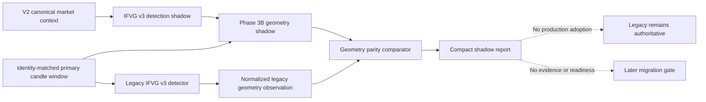

# GoTrader V2 Phase 3B IFVG v3 Geometry Shadow Report

## Executive Decision

Phase 3B adds a shadow-only IFVG v3 fresh-retest and trade-geometry canary.
It projects geometry from the Phase 2A canonical market context and its
identity-matched primary candle window, then compares that result with a
normalized observation of the authoritative legacy IFVG v3 detector.

The selected positive-canary candidate reaches exact geometry parity. The
full fixture reaches `acceptable_normalized_variance` because the legacy
public detector returns one post-ranked candidate while the V2 shadow canary
returns the complete bounded geometry set. Candidate ranking, non-geometry
blocker parity, replay, evidence, maturity, readiness, and production routing
remain outside this phase.

```text
Phase 3B implementation: complete
Selected-candidate geometry parity: achieved
Full candidate-selection parity: not achieved
Full strategy parity: not claimed
Production adoption: none
Legacy IFVG v3 authority: retained
V2 mode: shadow only
Execution authority: none
Broker authority: none
Readiness override authority: none
```

## Branch And Baseline

- Branch: `codex/gotrader-v2-phase-3b-ifvg-geometry`
- Baseline: `8811d0b Complete IFVG v3 shadow detection parity`
- Scope: additive shadow projection and comparison only

## Scope

Included:

- compact IFVG v3 geometry contract;
- identity-matched canonical context and primary-window input contract;
- legacy fresh-retest, entry, invalidation, target, and RR policy projection;
- normalized legacy geometry observation;
- deterministic geometry comparison with numeric tolerance;
- bullish, bearish, missing-retest, stale-retest, identity-mismatch, and
  deliberate-drift fixtures;
- preservation, source-integrity, provenance, safety, and browser tests.

Excluded:

- production strategy routing;
- selected-candidate ranking migration;
- HTF, volume, and session blocker parity;
- replay, walk-forward, OOS, evidence, maturity, or readiness migration;
- validation-chain entry creation;
- Paper-Demo promotion;
- broker, account, order, position, or execution integration.

## Architecture



The canonical market context supplies source identity and compact IFVG
detection facts. The corresponding `V2CanonicalCandleWindow` remains internal
to the geometry projection and must match the context's source fingerprint and
window identity. A mismatch blocks projection instead of attempting a fallback.

Raw candles are not included in artifacts, comparisons, logs, UI state,
memory, or validation-chain state.

## Geometry Policy

For each detection-stage IFVG candidate, the shadow adapter reproduces the
legacy geometry policy:

1. locate the inversion candle in the identity-matched primary window;
2. search the next 24 closed bars for the first zone retest that respects the
   inversion direction;
3. require a clean midpoint retest;
4. require the retest to be current, with signal age zero;
5. use the FVG midpoint as entry;
6. place invalidation beyond the FVG boundary using the larger of:
   - 3% of the recent 24-bar average range;
   - 2% of the gap size;
   - the minimum `0.01` buffer;
7. select the nearest qualifying prior-swing liquidity target from a 96-bar
   lookback;
8. apply the shared deterministic trade-construction contract with minimum
   RR `2.0` and preferred RR `3.0`.

The adapter emits blocker IDs for missing inversion history, missing or
unclean retest, stale signal, incomplete geometry, invalid price ordering,
and insufficient RR. It does not weaken or reinterpret those blockers.

## Compact Artifact

Each artifact contains:

- source, symbol, timeframe, fingerprint, and context identities;
- normalized candidate and detection artifact IDs;
- direction and inversion time;
- retest close time, bars after inversion, cleanliness, age, and freshness;
- zone bounds and midpoint;
- entry, invalidation, target, RR, risk distance, and target distance when
  constructible;
- prior-swing liquidity target reference;
- compact blockers, warnings, and limitations;
- `canCreateValidationChainEntry: false`;
- `researchOnly: true`;
- `shadowOnly: true`;
- authority `none / none / none`.

It excludes raw candles, runtime snapshots, account data, orders, positions,
secrets, and mutable broker commands.

## Canary Results

The deterministic positive long canary produced:

| Field | Value |
|---|---:|
| Side | `long` |
| Entry | `95.0000` |
| Invalidation | `93.9095` |
| Target | `98.6000` |
| RR | `3.3012` |

Comparison results:

| Canary | Result |
|---|---|
| Positive full fixture | `acceptable_normalized_variance` |
| Selected positive candidate | `exact_parity` |
| Bullish geometry | constructed |
| Bearish geometry | constructed |
| Missing retest | blocked |
| Stale retest | blocked |
| Primary-window identity mismatch | blocked |
| Deliberately altered target | `regression` |

The documented full-fixture variance is:

```text
legacy_single_ranked_candidate_vs_v2_geometry_set
```

It is accepted only when the legacy-selected candidate matches exactly and all
additional V2 artifacts remain bounded, research-only shadow outputs with no
validation-chain capability and authority `none / none / none`.

Therefore:

```text
selectedCandidateGeometryParityAchieved = true
fullCandidateSelectionParityAchieved = false
fullStrategyParityClaimed = false
productionAdoptionAllowed = false
```

## Comparison Policy

The comparator checks:

- source, context, and primary-window identity;
- direction and inversion time;
- retest time, horizon, cleanliness, age, and freshness;
- zone bounds and midpoint;
- entry, invalidation, target, RR, risk distance, and target distance;
- target type and price;
- minimum RR;
- construction validity and geometry completeness;
- blocker parity.

Numeric geometry uses a deterministic tolerance of `0.0001`. Metadata
mismatches and unexplained geometry drift are regressions.

## Validation

The following passed:

- `npm.cmd run typecheck`;
- `npm.cmd run build`;
- `npm.cmd run test:v2-ifvg-geometry-shadow`;
- `npm.cmd run test:v2-ifvg-shadow`;
- `npm.cmd run test:core`;
- `npm.cmd run test:strategy-baselines`;
- `npm.cmd run test:source-integrity`;
- `npm.cmd run test:provenance`;
- `npm.cmd run test:safety`;
- `npm.cmd run test:browser-smoke` (`44/44`);
- `git diff --check`.

The production build retains only the pre-existing Rollup circular-chunk and
large-chunk warnings.

## Preservation

Frozen behavior hashes remain unchanged:

- IFVG v3 positive canary:
  `1661113c11dccbb53516a5b42ba1dc70a9dbb4f5e7d33f4f03fb01e79116951a`
- IFVG v2 negative control:
  `3dcf4a0a0be9689031d42f4ec11ea6813b26c2314f830ea9f5a6f29001479224`

There are zero production adopters of the Phase 3B adapter. Existing legacy
strategy routing, replay, evidence, maturity, readiness, Paper-Demo, risk,
broker, and execution behavior are unchanged.

## Safety

Phase 3B adds no:

- execution route or live control;
- broker mutation;
- account, order, position, deal, or history access;
- readiness override;
- evidence creation;
- Paper-Demo promotion;
- raw candle persistence;
- autonomous calibration path.

All new contracts retain:

```text
executionAuthority: none
brokerAuthority: none
readinessOverrideAuthority: none
```

## Rollback

The canary is additive and shadow-only. Rollback requires removing the Phase
3B geometry types, adapter, legacy observation, comparator, test script,
exports, test-manifest registration, package command, and this report. No
production state or data migration is required.

## Next Recommendation

The next bounded migration step should be Phase 3C: selected-candidate ranking
and remaining detector-blocker parity. It should compare candidate ordering
and HTF, volume, and session blockers without adopting V2 output in production.
Only after that can the IFVG canary make a defensible full candidate-selection
parity claim. Replay, evidence, readiness, Paper-Demo, and execution must
remain separate later phases.

## Final Status

```text
PHASE 3B PASSED - SELECTED IFVG V3 GEOMETRY PARITY ACHIEVED
FULL CANDIDATE-SELECTION AND FULL STRATEGY PARITY NOT CLAIMED
LEGACY IFVG V3 REMAINS AUTHORITATIVE
V2 SHADOW ONLY
NO PRODUCTION ADOPTION
NO EXECUTION OR READINESS AUTHORITY
```
