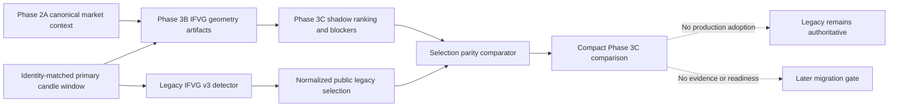

# GoTrader V2 Phase 3C IFVG v3 Selection Shadow Report

## Executive Decision

Phase 3C completes the public selected-candidate intake canary for IFVG v3. It
adds shadow-only candidate ranking and parity checks for higher-timeframe
alignment, low-volume detection, session context, and selected-candidate
blockers.

The deterministic canaries reach exact parity for the public legacy-selected
candidate, including positive, low-volume, against-HTF, and no-candidate cases.
The legacy detector does not expose its complete ranked candidate set, so this
phase does not claim full hidden candidate-set ordering or full strategy
parity.

```text
Phase 3C implementation: complete
Public selected-candidate ranking parity: achieved
Selected-candidate blocker parity: achieved
HTF, volume, and session parity: achieved
Full hidden candidate-set ordering parity: not claimed
Full strategy parity: not claimed
Production adoption: none
Legacy IFVG v3 authority: retained
V2 mode: shadow only
Execution authority: none
Broker authority: none
Readiness override authority: none
```

## Branch And Baseline

- Branch: `codex/gotrader-v2-phase-3c-ifvg-ranking`
- Baseline: `6e21360 Add IFVG v3 shadow geometry canary`
- Scope: additive shadow selection, observation, and comparison only

## Scope

Included:

- compact selected-candidate and candidate-summary contracts;
- deterministic ranking of Phase 3B geometry candidates;
- normalized observation of the public legacy-selected candidate;
- HTF direction and alignment parity;
- low-volume blocker parity;
- selected-candidate session-context parity;
- base and final blocker parity;
- identity mismatch and deliberate regression fixtures;
- preservation, source-integrity, provenance, safety, and browser validation.

Excluded:

- production strategy routing or adoption;
- full hidden legacy candidate-set ordering;
- replay, walk-forward, OOS, evidence, maturity, or readiness migration;
- validation-chain entry creation;
- Paper-Demo promotion;
- broker, account, order, position, or execution integration;
- raw candle serialization.

## Architecture



The V2 adapter consumes canonical context facts and the identity-matched
primary candle window. It does not call the legacy detector and does not
replace production routing. The separate legacy observation adapter converts
only the detector's public selected result into the comparison contract.

## Ranking Policy

Phase 3C reproduces the observable legacy ranking policy:

1. candidates with zero base blockers rank first;
2. candidates with fewer base blockers rank next;
3. more recent retest/inversion candidates rank next;
4. equal rank keys preserve FVG discovery order.

The positive canary intentionally contains two selection candidates. Its first
run exposed that blocker count and recency alone do not fully determine the
legacy winner. The legacy implementation relies on stable discovery order for
equal rank keys. Phase 3C now carries an explicit `discoveryIndex` and uses it
as the final deterministic tie-breaker. It does not substitute candidate hashes
or lexical IDs for that behavior.

Only the selected public candidate can be compared with certainty. The legacy
detector does not expose every ranked candidate, so:

```text
selectedCandidateRankingMigrated = true
fullCandidateSetOrderingObservable = false
fullStrategyParityClaimed = false
productionAdoptionAllowed = false
```

## Blocker And Context Policy

### Higher-Timeframe Alignment

HTF direction is consumed from canonical `higher_timeframe_bias` facts for
`15m`, `1h`, `4h`, and `1d`. A neutral canonical direction maps to the legacy
`mixed` vocabulary. Real policy drift remains a regression and is not
normalized away.

### Volume

The low-volume blocker mirrors legacy behavior:

- use the inversion candle volume;
- compare it with the positive-volume average of the preceding 24 bars;
- add the blocker when the ratio is below `35%`.

### Session

Session context is derived from the selected retest/inversion candle open time
in `America/New_York`. It is diagnostic context and does not become a new hard
blocker.

### Blocker Sets

Ranking uses the legacy base blocker set. Final selected-candidate blockers
then include fresh-retest constraints such as `clean_retest_required` and
`stale_retest_signal`.

When target geometry is absent, the shadow artifact includes both
`liquidity_target_missing` and the applicable trade-construction blockers so
the observable legacy blocker count and vocabulary remain comparable.

## Canary Results

| Canary | Result |
|---|---|
| Positive two-candidate fixture | `exact_parity` |
| Selected candidate | exact ID and rank parity |
| Base and final blockers | exact parity |
| Low-volume candidate | `exact_parity` |
| Against-HTF candidate | `exact_parity` |
| No-candidate fixture | `exact_parity` |
| Primary-window identity mismatch | blocked |
| Deliberately altered selection | `regression` detected |
| Deliberately altered HTF state | `regression` detected |

The focused test reported:

```text
evaluatedV2Candidates = 2
selectedSession = new_york_open
selectedCandidateRankingParityAchieved = true
selectedCandidateBlockerParityAchieved = true
htfAlignmentParityAchieved = true
volumeBlockerParityAchieved = true
sessionContextParityAchieved = true
fullCandidateSetOrderingParityAchieved = false
fullStrategyParityClaimed = false
productionAdoptions = 0
rawCandlesSerialized = false
validationChainEntryCreated = false
```

## Compact Artifact

The selection artifact contains only:

- source, symbol, timeframe, fingerprint, and context identities;
- compact candidate IDs and discovery order;
- side, inversion time, retest time, and rank key;
- base and final blocker IDs;
- HTF directions and alignment state;
- compact volume ratio and low-volume state;
- session context;
- limitations and parity-claim flags;
- `canCreateValidationChainEntry: false`;
- `researchOnly: true`;
- `shadowOnly: true`;
- authority `none / none / none`.

It excludes raw candles, runtime snapshots, account data, orders, positions,
secrets, and mutable broker commands.

## Validation

The following passed:

- `npm.cmd run typecheck`;
- `npm.cmd run build`;
- `npm.cmd run test:v2-ifvg-selection-shadow`;
- `npm.cmd run test:v2-ifvg-geometry-shadow`;
- `npm.cmd run test:v2-ifvg-shadow`;
- `npm.cmd run test:core`;
- `npm.cmd run test:strategy-baselines`;
- `npm.cmd run test:source-integrity`;
- `npm.cmd run test:provenance`;
- `npm.cmd run test:safety`;
- `npm.cmd run test:browser-smoke` (`44/44`);
- `git diff --check`.

The production build retains only the pre-existing Rollup circular-chunk and
large-chunk warnings.

## Preservation

Frozen behavior hashes remain unchanged:

- IFVG v3 positive canary:
  `1661113c11dccbb53516a5b42ba1dc70a9dbb4f5e7d33f4f03fb01e79116951a`
- IFVG v2 negative control:
  `3dcf4a0a0be9689031d42f4ec11ea6813b26c2314f830ea9f5a6f29001479224`

There are zero production adopters of the Phase 3C adapter. Existing legacy
strategy routing, replay, evidence, maturity, readiness, Paper-Demo, risk,
broker, and execution behavior are unchanged.

## Safety

Phase 3C adds no:

- execution route or live control;
- broker mutation;
- account, order, position, deal, or history access;
- readiness override;
- evidence creation;
- Paper-Demo promotion;
- raw candle persistence;
- autonomous calibration path.

All new contracts retain:

```text
executionAuthority: none
brokerAuthority: none
readinessOverrideAuthority: none
```

## Rollback

The canary is additive and shadow-only. Rollback requires removing the Phase
3C selection types, adapter, legacy observation, comparator, focused test,
exports, test-manifest registration, package command, and this report. No
production state or data migration is required.

## Next Recommendation

Before adapting another strategy family or adopting V2 IFVG output, run a
Phase 3D live read-only IFVG shadow comparison using the current canonical MT5
context. It should collect compact parity summaries across independent market
windows and verify detection, lifecycle, geometry, selected-candidate,
blocker, HTF, volume, and session behavior without storing raw candles.

Phase 3D must remain shadow-only. Production adoption, replay/evidence
migration, readiness progression, Paper-Demo, broker access, and execution
remain later explicit decisions.

## Final Status

```text
PHASE 3C PASSED - PUBLIC SELECTED-CANDIDATE RANKING AND BLOCKER PARITY ACHIEVED
FULL HIDDEN CANDIDATE-SET ORDERING AND FULL STRATEGY PARITY NOT CLAIMED
LEGACY IFVG V3 REMAINS AUTHORITATIVE
V2 SHADOW ONLY
NO PRODUCTION ADOPTION
NO EXECUTION OR READINESS AUTHORITY
```
