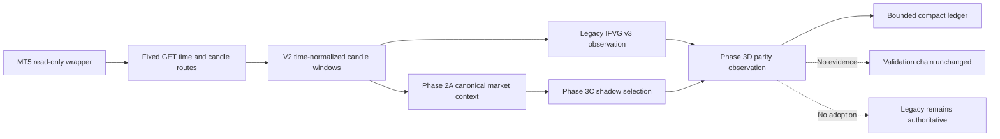

# GoTrader V2 Phase 3D IFVG v3 Live Shadow Report

## Executive Decision

Phase 3D implements the first bounded, read-only live canary for IFVG v3
selection parity. The collector observes distinct closed MT5 windows, compares
the legacy IFVG v3 selection with the Phase 3C shadow selection, and stores a
compact checksummed ledger.

The deterministic canary passes. Current live collection remains correctly
blocked because the provider time basis is not verified and the terminal clock
observation is stale. No blocked observation was persisted.

```text
Phase 3D implementation: complete
Deterministic live-window canary: passed
Current live verification: blocked by time contract
Production adoption: none
Legacy IFVG v3 authority: retained
Validation-chain evidence: none
Readiness or Paper-Demo promotion: none
Execution authority: none
Broker authority: none
Readiness override authority: none
```

## Branch And Baseline

- Branch: `codex/gotrader-v2-phase-3d-ifvg-live-shadow`
- Baseline: `6eb199d Complete IFVG v3 shadow selection parity`
- Scope: additive read-only shadow collection and compact parity ledger

## Architecture



Raw candles are used only inside the collector process. The persisted artifact
contains source identity, closed-window identity, compact selection parity,
blockers, warnings, and authority fields.

## Contract

Phase 3D adds:

- a live shadow observation contract;
- a compact parity summary;
- an idempotent bounded ledger;
- conflicting same-window result rejection;
- checksummed file validation;
- forbidden-field scanning;
- a fixed-route loopback collector;
- a deterministic canary test;
- one-shot and optional watch commands.

The collector stores at most 256 observations. It does not claim that separate
closed windows are statistically independent.

## Deterministic Canary

The focused test verifies:

| Case | Result |
|---|---|
| Positive IFVG v3 closed window | exact parity |
| No-candidate closed window | exact parity |
| Repeated same observation | idempotent |
| Contradictory same-window result | rejected |
| Stale current-live time context | blocked |
| Tampered ledger checksum | rejected |
| Forbidden raw field | rejected |
| Validation-chain creation | false |
| Production adoption | false |
| Raw candle serialization | false |

The canary produced two exact-parity observations across two distinct closed
windows and two market dates. These are operational observations, not a claim
of statistical independence.

## Current Live Result

The one-shot local collection reached the MT5 wrapper and all configured
read-only market endpoints. It returned `blocked_context` and did not save an
observation.

Observed blockers included:

- current-live time eligibility missing;
- context comparison ineligible;
- context blocked;
- primary window blocked, stale, and empty.

The upstream time-contract diagnostic reported:

```text
verificationStatus: observed_candidate
providerTimeBasis: unknown
dstPolicy: unknown
phase2Eligible: false
```

The terminal-clock diagnostic reported:

```text
status: blocked_terminal_probe_unavailable
reason: terminal_observation_stale
```

This is the intended fail-closed result. The collector did not infer a time
basis, persist a false parity observation, print raw candles, or call mutation
routes.

## Safety And Compatibility

- Legacy IFVG v3 remains authoritative.
- Phase 3D does not alter detector thresholds or production routing.
- No replay, walk-forward, OOS, evidence, maturity, or readiness state changes.
- No validation-chain entry is created.
- No Paper-Demo or execution transition is possible.
- No account, order, position, deal, or broker-mutation API is called.
- Authority remains `none / none / none`.

Rollback is additive: remove the Phase 3D exports, scripts, tests, and manifest
entries. No production strategy behavior or persisted production state needs
migration.

## Next Recommendation

1. Run a fresh `GoTraderClockProbe` observation from the connected USTECH MT5
   chart.
2. Verify the terminal clock contract.
3. Establish the current offset regime.
4. Collect multiple distinct closed-window observations.
5. Review every regression before considering any later adoption phase.

Do not advance IFVG v3 toward production routing while the live time contract
is blocked. Even after time verification, live shadow parity remains a canary;
it does not create evidence or justify readiness promotion by itself.
